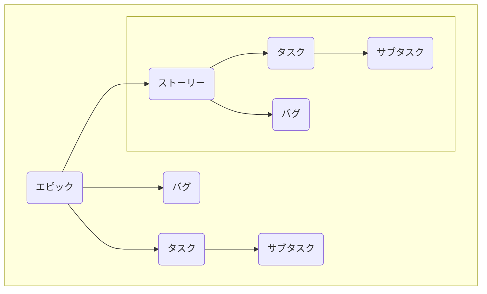

# JIRA における課題を完全に理解する

そもそも課題とはなんなのかおさらいしておきます。

課題は **プロジェクトの構成単位** でソフトウェアバグ、プロジェクトタスクなどを指します。プロジェクトに関係のあるものであればあらゆるものを課題と言えます。

JIRA に [課題とは](https://support.atlassian.com/ja/jira-software-cloud/docs/what-is-an-issue/) というページがあるのでこちらを参考にすると良いでしょう。

## 課題タイプの種類

Jira Software の課題タイプにはいくつか種類があり、それぞれの課題タイプがどういったものかまたどういう用途で使用するのかちゃんと把握し今後のタスク管理を行いやすいようにする。

種類としては５つしかない。こちらのタイプは ATLASSIAN の [課題タイプとは](https://support.atlassian.com/ja/jira-cloud-administration/docs/what-are-issue-types/) という記事を参考にして抜き出しています。

| タイプ     | 説明                                                                                                                                                                                                                                                                                                      |
|:-----------|:----------------------------------------------------------------------------------------------------------------------------------------------------------------------------------------------------------------------------------------------------------------------------------------------------------|
| エピック   | epic は「大規模な」という意味で、名前の通り **大規模なユーザーストーリーのこと** を指します。 バグ、ストーリー、タスクを含んだものになり、チームが今後開発するソフトウェアの新機能などの大規模な成果物を表します。エピックは大規模なユーザーストーリーなためより小さなユーザーストーリーに分割できる。 |
| バグ       | **プロジェクトの機能が損なわれる**、または **機能しなくなる問題のこと** を指す。                                                                                                                                                                                                                          |
| ストーリー | ユーザーストーリーとも呼ばれる。ソフトウェアの機能をエンドユーザーの観点から、堅苦しくない一般的な言葉で説明するものであり、 **ソフトウェアの機能が顧客にどのように価値を提供するかを示すもの**。                                                                                                         |
| タスク     | エピックやストーリーを達成するために必要な **実施すべき作業** を表す。                                                                                                                                                                                                                                    |
| サブタスク | １つのタスクの完了に必要な個々の作業です。                                                                                                                                                                                                                                                                |

それぞれの課題タイプは以下のような関係を持っています。

##  その他の課題タイプ - スパイク - 

その他の課題タイプとして、**「スパイク」** があります。 **「スパイク」** はいわゆる **技術調査のこと** を指します。  

なぜ「スパイク」というタスクがあるのか？ という疑問があると思います。スプリントが始まってから実装方法を検討をしたら技術的な制約があって想定通りに実装できないということはよくあることです。  
想定通りに実装できなくなると予定が狂うのでスプリントゴールを達成できなくなってしまいます。  
なので予測ができないものに関しては先に技術調査することでスプリントゴールが達成できないということを避けるために使ったりします。

「スパイク」はタスクの一部になると思われるため、上記の関係図でいうとタスクの部分に含まれると思います。  

### 参考情報

以下のサイトに詳しく説明されているで確認すると良いでしょう。

- [スクラムにおける技術的スパイクの進め方 | Ryuzee.com](https://www.ryuzee.com/contents/blog/7121)
- [スクラムのスパイクとは何ですか？ What is Spike in Scrum? : warren_lynchのblog](http://agile.blog.jp/agile_scrum/14976222.html)

## エピック

ATTLASIAN の [アジャイルエピック: 定義、例、テンプレート](https://www.atlassian.com/ja/agile/project-management/epics) ページの要約では以下のように書かれています。

> アジャイル エピックとは、顧客やエンドユーザーのニーズやリクエストに基づいて特定のタスク (通称「ユーザー ストーリー」) に細分化できるまとまった作業を指します。エピックは [アジャイル](https://www.atlassian.com/ja/agile/teams) チームと [DevOps](https://www.atlassian.com/ja/devops/what-is-devops) チームにとって重要なプラクティスです。

要約でも書かれている通り、 **ストーリーをいくつかまとめたもの（大きなストーリー）のこと** をエピックといいます。  
大きなストーリーになるため、１スプリントで終わることはなく **長期間に渡ること** になります。

開発担当者や顧客からのフィードバックを受けることで新たなストーリーが追加されたり、削除されたりするため、これらをまとめるために **課題を整理するのにエピックは役に立ちます**。課題の整理をすることでチームは大きな目標に向かって開発をしていくことができます。

またエピックの進捗具合を開発部門以外に共有することで経営計画や営業活動などにも役に立ちます。

### エピック例

[エピックとバックログという概念がなかなか理解できない - RS アトラシアン製品 ユーザーコミュニティ](https://www.ricksoft.jp/qa/questions/38175763/%E3%82%A8%E3%83%94%E3%83%83%E3%82%AF%E3%81%A8%E3%83%90%E3%83%83%E3%82%AF%E3%83%AD%E3%82%B0%E3%81%A8%E3%81%84%E3%81%86%E6%A6%82%E5%BF%B5%E3%81%8C%E3%81%AA%E3%81%8B%E3%81%AA%E3%81%8B%E7%90%86%E8%A7%A3%E3%81%A7%E3%81%8D%E3%81%AA%E3%81%84) にわかりやすく書かれております。  

図書館の蔵書検索システムを考えた時、以下のようなバックログがあるとする。

- iPhone 端末でも検索したい
- Android 端末でも検索したい
- Mac で半角文字が検索できない
- 予約ボタンのフォントを大きくしてほしい

「iPhone 端末でも検索したい」、「Android 端末でも検索したい」をまとめて **「モバイル対応」** とする。この **「モバイル対応」がエピックと言われる** 。

ATTLASIAN の [アジャイルエピック: 定義、例、テンプレート](https://www.atlassian.com/ja/agile/project-management/epics) ページでもエピックの例が記載されています。  

以下のような事例の時のことが書かれています。

> たとえば、私たちが 2050 年に娯楽用の宇宙旅行組織で働いているとしましょう。1 年のシャトル打ち上げ回数は 12 回前後であるため、各打ち上げは年に 1 度の大規模活動ではありませんが、それでも通常業務とはかけ離れており、完了までに多数の労力が必要です。

> 2050 年 3 月宇宙旅行シャトル打ち上げ」のエピックの例には、通常の作業項目に加え、顧客による宇宙旅行チケットの購入からロケットの打ち上げまで、シャトル打ち上げの主な要素の改善を目的とするストーリーが含まれます。

2050年3月の打ち上げ分のチケット購入をサポートするソフトウェアチームは以下のようなエピックを構築することが考えられます。

- ストーリー: 2050 年 3 月の打ち上げ日を含めるように期間を更新
- ストーリー: リクエストされた打ち上げリストの読み込み時間を 0.45 秒未満に短縮
- ストーリー: ファーストクラスの予約確認ページで土星旅行サマーセールを宣伝

### 参考情報

以下のサイトの情報も参考にすると良いでしょう。

- [アジャイルエピック: 定義、例、テンプレート](https://www.atlassian.com/ja/agile/project-management/epics)
- [エピックとバックログという概念がなかなか理解できない - RS アトラシアン製品 ユーザーコミュニティ](https://www.ricksoft.jp/qa/questions/38175763/%E3%82%A8%E3%83%94%E3%83%83%E3%82%AF%E3%81%A8%E3%83%90%E3%83%83%E3%82%AF%E3%83%AD%E3%82%B0%E3%81%A8%E3%81%84%E3%81%86%E6%A6%82%E5%BF%B5%E3%81%8C%E3%81%AA%E3%81%8B%E3%81%AA%E3%81%8B%E7%90%86%E8%A7%A3%E3%81%A7%E3%81%8D%E3%81%AA%E3%81%84)

## ストーリー（ユーザーストーリー）

ATTLASIAN の [例とテンプレートで作るユーザーストーリー](https://www.atlassian.com/ja/agile/project-management/user-stories) ページの要約では以下のように書かれています。

> ユーザーストーリーは、ソフトウェアの機能をエンドユーザーの観点から、堅苦しくない一般的な言葉で説明するものであり、ソフトウェアの機能が顧客にどのように価値を提供するかを示すことを目的としています。

ユーザーストーリーは **ソフトウェアのシステム要件であると説明されることがありますが実際はそうではない** です。ソフトウェアの機能を **エンドユーザーや顧客の観点から**、堅苦しくない一般的な言葉で説明します。エンドユーザーや顧客の観点を取り入れることで **ユーザーが何を求めているかを把握** し、独りよがりな機能ではなく、**適切な機能を提供できる** ようになります。

### ユーザーストーリーの形式

Asana の [ユーザーストーリー: ユーザー価値の高め方 (3 つの実例付)](https://asana.com/ja/resources/user-stories)の資料では **「(ペルソナ) として、(結果) ができるように、(ソフトウェアの目標) をしたい」** という形式にしたがって一文で書かれると記載されています。

出典：[ユーザーストーリー: ユーザー価値の高め方 (3 つの実例付)](https://asana.com/ja/resources/user-stories)

課題としてストーリータスクを作成する時は上記のような一文で書けるようにする必要があります。

### ユーザーストーリーの書き方

Asana の [ユーザーストーリー: ユーザー価値の高め方 (3 つの実例付)](https://asana.com/ja/resources/user-stories)の資料によると３つのステップで書くことができると書かれています。  
この３つのステップで **ペルソナ、結果、ソフトウェアの目標** を明確にするためいくつかの質問を用意しておき、これらに答えることで３つの要素を明確にすることができます。

**ステップ１：ペルソナを特定する**

誰が、そのソフトウェアの機能によって影響を受けるのか考えます。ここで重要なことは **役職などではなく特定の個人を元に考えること** です。

以下のような質問に応えます。

- 誰のために、このソフトウェア機能を開発しているのか？
- エンドユーザーは、どのような製品機能を求めているのか？
- エンドユーザーのデモグラフィック (属性) やサイコグラフィック (心理的特性) はどのようなものか？

**ステップ２：ニーズを説明する**

ユーザーがどのようにソフトウェア機能を使うかその理由を考えます。理由を考えることでその機能を使う理解を深められます。ここで重要なことは **ユーザーの意図を理解すること** です。

以下のような質問に答えます。

- エンドユーザーは何を達成しようとしているのか？
- そのソフトウェア機能は、どのようにしてエンドユーザーの目標達成に役立つのか？

**ステップ３：目的を明確にする**

ソフトウェアのリリースの全体像を分析することで目的を定義します。ソフトウェアの機能が会社全体の目標とどのように結びついているか考えます。ここで重要なことは **全体に目を向けること** です。

以下の質問に応えます。

- そのソフトウエアの機能は何の役に立つのか？
- 解決しようとしている問題は何か？
- この機能はどのようにして会社全体の目標と結びついているのか？

### ユーザーストーリーの実例

Asana の [ユーザーストーリー: ユーザー価値の高め方 (3 つの実例付)](https://asana.com/ja/resources/user-stories)の資料に書かれている実例になります。

- プロダクトマネージャー（ペルソナ）として、効率向上（結果）につながるように、チームメンバーが個々のタスクが会社全体の目標にどのように貢献しているかを理解できる（ソフトウェアの目標）ようにしたい。
- リピート顧客（ペルソナ）として、購入プロセスを効率化（結果）するために、自分の個人情報が保存されること（ソフトウェアの目標）を期待している。
- アプリをよく使う（ペルソナ）ので、関連情報をできるだけ速く確認できる（結果）方法（ソフトウェアの目標）を求めている。

ATTLASIAN の [アジャイルエピック: 定義、例、テンプレート](https://www.atlassian.com/ja/agile/project-management/user-stories)の資料に書かれている実例になります。

- 私が Max（ペルソナ） なら、友達を招待（結果）してこのサービスを一緒に受けられるようにしたい（ソフトウェアの目標）。
- 私が Sascha（ペルソナ） なら、仕事を整理（結果）して、上手に管理できている（ソフトウェアの目標）と思えるようになりたい。
- 私が管理者（ペルソナ）なら、部下たちの作業の進捗を把握（結果）できるようにして、成功や失敗についてより適切に報告できる（ソフトウェアの目標）ようになりたい。

### ユーザーストーリーを書くためのヒント

ユーザーストーリーをいい感じに書くためには **「３つのＣ」** の実施と **「INVEST」** の基準に当てはまっていなければなりません。  

出典：[ユーザーストーリー: ユーザー価値の高め方 (3 つの実例付)](https://asana.com/ja/resources/user-stories)

### ３つのＣ

**C**ard（カード）、**C**onversation（会話）、**C**onfirmation（確認）という３つの単語の頭文字のことを指します。  
ユーザーストーリーは誰かが作成すると思いますが作ったら終わりではなく、それが妥当性のあるものかしっかりと議論する必要があります。それを促進させるための方法になります。

基本的には Card → Conversation → Confirmation という順番で行っていきます。

**～Card（カード）～**

- ユーザーストーリーの概略が書かれたもの（付箋などで構わない）
- 議論をするために必要な資料

**～Conversation（会話）～**

- Cardに書かれたユーザーストーリーを元に優先順位や解決策の可能性、ユーザーストーリーの背後にある詳細などを顧客、ユーザー、開発者間で行われるディスカッション
- 関係者がユーザーストーリーのことについて理解していることを目標にする

**～Confirmation（確認）～**

- Cardに書かれた内容をConversationしても関係者間で認識の違いがあるかもしれないため、確認を行います
- 目的と解決策が関係者間で合意が取れていること

### INVEST

INVEST は、**I**ndependent (独立している)、**N**egotiable (交渉可能である)、**V**aluable (価値がある)、**E**stimable (見積もり可能である)、**S**mall (小さい)、**T**estable (テスト可能である) の頭文字をとったものです。  
この基準を満たしていることでよりユーザーストーリーを強化することができます。

Asana の[ユーザーストーリー: ユーザー価値の高め方 (3 つの実例付)](https://asana.com/ja/resources/user-stories) のページでは以下のように記載されています。

| 名前                               | 概略                                                                                                                  |
|:-----------------------------------|:----------------------------------------------------------------------------------------------------------------------|
| **I**ndependent (独立している)     | ユーザーストーリーは独立したものであるべきです。つまり、他のタスクに依存せず、自己完結型である必要があります。        | 
| **N**egotiable (交渉可能である)    | ユーザーストーリーは交渉可能であるべきです。つまり、議論の余地を残している必要があります。                            |
| **V**aluable (価値がある)          | ユーザーストーリーは、エンドユーザーに価値を提供し、より大きな長期目標に近づけるものでなければなりません。            |
| **E**stimable (見積もり可能である) | ユーザーストーリーは、スプリント内に収まるように見積もり、適切な優先順位をつける必要があります。                      |
| **S**mall (小さい)                 | ユーザーストーリーは、短時間で完成できる規模の仕事でなければなりません。                                              |
| **T**estable (テスト可能である)    | ユーザーストーリーは、品質を確認するために、受け入れテストを経て、事前に決められた受け入れ基準を満たす必要があります。|

上記、基準を満たすことで具体的かつ達成可能なユーザーストーリーになります。

### 参考情報

以下のサイトの情報も参考にすると良いでしょう。

- [ユーザーストーリー: ユーザー価値の高め方 (3 つの実例付) • Asana](https://asana.com/ja/resources/user-stories)
- [例とテンプレートで作るユーザーストーリー](https://www.atlassian.com/ja/agile/project-management/user-stories)

## 課題の見積もり

ATTLASIAN の [ストーリーポイントと見積もり](https://www.atlassian.com/ja/agile/project-management/estimation) のページに見積もりについて詳しく記載されています。  
このページで覚えておいたほうがよいことをこちらに記載しておきます。

そもそも **見積もりは困難** です。 **アジャイル見積もりは見積もりに過ぎない** ので見積もりを間違ってしてしまっても残業をして仕事をする必要はありません。  
なるべく見積もりは正確なものが良いので正確に見積もりを行う方法をこちらに記載していきます。  
ここでは「プロダクトオーナーとのコラボレーション」、「ストーリーポイントとプランニングポーカー」については記載しておりませんので ATTLASIAN の [ストーリーポイントと見積もり](https://www.atlassian.com/ja/agile/project-management/estimation) のページを読んで下さい。

### アジャイル見積もりはチームスポーツ

あらゆる人（開発者、デザイナー、テスター、デプロイメント担当者など）をチーム参加させること記載が鍵です。  
各チームメンバーは製品に対する様々な観点とユーザーストーリーを実現するために必要な作業をあげます。

何か新しい機能を作成する時、 **開発及び QA チームは表面に見えるものの影に怪物が潜んでいる場合を経験上知っている** ため、議論に加わる必要があります。同様に、設計変更にはデザインチームの意見だけでなく、開発および QA チームの意見も取り入れる必要があります。  

**見積もりはチームで必ず行います。** なぜならチームと無関係な見積もりは当事者意識が生まれず士気も下がり、ソフトウェアの品質に関して妥協されてしまう可能性があるためです。

### ストーリーポイント VS 時間

**チームは作業のサイズや作業の優先順位を把握するためにストーリーポイントを使用する** 必要があります。 

#### 時間ではなくストーリーポイントを使用する理由

- 日付は、日常で必然的に生じるプロジェクト関連外作業を考慮に入れていません（ミーティングや採用活動やチャットなど）
- 日付で見積もると日付に執着してしまいます（相対的見積もりは、この執着を取り除きます）
- 各チームは作業を微妙に異なった規模で見積もるため、速度 (ポイントで測定される) が必然的に異なってきます
- 各ストーリーポイント値の相対的労力について合意したら、議論を重ねることなくポイントをすばやく割り当てることができます
- ストーリーポイントでは、問題解決の所要時間ではなく、難易度に基づいてチームメンバーを評価します。これにより、チームメンバーは時間をかけることではなく価値を生み出すことに集中できます

ストーリーポイントの実践的な方法については[こちら](https://community.atlassian.com/t5/Agile-articles/Six-experts-sound-off-on-story-points-the-evolution-of-agile/ba-p/1553590)を

### 見積もりがスマートになるほど楽になる

**大きなストーリーポイントは見積もりが困難** である。

個々の課題は作業が16時間を超えないようにすること。これより規模が大きい場合は個々の作業項目を正確に見積もることが難しいためです。  
また16時間を超えるようであれば課題を細分化する必要があります。

**バックログの深い箇所にある課題** については **大まかな見積もり** をします。  

実際に作業を開始する段階では要件が変化している可能性もあるため事前に正確な見積もりをしすぎるのは時間の無駄になる可能性があります。  
プロダクトオーナーが製品のロードマップの **優先順位付けを適切に行うことができる程度の概算見積もりを提供する** 程度で良いでしょう。

### 過去の見積もりから学ぶ

**見積もりは実践が一番です。回数を重ねるごとに上達します。**  

振り返りの場はチームの見積もりの精度も含まれます。前回のスプリントで見積もった見積もりが想定通りだったかどうかをチームで話し合います。  
想定通りでなかった場合は何がいけなかったのか話し合い、次回のスプリントに活かします。こうしてイテレーションを回していくことでチームの見積もりの精度が上達していきます。

## まとめ

いろいろと調べてまとめましたが、まだ完全に理解した程度（なんもわからん）です。  
これからも JIRA 力を高めつつ開発を効率よく進めるようにしていきたいですね。この辺の話は奥が深すぎる……。
