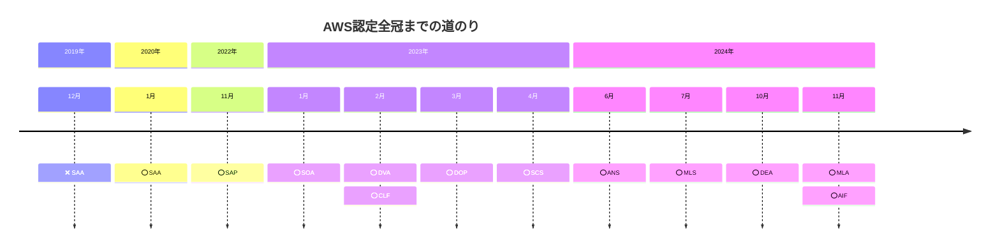
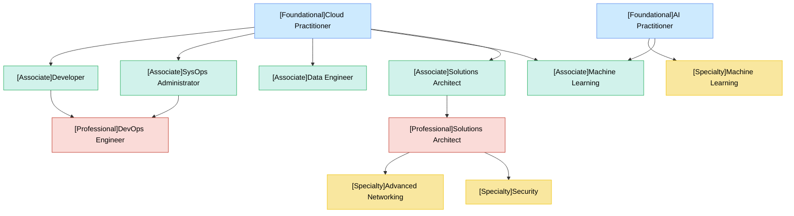

# AWS認定は投資か浪費か？全冠から見えた価値とは？

**AWS認定は「投資」でしょうか？ それとも「浪費」でしょうか？**

本記事では、AWS認定の全12種（いわゆる **全冠** ）を取得した筆者の経験をもとに、AWS認定の本当の価値について、さまざまな角度から掘り下げていきます。
- AWS認定とはそもそも何か？
- なぜ取得する意義があるのか？
- 全冠までにどのような道のりがあったのか？
- 取得によって得られたスキル・変化とは？
- 時間・お金をかけて得られたものは、本当に価値があったのか？

こうした問いを軸に **「資格の価値」や「学びの意義」** を振り返ります。  
これからAWS認定を目指す方、学習の方向性に迷っている方の参考になればと思っています。

# AWS認定の概要

AWS認定とは、Amazon Web Services (AWS) に関する知識やスキルを証明する資格制度です。全部で12個の認定（2025年5月時点）があり難易度としても初級者向け、中級者向け、上級者向けと分かれています。  

## AWS認定の全情報

AWS認定の情報をすべて表にまとめたものです。

| **カテゴリ** | **難易度** | **略称** | **資格名** | **料金** | **ダミー問題/問題数** | **合格点ライン** | **試験時間** |
| --- | --- | --- | --- | --- | --- | --- | --- |
| Foundational | 初心者向け | CLF | [AWS Certified Cloud Practitioner](https://aws.amazon.com/jp/certification/certified-cloud-practitioner/?ch=sec&sec=rmg&d=1) | 15,000円 | 15問/65問 | 700点/1000点 | 90分 |
| Foundational | 初心者向け | AIF | [AWS Certified AI Practitioner](https://aws.amazon.com/jp/certification/certified-ai-practitioner/?ch=sec&sec=rmg&d=1) | 15,000円 | 15問/65問 | 700点/1000点 | 90分 |
| Associate | 中級者向け | SOA | [AWS Certified SysOps Administrator - Associate](https://aws.amazon.com/jp/certification/certified-sysops-admin-associate/?ch=sec&sec=rmg&d=1) | 20,000円 | 15問/65問 | 720点/1000点 | 130分 |
| Associate | 中級者向け | DVA | [AWS Certified Developer - Associate](https://aws.amazon.com/jp/certification/certified-developer-associate/?ch=sec&sec=rmg&d=1) | 20,000円 | 15問/65問 | 720点/1000点 | 130分 |
| Associate | 中級者向け | SAA | [AWS Certified Solutions Architect - Associate](https://aws.amazon.com/jp/certification/certified-solutions-architect-associate/?ch=sec&sec=rmg&d=1) | 20,000円 | 15問/65問 | 720点/1000点 | 130分 |
| Associate | 中級者向け | DEA | [AWS Certified Data Engineer - Associate](https://aws.amazon.com/jp/certification/certified-data-engineer-associate/?ch=sec&sec=rmg&d=1) | 20,000円 | 15問/65問 | 720点/1000点 | 130分 |
| Associate | 中級者向け | MLA | [AWS Certified Machine Learning Engineer - Associate](https://aws.amazon.com/jp/certification/certified-machine-learning-engineer-associate/?ch=sec&sec=rmg&d=1) | 20,000円 | 15問/65問 | 720点/1000点 | 130分 |
| Professional | 上級者向け | SAP | [AWS Certified Solutions Architect - Professional](https://aws.amazon.com/jp/certification/certified-solutions-architect-professional/?ch=sec&sec=rmg&d=1) | 40,000円 | 10問/75問 | 750点/1000点 | 180分 |
| Professional | 上級者向け | DOP | [AWS Certified DevOps Engineer - Professional](https://aws.amazon.com/jp/certification/certified-devops-engineer-professional/?ch=sec&sec=rmg&d=1) | 40,000円 | 10問/75問 | 750点/1000点 | 180分 |
| Specialty | 上級者向け | ANS | [AWS Certified Advanced Networking - Specialty](https://aws.amazon.com/jp/certification/certified-advanced-networking-specialty/?ch=sec&sec=rmg&d=1) | 40,000円 | 15問/65問 | 750点/1000点 | 180分 |
| Specialty | 上級者向け | SCS | [AWS Certified Security - Specialty](https://aws.amazon.com/jp/certification/certified-security-specialty/) | 40,000円 | 15問/65問 | 750点/1000点 | 180分 |
| Specialty | 上級者向け | MLS | [AWS Certified Machine Learning - Specialty](https://aws.amazon.com/jp/certification/certified-machine-learning-specialty/) | 40,000円 | 15問/65問 | 750点/1000点 | 180分 |

### カテゴリ

Foundational, Associate, Professional, Specialty という４つのカテゴリに分けられています。

| **カテゴリ** | **難易度** | **説明** |
| --- | --- | :--- |
| Foundational | 初心者向け | AWS クラウドの基礎的な理解を目的とした知識ベースの認定です。**事前の経験は必要ありません。** |
| Associate | 中級者向け | AWS の知識とスキルを証明し、AWS クラウドのプロフェッショナルとしての信頼性を構築するロールベースの認定です。**クラウドおよび/または豊富なオンプレミスでの IT 経験があることが望ましいです。** |
| Professional | 上級者向け | AWS 上で安全かつ最適化された最新のアプリケーションを設計し、プロセスを自動化するために必要な高度なスキルと知識を証明するロールベースの認定です。2 年以上の AWS クラウドの経験があることが望ましいです。 |
| Specialty | 上級者向け | より深く掘り下げ、これらの戦略的領域において、ステークホルダーおよび/または顧客に信頼されるアドバイザーとしての地位を確立してください。**推奨される経験については、試験のページで試験ガイドを参照してください。** |

### 資格名

AWSの認定は３文字のアルファベットで表記されることが多いです。カテゴリと認定名を元に３文字のアルファベットで表記されます。

| **カテゴリ** | **略称** | **資格名** |
| --- | --- | --- |
| Foundational | CLF | [AWS Certified Cloud Practitioner](https://aws.amazon.com/jp/certification/certified-cloud-practitioner/?ch=sec&sec=rmg&d=1) |
| Foundational | AIF | [AWS Certified AI Practitioner](https://aws.amazon.com/jp/certification/certified-ai-practitioner/?ch=sec&sec=rmg&d=1) |
| Associate | SOA | [AWS Certified SysOps Administrator - Associate](https://aws.amazon.com/jp/certification/certified-sysops-admin-associate/?ch=sec&sec=rmg&d=1) |
| Associate | DVA | [AWS Certified Developer - Associate](https://aws.amazon.com/jp/certification/certified-developer-associate/?ch=sec&sec=rmg&d=1) |
| Associate | SAA | [AWS Certified Solutions Architect - Associate](https://aws.amazon.com/jp/certification/certified-solutions-architect-associate/?ch=sec&sec=rmg&d=1) |
| Associate | DEA | [AWS Certified Data Engineer - Associate](https://aws.amazon.com/jp/certification/certified-data-engineer-associate/?ch=sec&sec=rmg&d=1) |
| Associate | MLA | [AWS Certified Machine Learning Engineer - Associate](https://aws.amazon.com/jp/certification/certified-machine-learning-engineer-associate/?ch=sec&sec=rmg&d=1) |
| Professional | SAP | [AWS Certified Solutions Architect - Professional](https://aws.amazon.com/jp/certification/certified-solutions-architect-professional/?ch=sec&sec=rmg&d=1) |
| Professional | DOP | [AWS Certified DevOps Engineer - Professional](https://aws.amazon.com/jp/certification/certified-devops-engineer-professional/?ch=sec&sec=rmg&d=1) |
| Specialty | ANS | [AWS Certified Advanced Networking - Specialty](https://aws.amazon.com/jp/certification/certified-advanced-networking-specialty/?ch=sec&sec=rmg&d=1) |
| Specialty | SCS | [AWS Certified Security - Specialty](https://aws.amazon.com/jp/certification/certified-security-specialty/) |
| Specialty | MLS | [AWS Certified Machine Learning - Specialty](https://aws.amazon.com/jp/certification/certified-machine-learning-specialty/) |

#### 試験バージョンについて（例： SAA-C03）

試験には「SAA-C03」や「SAP-C02」などの表記が付いています。
これはバージョン番号であり、クラウド技術の進化に合わせて、試験問題が定期的に改訂されていることを示します。

- SAA-C01 → 初版
- SAA-C02 → 2回目の改訂
- SAA-C03 → 3回目の改訂（最新）

AWS認定は **一度取れば一生モノ** ではなく、最新技術を学び続けることが前提になっています。

### 料金

すべて取得するためには結構なお金がかかります。

カテゴリごと値段が設定されています。全12個の認定をすべて取得するためには330,000円にプラスで消費税の10%を加えると **350,000円** が必要になります。  
実際には1つの認定を取得すると特典として次回の認定試験の半額バウチャーを貰えるので一番始めに Foundational の認定から始めた場合は合計で165,000円にプラスで消費税の10%を加えると **175,000円** が必要となります。

| **カテゴリ** | **料金** | **半額バウチャー利用時** |
| --- | --- | --- |
| Foundational | 15,000円 | 7,500円 |
| Associate | 20,000円 | 10,000円 |
| Professional | 40,000円 | 20,000円 |
| Specialty | 40,000円 | 20,000円 |

料金については [試験の料金 | 試験前 | AWS 認定に関する情報とポリシー | AWS](https://aws.amazon.com/jp/certification/policies/before-testing/#Exam_pricing) を参照してください。

### 問題数/合格点/試験時間

| **カテゴリ** | **ダミー問題/問題数** | **合格点** | **試験時間** |
| --- | --- | --- | --- |
| Foundational | 15問/65問 | 700点/1000点 | 90分 |
| Associate | 15問/65問 | 720点/1000点 | 130分 |
| Professional | 10問/75問 | 750点/1000点 | 180分 |
| Specialty | 15問/65問 | 750点/1000点 | 180分 |

**ダミー問題/問題数**

カテゴリごとで問題数が微妙に異なっています。ダミー問題（どれがダミー問題か区別はできません）が含まれておりこれらの問題に回答して正解、不正解だったとしてもそれは点数に含まれないものになります。  
これらの問題はAWSがお試しで出しており今後の認定試験に問題を含めるかどうかを検討するために行っている施策となります。

**合格点**

カテゴリごと合格ラインの点数が決まっており、難易度が上がるにつれて、問題が長文化し合格ラインの点数が上がっていきます。

**試験時間**

カテゴリごとに試験時間が異なっています。難易度が上がるにつれて、問題が長文化し、すぐに回答できなくなってきます。一つの問題に対して数分かけることもあるため、Professional や Specialty の 180分でも足りないということは人によってはあります。自分も時間が足りなくてギリギリで回答し終わるということが何度もありました。

## 認定を取得するとどうなる？

認定を取得するとデジタル認定バッジと半額バウチャーとSubject Matter Expert (SME)への参加の3点の特典が手に入ります。  

実際に認定を取得すると AWS からメールが以下のような形で送られてきます。こちらのメールの本文内のリンクから実際のスコアと獲得したバッジを見ることができます。

```
◯◯◯様

おめでとうございます。 AWS Certified Machine Learning - Specialty 認定を取得されました。この認定および関連するすべての特典は、Jul 07, 2027 まで有効となります。

完了した試験のスコアレポートとその関連結果を表示するには、AWS 認定アカウント (http://aws.training/certification) にログインして、[試験履歴] タブをクリックし、[スコアレポート] 列の適切な行の下にある [<strong">ダウンロード] リンクをクリックします。</strong">

AWS Certification アカウントにサインインして、AWS Certified Machine Learning - Specialty 認定に関連する次の特典を活用してください。 

デジタルバッジを獲得およびシェアする
ソーシャルメディアプロフィールや E メール署名などでデジタルバッジを使用して、AWS Certification 試験に合格したことがわかるようにしましょう。認知と証明に役立つ柔軟なオプションをご活用ください。 詳細はこちら。

次のチャレンジへのサポートを取得する
AWS トレーニングと練習リソースを使用して、次の AWS 認定の準備をしてください。すべての AWS 認定試験を見るページで試験を選択すると、準備に役立つリソースを確認できます。

次の AWS 認定試験を受ける準備ができたら、50% 割引の試験バウチャーをどの試験にも使用できます。これらのバウチャーは、Jul 07, 2027 が有効期限です。

Subject Matter Expert (SME) に申し込む
試験は見事合格でした。次は試験の作成を手伝っていただけますか? AWS Certification では、試験トピックの決定、質問の作成、合格スコアの決定を手伝っていただける SME を求めています。 詳細はこちら。

実績を示す
AWS 認定アカウントの [特典] タブをクリックすると、デジタルバッジを確認したり、試験バウチャーコードを受け入れたりできます。

特典にアクセスする

どうぞよろしくお願いいたします。

AWS Certification
```

### デジタル認定バッジがもらえる

有効期限としては3年なので再認定を受けるには3年経つ前に再取得が必要になります。
半年前ぐらいに再認定のリマインドメールが以下のような形で AWS から送られてきます。

```
◯◯◯様

再認定が必要となりました。 AWS Certified Solutions Architect - Professional は Nov 12, 2025 が有効期限となります。

重要:認定資格の廃止
AWS は 2024 年 4 月 9 日に AWS Certified Data Analytics - Specialty を廃止します。この試験の最終受験日は 2024 年 4 月 8 日です。認定資格の有効期限が切れる前、または 2024 年 4 月 9 日 (いずれか早い方) までに、この試験を受験して再認定を受けることをお勧めします。認定資格は、再認定を受けた日から 3 年間有効です。

割引を利用する
AWS Certified Solutions Architect - Professional を取得すると、今後の試験で使用できる 50% 割引のバウチャーが提供されます。これらの割引もまた Nov 12, 2025 に有効期限が切れますので、すぐにご利用ください。割引のステータスを確認するには、AWS Certification アカウントにサインインし、[特典] セクションを確認します。このバウチャーをまだ使用していない場合は、再認定の試験料金に適用するか、または Nov 12, 2025 までに今後受験予定の認定試験に適用できます。 

当社のウェブサイトで再認定ポリシーの詳細をご確認ください。

よろしくお願いします。
AWS Training and Certification
```

[Earn AWS 認定バッジ | デジタルバッジ | AWS](https://aws.amazon.com/jp/certification/certification-digital-badges/) のリンクからもログインすることでデジタル認定バッジの確認ができます。

### 半額バウチャーがもらえる

次回以降で認定試験を受ける時に料金が半額にすることができる権利をもらえます。  
AWS認定アカウントの特典のメニュー欄に半額バウチャーの取得ができていることを確認できます。

### Subject Matter Expert (SME)への参加

こちらは実際に私自身が行ったことが無いので詳しくは公式ページとわかりやすく書いてあるブログを参照してください。

- [Subject Matter Expert (SME) Programs | AWS Certification | AWS](https://aws.amazon.com/jp/certification/certification-sme-program/)
- [【re:invent2023】AWS認定資格とSubject Matter Expert Programについて - サーバーワークスエンジニアブログ](https://blog.serverworks.co.jp/reInvent2023-sme)

## AWS認定の再認定

AWS認定の有効期限が3年なので再度認定試験を受験する必要があります。詳しくは [AWS Recertification（再認定）](https://aws.amazon.com/jp/certification/recertification/) のページで内容を確認できます。

再認定で重要なことは **12個すべて再度受験する必要はない** ということです。認定の一部には親子関係があるものがありその場合は上位認定だけ更新すれば自動的に下位資格も再認定されることになります。  
関係図に表したものが以下となります。⭐️マークの付いている上位認定を受けていくことで全冠を維持することができます。

具体的には以下の認定のみ再度受験が必要です。

- [AWS Certified Data Engineer - Associate](https://aws.amazon.com/jp/certification/certified-data-engineer-associate/?ch=sec&sec=rmg&d=1)
- [AWS Certified Machine Learning Engineer - Associate](https://aws.amazon.com/jp/certification/certified-machine-learning-engineer-associate/?ch=sec&sec=rmg&d=1)
- [AWS Certified Solutions Architect - Professional](https://aws.amazon.com/jp/certification/certified-solutions-architect-professional/?ch=sec&sec=rmg&d=1)
- [AWS Certified DevOps Engineer - Professional](https://aws.amazon.com/jp/certification/certified-devops-engineer-professional/?ch=sec&sec=rmg&d=1)
- [AWS Certified Advanced Networking - Specialty](https://aws.amazon.com/jp/certification/certified-advanced-networking-specialty/?ch=sec&sec=rmg&d=1)
- [AWS Certified Security - Specialty](https://aws.amazon.com/jp/certification/certified-security-specialty/)
- [AWS Certified Machine Learning - Specialty](https://aws.amazon.com/jp/certification/certified-machine-learning-specialty/)


## AWS認定の受験方法

こちらも公式ページとわかりやすく書かれているブログを参照してください。

- [試験の予約 | 試験前 | AWS 認定に関する情報とポリシー | AWS](https://aws.amazon.com/jp/certification/policies/before-testing/#Scheduling_Exams)
- [AWS資格試験の申し込み方法まとめ！自宅で受けるときのポイントも解説](https://raise-tech.net/depot/aws-examination-application/)

# AWS認定を受ける意義

AWS認定を受ける意義について以下の3つの視点を元にまとめています。
- **AWS認定を受ける理由の公式の見解**
- **AWS認定の全冠達成者の希少性**
- **全冠してわかった「AWS認定を取得する本当の意義」**

## AWS認定を受ける理由の公式の見解

公式ページにAWS認定を受ける理由が紹介されています。


参照: [AWS 認定 – AWS クラウドコンピューティング認定プログラム | AWS](https://aws.amazon.com/jp/certification/#AWS-%E8%AA%8D%E5%AE%9A%E3%82%92%E5%8F%97%E3%81%91%E3%82%8B%E7%90%86%E7%94%B1)

要約すると以下のように書かれています。
- 今後5年間でクラウドスキルの需要が急増すると多くの専門家が予測しており、AWS認定の学習はそのスキルを身につける最適な方法のひとつです。
- AWS認定を持つ人がいる組織では、AWSサービスを使った革新的な取り組みが進んでいるという報告が多く、認定取得が組織の成長にもつながっています。
- AWS認定を取得した後、スタッフの生産性が向上したと答えたITリーダーは多数。また、89%のリーダーが「トラブル対応が早くなった」とも回答しています。

つまり

**「AWS認定」は、個人のスキルアップだけでなく、組織全体のイノベーションと生産性の向上にもつながる重要な資格と書かれています。**

## AWS認定の全冠達成者の希少性

AWS認定の全冠達成者の希少性はどの程度だと思いますか？

2024年に日本における全冠の達成者（Japan AWS All Certifications Engineers）の総数は1,222名です。  
※AWS Partner Network (APN) に参加している会社のみ  
参照: [2024 Japan AWS All Certifications Engineers の発表 | AWS JAPAN APN ブログ](https://aws.amazon.com/jp/blogs/psa/2024-japan-aws-all-certifications-engineers/)

### Japan AWS All Certifications Engineers とは？

Japan AWS All Certifications Engineersは、AWS認定の全12種を取得した日本国内のエンジニアを対象に、AWS Japanが公式に紹介・表彰している制度です。  
取得要件などはこちらの [2025 Japan All AWS Certifications Engineers クライテリアのお知らせ | AWS JAPAN APN ブログ](https://aws.amazon.com/jp/blogs/psa/2025-japan-aws-all-certifications-engineers-criteria/) を確認してください。

### IT企業数とIT企業の従業員数からみる希少性について

[あえてIT中小企業という選択。時代を生き抜くための就活 | ITなび就活Magazine](https://itnabi.com/shukatsu/magazine/archives/1680#:~:text=%E7%8F%BE%E5%9C%A8%E3%81%AE%E6%97%A5%E6%9C%AC%E3%81%AB%E3%81%8A%E3%81%91%E3%82%8BIT,%E3%81%A8%E3%81%84%E3%81%86%E3%81%93%E3%81%A8%E3%81%AB%E3%81%AA%E3%82%8A%E3%81%BE%E3%81%99%E3%80%82) の記事によるとIT企業数は43,006社、IT企業の従業員数が1,575,414人みたいです。  
この数字から考えると日本のIT企業の従業員数に対して全冠達成者は **全体の約0.077%** に相当しIT企業で考えても **全体の約2.8%** に相当します。  


参照: [あえてIT中小企業という選択。時代を生き抜くための就活 | ITなび就活Magazine](https://itnabi.com/shukatsu/magazine/archives/1680#:~:text=%E7%8F%BE%E5%9C%A8%E3%81%AE%E6%97%A5%E6%9C%AC%E3%81%AB%E3%81%8A%E3%81%91%E3%82%8BIT,%E3%81%A8%E3%81%84%E3%81%86%E3%81%93%E3%81%A8%E3%81%AB%E3%81%AA%E3%82%8A%E3%81%BE%E3%81%99%E3%80%82)

IT企業の従業員がすべてエンジニアではないですしAWSを使用していない企業もありますが数字から見ても非常に希少な存在であることがわかります。  
IT企業100社のうち97社には全冠達成者が居ない計算になるため　**「どの企業に行っても全冠者としてオンリーワンの存在になれる」** という圧倒的希少性があります。

このように **「ポジショニングとしての価値」** が際立つのも、AWS認定全冠の大きな特徴の1つだと思います。

## 全冠してわかった「AWS認定を取得する本当の意義」

AWS認定は「肩書きのために取る資格」と思われがちですが、実際にはもっと深い意義があると感じました。  
ここでは、全冠を目指して実感した、AWS認定を取得する5つの意義を紹介します。

### 体系的にクラウドを学ぶ絶好の機会

普段の業務では触れるサービスに偏りがちで、使っていないサービスを体系的に学ぶ機会はなかなかありません。
AWS認定を通じて学ぶことで、セキュリティ・ネットワーク・アーキテクチャ・災害戦略・運用設計など、広範な領域をバランスよくカバーできます。

### 実務と知識をつなぐ「意味の言語化」ができる

普段の業務で何気なく行っていた設計や運用について、「なぜその構成にするのか？」「他にどんな選択肢があるのか？」を認定の学習を通じて 言語化できるようになった と感じました。  
結果として、技術選定や設計の場面で 知識に裏打ちされた判断 ができるようになり、経験と知識がつながる感覚を得られるようになりました。

### 継続力・粘り強さが鍛えられる

全冠達成は、決して簡単なチャレンジではありません。日々の学習を計画的に積み重ね、反復して定着させることが求められます。  
諦めずに勉強を続ける経験は、資格取得以上に「自分を信じる力」を育ててくれました。

### 社内外での信頼を得るきっかけになる

AWS認定を取得したからといって、すぐに待遇や役割が大きく変わるわけではありません。それでも「努力できる人」「継続できる人」としての信頼を得る材料になります。  
話のきっかけとしても役立つことがありました。

### 将来を見据えた「学びの土台作り」

AWS認定はゴールではなく、次に進むための「土台」でもあります。例えば Terraform などの IaC コードを深く理解するためのインフラ知識など。  
「認定を取った後」が、本当の学びのスタートだと今では感じています。

# 全冠までの道のり

こちらではAWS認定の全冠までどういった道のりで達成したのかまとめています。証拠として実際に全冠を達成した画面です。


全部の点数は以下の通り。全体的にそこまで点数は高いわけではないです。

| **日付** | **資格名** | **点数** | **合否** |
| --- | --- | --- | --- |
| 2019/12/22 | [AWS Certified Solutions Architect - Associate](https://aws.amazon.com/jp/certification/certified-solutions-architect-associate/?ch=sec&sec=rmg&d=1) | 700 | 不合格 |
| 2020/01/20 | [AWS Certified Solutions Architect - Associate](https://aws.amazon.com/jp/certification/certified-solutions-architect-associate/?ch=sec&sec=rmg&d=1) | 867 | 合格 |
| 2022/11/12 | [AWS Certified Solutions Architect - Professional](https://aws.amazon.com/jp/certification/certified-solutions-architect-professional/?ch=sec&sec=rmg&d=1) | 773 | 合格 |
| 2023/01/07 | [AWS Certified SysOps Administrator - Associate](https://aws.amazon.com/jp/certification/certified-sysops-admin-associate/?ch=sec&sec=rmg&d=1) | 726 | 合格 |
| 2023/02/04 | [AWS Certified Developer - Associate](https://aws.amazon.com/jp/certification/certified-developer-associate/?ch=sec&sec=rmg&d=1) | 846 | 合格 |
| 2023/02/13 | [AWS Certified Cloud Practitioner](https://aws.amazon.com/jp/certification/certified-cloud-practitioner/?ch=sec&sec=rmg&d=1) | 803 | 合格 |
| 2023/03/05 | [AWS Certified DevOps Engineer - Professional](https://aws.amazon.com/jp/certification/certified-devops-engineer-professional/?ch=sec&sec=rmg&d=1) | 792 | 合格 |
| 2023/04/13 | [AWS Certified Security - Specialty](https://aws.amazon.com/jp/certification/certified-security-specialty/) | 802 | 合格 |
| 2024/06/16 | [AWS Certified Advanced Networking - Specialty](https://aws.amazon.com/jp/certification/certified-advanced-networking-specialty/?ch=sec&sec=rmg&d=1) | 760 | 合格 |
| 2024/07/07 | [AWS Certified Machine Learning - Specialty](https://aws.amazon.com/jp/certification/certified-machine-learning-specialty/) | 770 | 合格 |
| 2024/10/24 | [AWS Certified Data Engineer - Associate](https://aws.amazon.com/jp/certification/certified-data-engineer-associate/?ch=sec&sec=rmg&d=1) | 859 | 合格 |
| 2024/11/14 | [AWS Certified Machine Learning Engineer - Associate](https://aws.amazon.com/jp/certification/certified-machine-learning-engineer-associate/?ch=sec&sec=rmg&d=1) | 740 | 合格 |
| 2024/11/23 | [AWS Certified AI Practitioner](https://aws.amazon.com/jp/certification/certified-ai-practitioner/?ch=sec&sec=rmg&d=1) | 768 | 合格 |

## 全冠までの振り返り

取得開始から全冠までを時系列で表した図が以下となります。



全冠を振り返ると、大きく4つのフェーズに分けられます。  
そのときどきの仕事やプライベートの状況と当時のSlackの投稿も含めながら、日記風に振り返ってみます。

### 第1フェーズ: はじめての挫折、そして挑戦（2019年〜2020年）

取得した認定
- AWS Certified Solutions Architect - Associate（SAA）

会社の同僚と一緒に、はじめてのAWS認定に挑戦しました。
2019年12月、誕生日前に受験した初試験。  
結果は、あと数問足りず不合格。
試験直後に落ちたことを知らされ、正直かなり心が折れました。

それでも「ここで諦めたらもったいない」と思い直し、1ヶ月間みっちり勉強。
年明けの2020年1月、無事に合格できました。

### 第2フェーズ: 再始動（2022年後半〜2023年前半）

取得した認定
- AWS Certified Solutions Architect - Professional（SAP）
- AWS Certified SysOps Administrator - Associate（SOA）
- AWS Certified Developer - Associate（DVA）
- AWS Certified Cloud Practitioner（CLF）
- AWS Certified DevOps Engineer - Professional（DOP）
- AWS Certified Security - Specialty（SCS）

2022年、転職して新機能の立ち上げチームに参加。  
半年間、リリースに向けて走り抜け、無事に新機能を公開することができました。

少し落ち着いたタイミングで、「また何かに挑戦したい」という気持ちが湧き、  
AWS認定で難関と言われる Solutions Architect - Professional（SAP） に挑戦を決意します。

このSAP試験は想像以上にハードで、改定直前のタイミングもあり、本当にギリギリまで苦戦しました。
それでもなんとか合格。

2022年11月14日 10:32 slack の投稿より
> SAP 受かってきたので、ゆるーく6冠(FOUNDATIONAL, ASSOCIATE, PROFESSIONAL)を目指そうと思う。  
> PROFESSIONAL の認定試験を3年に1回受ければ再認定になるから6冠と言いつつ2つだけ更新していけばいいし。
> 
> SPECIALTY は興味のあるものはいずれとりたい。

そして勢いのまま、次に Associateレベルの認定群 にも挑戦することに。  
当初は「まぁ、取れたらいいかな」くらいの軽い気持ちでした。

2023年1月10日 12:04 slack の投稿より
> 3つ目の AWS の資格に合格してきた！
> 
> AWS Certified SysOps Administrator - Associate はラボ試験という名のコンソール画面を操作する試験があるので他の資格と少し違うため注意が必要であった。ラボ試験の勉強ほぼしてなかったけどなんとか受かったようだった。  
> ラボ試験の内容は詳しく言えなけど結構当たり前に必要な機能をコンソールで実装する感じだった。
> 
> 来月あたりに AWS Certified Developer - Associate は受ける予定。

2023年2月6日 17:26 slack の投稿より
> AWS Certified Developer - Associate に受かってきた！  
> 来週は AWS Certified Cloud Practitioner を受けてくる。AWS Certified Cloud Practitioner は 160門ぐらい解いてみたけど割とクセのある問題が多いと感じた。  
> 問題の書き方で曲解して間違えるのが多い……。

1つ取るたびに自信がつき、「取れるかも」「次もいけるかも」と、どんどん前向きになっていきました。  

2023年2月15日 09:55 slack の投稿より
> AWS Certified Cloud Practitioner (CLF) に受かってきたのでこれで5冠になった。CLFは一番下のレベルの資格だけあって難しいとは感じなかった。  
> ある程度AWS触っている人だったら勉強なしでも受かりそう。自分は一週間ぐらい問題解くのと参考書で知らない箇所を読む程度で大丈夫だった。
>  
> サポートプランの話が試験で出るからこの辺全くわからんかったから参考書がためになった。参考書は無料で kindle でダウンロードできるからこれ１冊で充分や！
>  
> https://dev.classmethod.jp/articles/book-review-certification-clf/

次々と合格を重ねるうちに、「もしかして、全冠も夢じゃないかもしれない」 そんな手応えを感じ始めます。

2023年3月6日 10:20 slack の投稿より
> 昨日の日曜日に「AWS Certified DevOps Engineer - Professional (DOP)」に無事受かってきたのでAWS6冠になった💪
> 
> > ゆるーく6冠(FOUNDATIONAL, ASSOCIATE, PROFESSIONAL)を目指そう
> 
> 11月14日にゆるーくと言っていたが全然ゆるくじゃなかくてかなり急ピッチだった😇  
> Foundational、Associate、Professionalが完了したのでこれからはゆるーく Speciality を取得していこうと思う。  
> Specialityは2ヶ月に1つ取得ぐらいのペースにする。今度こそ本当にゆるーくする。ゆるーくと言いつつ書籍は3冊購入完了してるけど……。

この頃、自然とSlackへの投稿頻度も上がり、「自分との約束」として、勉強の進捗を残していくようになっていました。

2023年4月17日 15:55 slack の投稿より
> 先々週の金曜日に遅刻して試験がパーになって失った1万5000円だけど先週の木曜日の仕事終わりに更に追加で1万5000円を課金して無事AWS Certified Security - Specialty（SCS）に受かってきたのでAWS7冠になった！
> 
> SCSを受けてKMSとか通信の暗号化とか少しわかるようになった。  
> 今まで受けてきた資格の難易度をこんな感じかな🤔
> 
> SAP:☆☆☆☆☆  
> DOP:☆☆☆☆  
> SCS:☆☆☆☆ → 今回  
> SOA:☆☆☆  
> SAA:☆☆  
> DVA:☆☆  
> CLF:☆

ここで6冠達成。  
「これは、本当に全冠を狙ってもいいかもしれない」そんな想いを強く意識するようになりました。

### 第3フェーズ: 育休前ラストスパート（2024年6月〜7月）

取得した認定
- AWS Certified Advanced Networking - Specialty（ANS）
- AWS Certified Machine Learning - Specialty（MLS）

2023年〜2024年前半にかけては、さらに大きな変化がありました。  
会社では、新規サービスをリリースするプロジェクトが本格始動。そのなかで、自分がチームのリーダーを任されることになりました。

責任の重い立場、日々の開発……  
並行して、プライベートでは結婚、そして妊娠という嬉しいニュースもありました。  
新規サービスのリリースも完了し落ち着いた頃に勉強を再開しました。

勉強時間の確保が本当に難しかったですが、「育休に入る前に、あと少しだけ進めたい」という思いで、夜遅くにコツコツ勉強を継続。  
家事と仕事を終えてからの短い時間に、なんとか勉強時間を捻出しました。

2024年6月17日 12:56 slack の投稿より
> 去年も継続的にやっていたAWSの資格取得を再開してみた。  
> リハビリがてら巷では一番むずかしいと噂の **AWS Certified Advanced Networking - Specialty** を昨日 150$ と 3時間かけて受けてきたけど無事受かってきた。
> 
> 試験が3時間ある中、1時間たった頃から尿意との戦いだったな……。  
> 頭の中で構成図を生成しながら尿意を我慢しながらという感じ。  
> 
> Beta版も含めればあと4つ！なんとか今年中には全部取得してしまいたい。
> 
> - **AWS Certified Machine Learning - Specialty**
> - **AWS Certified Machine Learning Engineer - Associate**
> - **AWS Certified Data Engineer - Associate**
> - **AWS Certified AI Practitioner**
> 
> やっぱ試験数多くない。

2024年7月8日 16:32 slack の投稿より
> 昨日は暑い中、横浜まで出向き **AWS Certified Machine Learning - Specialty** を受けてきて無事受かってきた！
> 
> 準備期間がだいたい 3週間ぐらいで機械学習に関しては知識が無い状態からの勉強だからきついかなと思ったけどやればいけるもんだな。  
> 今までは資格に特化した書籍があったりと勉強しやすかったけど今回は無いし一般的な機械学習の知識をいれないといけなかったらちょっとつらかった。G検の書籍を買って読んだり Youtube を見たりそんなんばっかやってた。
> 
> 知らないアルゴリズムとか概念とか単語が多すぎる試験で例えば……教師なし学習, 教師あり学習, 強化学習, K近傍法, K-means法, XGBoost, ロジスティック回帰, 線形回帰,  過学習, 正規化(L1正規化, L2正規化), SMOTE, ランダムカットフォレスト, クラス不均衡, バイアス, 混同行列, Seq2Seq, Word2vecなどなど。これらの機械学習の知識に AWS のサービスの話しが入ってくるから割ときつい。
> 
> 残りはBeta版含めて後３つ！そのうち以下の２つは今回受かった資格の下位の資格だから多分いけるはず……。
> 
> - **AWS Certified Machine Learning Engineer - Associate**
> - **AWS Certified AI Practitioner**
> 
> 多分、年内にはすべて取得できる予定。そして来年は AWS Summit に出てステッカーもらうぞ！

義母にもサポートをお願いしながら、ANSとMLSに無事合格。家族に支えられながら、なんとかここまでたどり着きました。

### 第4フェーズ: 残りの認定取得（2024年10月〜11月）

取得した認定
- AWS Certified AI Practitioner（AIF）
- AWS Certified Data Engineer - Associate（DEA）
- AWS Certified Machine Learning Engineer - Associate（MLA）

育休明け、子育て・仕事・家事を同時にこなす怒涛の日々。  
正直、勉強に割ける時間も、気力も限られていました。

それでも、「ここまで来たなら、あと少し。なんとか取り切りたい」。
そんな思いが、毎晩、机に向かう力になりました。  
夜、子どもが寝静まったあと、ヘトヘトになりながらも机に向かう。そんな毎日を積み重ね、新設されたばかりのAIF、DEA、MLAに挑戦しました。

新しい試験だったため、参考情報もほとんどなく、すべて手探りながら勉強を継続。

そして

2024年10月25日 11:15 slack の投稿より
> 昨日は出社してお昼の時間とプラスで1時間を使って渋谷のテストセンターで **AWS Certified Data Engineer - Associate** を受けてきて無事受かってきた！  
> 
> 10:40 〜 12:36の間に離席したから Door to Door で 2時間もかからずに戻ってこれた。  
> 
> 育休明けからゆるーく勉強して受けたから 24日ぐらいかかったけど Professional とか Speciality と比べると Associate は問題自体が解きやすいなー。  
> 今年の3月ぐらいにできた資格だからあんまり情報がなかったけどなんとかなるな。AWS Glue, AWS Lake Formation, Amazon Redshift, Amazon Athena, Amazon S3 あたりがよくでてきた印象。前職で AWS Glue はよく使ってたからイメージが湧きやすい資格やった。  
> 
> 残りはBeta版含めて後２つ！これらの資格は最近、できたばっかだから情報ほぼ皆無だから普段と違う進め方をしないといけないな。  
>   
> - **AWS Certified Machine Learning Engineer - Associate**
> - **AWS Certified AI Practitioner**
>   
> AWS Certified AI Practitioner に関しては来年の2月15日までは再受験がタダになるから実質受かるまで受け放題なのがいい。なんとか11月中には取得してしまいたい。 

2024年11月25日 18:27 slack の投稿より
> 実は先週の土曜日と先々週の木曜日でAWSの残り２つの資格を取って無事、全冠してきました！  
> ちょうど今日の25日がギルド会での発表だったのでそれになんとか間に合わせようと頑張って詰め込んだんですがまぁなんとかなるもんですね。  
>   
> **AWS Certified AI Practitioner**  
> **AWS Certified Machine Learning Engineer - Associate**  
>  
> どっちも今年の10月に正式版が出たばっかりで情報がほぼ皆無だったのですがなんとかなりました。  
> AWS Certified AI Practitioner は [Prompt Engineering Guide](https://www.promptingguide.ai/jp) の内容が出たりと割と勉強になる感じの試験だったのでオススメ。  
> AWS Certified Machine Learning Engineer - Associate はどんだけ AWS SageMarker が好きなんだよってぐらい SageMarker 一色のような試験だった。  
> この２つの認定は来年の２月ぐらいまでに取得するとアーリアダプターということで認定バッジ以外にもう一つ認定バッジがもらえる。  
> AWS認定を受けてきてやっと全冠できてそしてギルド会でも喋ったのでもう満足です :smile_a:

2024年11月、すべての認定試験に合格。ついに、AWS認定「全冠」を達成。  
この時の達成感は、単なる資格取得の喜びではありませんでした。

「諦めずに続けた自分自身を誇りに思えた」

そんな、人生で一度きりの特別な瞬間でした。  
そして、全冠達成後、ずっと楽しみにしていた [マルちゃん 北海道限定 でっかいやきそば弁当](https://www.amazon.co.jp/%E3%83%9E%E3%83%AB%E3%81%A1%E3%82%83%E3%82%93-%E5%8C%97%E6%B5%B7%E9%81%93%E9%99%90%E5%AE%9A-%E3%81%A7%E3%81%A3%E3%81%8B%E3%81%84%E3%82%84%E3%81%8D%E3%81%9D%E3%81%B0%E5%BC%81%E5%BD%93-258g%C3%9712%E5%80%8B/dp/B00TY03EN2/ref=asc_df_B00TY03EN2?mcid=6578602a75ef331daf0045e0eb92f6bc&tag=jpgo-22&linkCode=df0&hvadid=707549646446&hvpos=&hvnetw=g&hvrand=7145256689919525103&hvpone=&hvptwo=&hvqmt=&hvdev=c&hvdvcmdl=&hvlocint=&hvlocphy=9197917&hvtargid=pla-338949772283&gad_source=1&th=1) に食らいつきました。  
あの日の味は、今でも忘れられません。

## 認定ごとの難易度

ここでは、全冠を達成するまでに受験したAWS認定それぞれについて、個人的に感じた難易度と、勉強を通して印象に残ったことをまとめました。  
難易度は主観的なものですが、これから挑戦する方の参考になれば幸いです。

| **資格名** | **難易度** | **感想** |
| --- | --- | --- |
| [AWS Certified Solutions Architect - Professional](https://aws.amazon.com/jp/certification/certified-solutions-architect-professional/?ch=sec&sec=rmg&d=1) | ⭐️⭐️⭐️⭐️⭐️ | AWSの総合格闘技というような感じで範囲も広ければ問題文も長文でもっとも難しいと感じた|
| [AWS Certified Machine Learning - Specialty](https://aws.amazon.com/jp/certification/certified-machine-learning-specialty/) | ⭐️⭐️⭐️⭐️⭐️ | 自分の業務とほぼ関わりがなく一からの勉強で覚えることも多いし難しい。機械学習に関する単語がすごく多くそれらを覚えるのに苦労した |
| [AWS Certified Advanced Networking - Specialty](https://aws.amazon.com/jp/certification/certified-advanced-networking-specialty/?ch=sec&sec=rmg&d=1) | ⭐️⭐️⭐️⭐️ | クラウドだけでなくオンプレや大規模ネットワークに関する問題が出て馴染がないためむずと感じた |
| [AWS Certified Security - Specialty](https://aws.amazon.com/jp/certification/certified-security-specialty/) | ⭐️⭐️⭐️⭐️ | セキュリティに関する知識を深ぼることができた認定であった |
| [AWS Certified DevOps Engineer - Professional](https://aws.amazon.com/jp/certification/certified-devops-engineer-professional/?ch=sec&sec=rmg&d=1) | ⭐️⭐️⭐️⭐️ | SAPと同じでProfessionalの認定なため問題文が長文のものが多く読み解くのが大変。ただSAPよりかは難しくなかった |
| [AWS Certified SysOps Administrator - Associate](https://aws.amazon.com/jp/certification/certified-sysops-admin-associate/?ch=sec&sec=rmg&d=1) | ⭐️⭐️⭐️ | 当時はラボ試験もあり他の認定とは少し違っている。扱うサービス自体、自分に馴染みのないもので理解に苦戦した。Associateの認定の中では一番難しいと感じた |
| [AWS Certified Solutions Architect - Associate](https://aws.amazon.com/jp/certification/certified-solutions-architect-associate/?ch=sec&sec=rmg&d=1) | ⭐️⭐️⭐️ | AWSに関するよく使われるサービスについて問われることが多く、この認定を取得したことによって広く、浅い知識を取得することができた |
| [AWS Certified Machine Learning Engineer - Associate](https://aws.amazon.com/jp/certification/certified-machine-learning-engineer-associate/?ch=sec&sec=rmg&d=1) | ⭐️⭐️⭐️ | Specialtyとはまた違った認定でSpecialtyを取得していても扱う知識が違っているため勉強が必要 |
| [AWS Certified Developer - Associate](https://aws.amazon.com/jp/certification/certified-developer-associate/?ch=sec&sec=rmg&d=1) | ⭐️⭐️ | 開発者向けの認定ではあるが他の認定で出た問題とも重複することもありそこまで難しいと感じなかった |
| [AWS Certified Data Engineer - Associate](https://aws.amazon.com/jp/certification/certified-data-engineer-associate/?ch=sec&sec=rmg&d=1) | ⭐️⭐️ | 前職で使っていたサービスの問題も多くそんなに難しいとは感じなかった |
| [AWS Certified AI Practitioner](https://aws.amazon.com/jp/certification/certified-ai-practitioner/?ch=sec&sec=rmg&d=1) | ⭐️⭐️ | プロンプトエンジニアリングの手法などAWSに限らず勉強になった認定 |
| [AWS Certified Cloud Practitioner](https://aws.amazon.com/jp/certification/certified-cloud-practitioner/?ch=sec&sec=rmg&d=1) | ⭐️ | ある程度、AWSを触ったことのある人であれば難しいとは感じないと思う。勉強時間ももっとも少なかった |

## おすすめの受ける順番

AWS認定を全冠したからこそ感じたおすすめの受ける順番をこちらにまとめています。



受ける順番のおすすめとしては [AWS認定の再認定](#aws認定の再認定) の通り、認定には親子関係があるため下位認定から取得していくことで効率よく下位認定の知識を使いつつ勉強していくことが可能です。くわしくは図を確認ください。  
Specialty の認定に関しては親子関係はありませんが [AWS Certified Solutions Architect - Professional](https://aws.amazon.com/jp/certification/certified-solutions-architect-professional/?ch=sec&sec=rmg&d=1) を取得してから [AWS Certified Advanced Networking - Specialty](https://aws.amazon.com/jp/certification/certified-advanced-networking-specialty/?ch=sec&sec=rmg&d=1) と [AWS Certified Security - Specialty](https://aws.amazon.com/jp/certification/certified-security-specialty/) を受けると良いと思います。  
いきなり Specialty に挑戦するのはかなりキツイのでまずは Professional を受けて慣れてから受けるとスムーズですし Specialty の問題も Professional と同じで長文問題が多く、頭の中で構成図をちゃんと描いて解く必要があるためそういった意味でも先に取得してから取り掛かることをオススメします。

Machine Learning 系は少し特殊な立ち位置なので他の認定とは別で考えた方が良いです。Associate と Specialty は被る部分はありますが Specialty が合格したからといって Associate も受かるわけではなく必要な知識が少し違います。なのでこれらに関しては事前に [AWS Certified AI Practitioner](https://aws.amazon.com/jp/certification/certified-ai-practitioner/?ch=sec&sec=rmg&d=1) を受けてから臨むと良いと思います。

[AWS Certified Solutions Architect - Associate](https://aws.amazon.com/jp/certification/certified-solutions-architect-associate/?ch=sec&sec=rmg&d=1) を1番最初に受ける戦略も良いです。  
汎用性がとにかく高く横展開（Developer, SysOps Administrator, Data Engineer）も良いですし下位認定もなんなく受かるレベルまでいけます。個人的な感覚としてはすべての認定の基礎といっても過言ではないかと思っています。AWS認定がどういったものか把握するのにもいいですし難易度としてもちょうどよいためです。  
扱う範囲も広いため、最初のインプットにすごく苦労はしますが先にやっておくと後が楽だと思います。

## 勉強時間と期間

全冠達成までの勉強時間と期間についてまとめます。

### 総期間

- 全冠達成まで：約 **5年**
- うち実質的な勉強期間：約 **2年**

### 1認定あたりの勉強量

- 勉強期間：**2週間〜1ヶ月**
- 1日の勉強時間：**仕事終わりに3〜4時間**

### 総勉強時間（概算）

- 1認定あたり：約 **42時間**（3時間 × 14日）
- 全認定合計：約 **504時間**
- ※勤務時間（160h/月）換算で**約3ヶ月分**に相当

---

人によって学習速度は異なりますので、あくまで参考値です。

## 勉強方法

色々と試行錯誤しながら勉強した結果、自分なりに最適だと思う勉強方法があるのでそれをまとめています。  
だいたい以下の5ステップを元に勉強をすることで合格するまでの知識を得ることができます。

1. 試験概要を確認する
2. 書籍を購入する（必要に応じて）
3. 問題をひたすら解く
4. 問題を解いてわからないところを確認する
5. 公式の模擬問題を解く

### 1. 試験概要を確認する

試験概要にはその認定に関する情報がすべてまとまっています。  
「どのような能力が検証されるのか」、「受験対象者」、「試験内容」、「試験で出題されるサービスの一覧」などがまとまっているため、この試験ガイドを見るだけで何を勉強するべきかを把握することができます。  
自分の失敗談ですが最初の頃は試験ガイドを見ずに勉強をしていたためかなり非効率でした。

| **資格名** | **試験ガイド** |
| --- | --- |
| [AWS Certified Cloud Practitioner](https://aws.amazon.com/jp/certification/certified-cloud-practitioner/?ch=sec&sec=rmg&d=1) | [AWS-Certified-Cloud-Practitioner_Exam-Guide.pdf](https://d1.awsstatic.com/ja_JP/training-and-certification/docs-cloud-practitioner/AWS-Certified-Cloud-Practitioner_Exam-Guide.pdf) |
| [AWS Certified AI Practitioner](https://aws.amazon.com/jp/certification/certified-ai-practitioner/?ch=sec&sec=rmg&d=1) | [AWS-Certified-AI-Practitioner_Exam-Guide.pdf](https://d1.awsstatic.com/ja_JP/training-and-certification/docs-ai-practitioner/AWS-Certified-AI-Practitioner_Exam-Guide.pdf) |
| [AWS Certified SysOps Administrator - Associate](https://aws.amazon.com/jp/certification/certified-sysops-admin-associate/?ch=sec&sec=rmg&d=1) | [AWS-Certified-SysOps-Administrator-Associate_Exam-Guide.pdf](https://d1.awsstatic.com/ja_JP/training-and-certification/docs-sysops-associate/AWS-Certified-SysOps-Administrator-Associate_Exam-Guide.pdf) |
| [AWS Certified Developer - Associate](https://aws.amazon.com/jp/certification/certified-developer-associate/?ch=sec&sec=rmg&d=1) | [AWS-Certified-Developer-Associate_Exam-Guide.pdf](https://d1.awsstatic.com/ja_JP/training-and-certification/docs-dev-associate/AWS-Certified-Developer-Associate_Exam-Guide.pdf) |
| [AWS Certified Solutions Architect - Associate](https://aws.amazon.com/jp/certification/certified-solutions-architect-associate/?ch=sec&sec=rmg&d=1) | [AWS-Certified-Solutions-Architect-Associate_Exam-Guide.pdf](https://d1.awsstatic.com/ja_JP/training-and-certification/docs-sa-assoc/AWS-Certified-Solutions-Architect-Associate_Exam-Guide.pdf) |
| [AWS Certified Data Engineer - Associate](https://aws.amazon.com/jp/certification/certified-data-engineer-associate/?ch=sec&sec=rmg&d=1) | [AWS-Certified-Data-Engineer-Associate_Exam-Guide.pdf](https://d1.awsstatic.com/ja_JP/training-and-certification/docs-data-engineer-associate/AWS-Certified-Data-Engineer-Associate_Exam-Guide.pdf) |
| [AWS Certified Machine Learning Engineer - Associate](https://aws.amazon.com/jp/certification/certified-machine-learning-engineer-associate/?ch=sec&sec=rmg&d=1) | [AWS-Certified-Machine-Learning-Engineer-Associate_Exam-Guide.pdf](https://d1.awsstatic.com/ja_JP/training-and-certification/docs-machine-learning-engineer-associate/AWS-Certified-Machine-Learning-Engineer-Associate_Exam-Guide.pdf) |
| [AWS Certified Solutions Architect - Professional](https://aws.amazon.com/jp/certification/certified-solutions-architect-professional/?ch=sec&sec=rmg&d=1) | [AWS-Certified-Solutions-Architect-Professional_Exam-Guide.pdf](https://d1.awsstatic.com/ja_JP/training-and-certification/docs-sa-pro/AWS-Certified-Solutions-Architect-Professional_Exam-Guide.pdf) |
| [AWS Certified DevOps Engineer - Professional](https://aws.amazon.com/jp/certification/certified-devops-engineer-professional/?ch=sec&sec=rmg&d=1) | [AWS-Certified-DevOps-Engineer-Professional_Exam-Guide.pdf](https://d1.awsstatic.com/ja_JP/training-and-certification/docs-devops-pro/AWS-Certified-DevOps-Engineer-Professional_Exam-Guide.pdf) |
| [AWS Certified Advanced Networking - Specialty](https://aws.amazon.com/jp/certification/certified-advanced-networking-specialty/?ch=sec&sec=rmg&d=1) | [AWS-Certified-Advanced-Networking-Specialty_Exam-Guide.pdf](https://d1.awsstatic.com/ja_JP/training-and-certification/docs-advnetworking-spec/AWS-Certified-Advanced-Networking-Specialty_Exam-Guide.pdf) |
| [AWS Certified Security - Specialty](https://aws.amazon.com/jp/certification/certified-security-specialty/) | [AWS-Certified-Security-Specialty_Exam-Guide.pdf](https://d1.awsstatic.com/ja_JP/training-and-certification/docs-security-spec/AWS-Certified-Security-Specialty_Exam-Guide.pdf) |
| [AWS Certified Machine Learning - Specialty](https://aws.amazon.com/jp/certification/certified-machine-learning-specialty/) | [AWS-Certified-Machine-Learning-Specialty_Exam-Guide.pdf](https://d1.awsstatic.com/ja_JP/training-and-certification/docs-ml/AWS-Certified-Machine-Learning-Specialty_Exam-Guide.pdf) |

### 2. 書籍を購入する（必要に応じて）

書籍はその認定で出題される内容が網羅的に抑えられているため、オススメです。  
注意がいることはすべての認定に対応した書籍があるわけではありません。また発売した日によっては内容が古く一部仕様が間違っていることもあるため見極めが必要です。

さらに書籍を購入するもう1つの利点としては巻末に本番相当の模擬問題が付属していることです。この模擬問題のためだけに書籍を購入するだけでも価値があります。

こちらの書籍一覧は実際に AWS認定のために私自身が購入したものとなります。ここまで購入する必要は全くありませんし購入しなくても合格はできると思います。


### 3. 問題をひたすら解く

このフェーズに来たら試験概要を把握できて、さらにその認定の全体像まで分かった状態かと思います。  
書籍を購入していない場合は全体像は把握できていないかもしれないですが問題をひたすら解いていくことで把握もできるようになります。

問題をどうやって解いていくのかですが4つほど方法があります。

#### 1. 書籍の巻末に付属している模擬問題を解く

書籍を購入すると大抵は巻末に模擬問題が用意されています。  
こちらの問題は普段使うというよりかは本番相当の試験を想定して解くために使用するのがよいでしょう。

問題の内容は書籍によってバラバラです。、また認定試験では問われないような問題も出ることがあります。なので実際に試してみて点数が思ったほど取れなくても合格できないということはなかったりします。

#### 2. [CloudLicense | AWS WEB問題集で学習しよう](https://cloud-license.com/) に登録して問題を解く（もっともオススメ）

有料ですが効率よく問題を解くことに特化しておりAWS認定全冠でもっとも貢献度の高いサービスでした。  
大体、料金的には AWS認定の書籍を2冊購入した程度の価格です。

3ヶ月単位での契約になりベーシックとプロフェッショナルがありますが Associate の認定のみ取得を考えているならベーシックで大丈夫です。  
Professional, Specialty も考えているならプロフェッショナルで登録する必要があります。

こちらのサービスでは7問ごと問題を解くことができ、解説も含まれるためこのサービスだけで合格が可能です。  
また AWS認定本試験モード というものがあり、これは本番と同じ問題数を解いて結果を確認することができる機能で、この AWS認定本試験モード で8割ほど正解するようになったら合格ラインに達していると判断してよいです。

このサービスで解くことになる問題のサンプルは本番の認定試験で問われる内容とかなり似通っています。そのためある程度、点数を取ることができるようになれば認定試験を受けに行く目安にして大丈夫です。

#### 3. [Udemy](https://www.udemy.com/courses/search/?src=ukw&q=AWS)

Udemy では個人で模擬問題を提供しているケースがあります。  
模擬試験形式でいくつか提供されるため本番を想定した形で何度か挑戦することができます。  
1問ずつ回答し結果と回答を確認していく形式とすべて解き終わってから結果を確認する形式があるため、自分の状況に合わせて学習することが可能です。

こちらも書籍と同じ問題で認定試験では問われないような問題もでることがあります。

#### 4. 試験ガイドを読み込ませて生成AIに問題を出してもらう

[こちらの投稿](https://x.com/nasuvit_z/status/1828824115781984279) の内容です。  

<blockquote class="twitter-tweet"><p lang="ja" dir="ltr">AWS Certified AI Practitioner (AI1-C01) と、AWS Certified Machine Learning Engineer - Associate (ME1-C01) に合格したので、対策と勉強法の紹介です。<br><br>これは、試験ガイドの通りで、生成AI (Amazon Bedrock) の知識だけで乗り切るのは不可能です。… <a href="https://t.co/rlqTksHxjF">pic.twitter.com/rlqTksHxjF</a></p>&mdash; nasuuu (@nasuvit_z) <a href="https://twitter.com/nasuvit_z/status/1828824115781984279?ref_src=twsrc%5Etfw">August 28, 2024</a></blockquote> <script async src="https://platform.twitter.com/widgets.js" charset="utf-8"></script>

試験ガイドを ChatGPT などに読み込ませ、その後問題を出してもらう方法です。  
これはまだ認定資格ができたばかりの時で情報が少ない時に有効です。

### 4. 問題を解いてわからないところを確認する

[CloudLicense | AWS WEB問題集で学習しよう](https://cloud-license.com/) や [Udemy](https://www.udemy.com/courses/search/?src=ukw&q=AWS) を活用していく中でもすべてを解説しているわけではなかったりします。  
そのため、別途わからないことについて調べて理解する必要があります。

AWSが公式で出している [サービス別資料 | AWS クラウドサービス活用資料集](https://aws.amazon.com/jp/events/aws-event-resource/archive/?cards.sort-by=item.additionalFields.SortDate&cards.sort-order=desc&awsf.tech-category=*all) にはサービス単位でわかりやすくまとまっているためこちらを参考にすると良いでしょう。  
購入した書籍があれば書籍に戻って確認することも良いでしょう。

また生成AIなどを使い、わからないことについて聞くことも有効です。

### 5. 公式の模擬問題を解く

最後の総仕上げとして公式が提供している模擬問題を解きます。こちらは本番の認定試験と同じ形式で模擬問題を解くことができるので最後の総仕上げとして有効活用しましょう。  
私の場合は認定資格の前日に模擬問題を受けて8割取得できるか必ず腕試しをします。

| **資格名** | **模擬問題** |
| --- | --- |
| [AWS Certified Cloud Practitioner](https://aws.amazon.com/jp/certification/certified-cloud-practitioner/?ch=sec&sec=rmg&d=1) | [AWS Certified Cloud Practitioner Official Practice Question Set (CLF-C02- Japanese)](https://explore.skillbuilder.aws/learn/course/external/view/elearning/16792/aws-certified-cloud-practitioner-official-practice-question-set-clf-c02-japanese) |
| [AWS Certified AI Practitioner](https://aws.amazon.com/jp/certification/certified-ai-practitioner/?ch=sec&sec=rmg&d=1) | [Exam Prep Official Practice Question Set: AWS Certified AI Practitioner (AIF-C01 - Japanese)](https://explore.skillbuilder.aws/learn/course/external/view/elearning/19791/exam-prep-official-practice-question-set-aws-certified-ai-practitioner-aif-c01-japanese) |
| [AWS Certified SysOps Administrator - Associate](https://aws.amazon.com/jp/certification/certified-sysops-admin-associate/?ch=sec&sec=rmg&d=1) | [AWS Certified SysOps Administrator - Associate Official Practice Question Set (SOA-C02 - Japanese)](https://explore.skillbuilder.aws/learn/course/external/view/elearning/12555/aws-certified-sysops-administrator-associate-official-practice-question-set-soa-c02-japanese) |
| [AWS Certified Developer - Associate](https://aws.amazon.com/jp/certification/certified-developer-associate/?ch=sec&sec=rmg&d=1) | [AWS Certified Developer - Associate Official Practice Question Set (DVA-C02 - Japanese)](https://explore.skillbuilder.aws/learn/course/external/view/elearning/14060/aws-certified-developer-associate-official-practice-question-set-dva-c02-japanese) |
| [AWS Certified Solutions Architect - Associate](https://aws.amazon.com/jp/certification/certified-solutions-architect-associate/?ch=sec&sec=rmg&d=1) | [AWS Certified Solutions Architect – Associate Official Practice Question Set (SAA-C03 - Japanese)](https://explore.skillbuilder.aws/learn/course/external/view/elearning/13269/aws-certified-solutions-architect-associate-official-practice-question-set-saa-c03-japanese) |
| [AWS Certified Data Engineer - Associate](https://aws.amazon.com/jp/certification/certified-data-engineer-associate/?ch=sec&sec=rmg&d=1) | [Exam Prep Official Practice Question Set: AWS Certified Data Engineer - Associate (DEA-C01 - Japanese)](https://explore.skillbuilder.aws/learn/course/external/view/elearning/18145/exam-prep-official-practice-question-set-aws-certified-data-engineer-associate-dea-c01-japanese) |
| [AWS Certified Machine Learning Engineer - Associate](https://aws.amazon.com/jp/certification/certified-machine-learning-engineer-associate/?ch=sec&sec=rmg&d=1) | [Exam Prep Official Practice Question Set: AWS Certified Machine Learning Engineer - Associate (MLA-C01 - Japanese)](https://explore.skillbuilder.aws/learn/course/external/view/elearning/19689/exam-prep-official-practice-question-set-aws-certified-machine-learning-engineer-associate-mla-c01-japanese) |
| [AWS Certified Solutions Architect - Professional](https://aws.amazon.com/jp/certification/certified-solutions-architect-professional/?ch=sec&sec=rmg&d=1) | [AWS Certified Solutions Architect – Professional Official Practice Question Set (SAP-C02 - Japanese)](https://explore.skillbuilder.aws/learn/course/external/view/elearning/13272/aws-certified-solutions-architect-professional-official-practice-question-set-sap-c02-japanese) |
| [AWS Certified DevOps Engineer - Professional](https://aws.amazon.com/jp/certification/certified-devops-engineer-professional/?ch=sec&sec=rmg&d=1) | [AWS Certified DevOps Engineer - Professional Official Practice Question Set (DOP-C02 - Japanese)](https://explore.skillbuilder.aws/learn/course/external/view/elearning/14541/aws-certified-devops-engineer-professional-official-practice-question-set-dop-c02-japanese) |
| [AWS Certified Advanced Networking - Specialty](https://aws.amazon.com/jp/certification/certified-advanced-networking-specialty/?ch=sec&sec=rmg&d=1) | [AWS Certified Advanced Networking - Specialty Official Practice Question Set (ANS-C01 - Japanese)](https://explore.skillbuilder.aws/learn/course/external/view/elearning/14837/aws-certified-advanced-networking-specialty-official-practice-question-set-ans-c01-japanese) |
| [AWS Certified Security - Specialty](https://aws.amazon.com/jp/certification/certified-security-specialty/) | [AWS Certified Security - Specialty Official Practice Question Set (SCS-C02 - Japanese)](https://explore.skillbuilder.aws/learn/course/external/view/elearning/15232/aws-certified-security-specialty-official-practice-question-set-scs-c02-japanese) |
| [AWS Certified Machine Learning - Specialty](https://aws.amazon.com/jp/certification/certified-machine-learning-specialty/) | [Exam Prep Official Practice Question Set: AWS Certified Machine Learning - Specialty (MLS-C01 - Japanese)](https://explore.skillbuilder.aws/learn/course/external/view/elearning/12525/exam-prep-official-practice-question-set-aws-certified-machine-learning-specialty-mls-c01-japanese) |

詳しくはこちらの記事がわかりやすくまとめてくださっているので参照してください。

- [ななななんと！AWS認定の模擬試験が無料になりました！！ | DevelopersIO](https://dev.classmethod.jp/articles/new-aws-official-practice-questions/)
- [AWS認定の無料模擬試験がさらに便利になりました！ | DevelopersIO](https://dev.classmethod.jp/articles/new-aws-official-practice-questions2/)

## 特定の認定における特化した勉強方法

どの認定にも共通した勉強方法は [こちら](#勉強方法) を参考にしてください。ここでは特定の認定に特化した勉強方法をまとめています。

### AWS Certified Cloud Practitioner

AWS Certified Cloud Practitioner で出題される内容を網羅的に把握したい場合は [AWS認定資格 クラウドプラクティショナーの教科書: 合格へ導く虎の巻 CloudTech制作委員会シリーズ](https://amzn.asia/d/69zrPls) の書籍が無料で Kindle で読めるため、これだけで充分です。  

### AWS Certified AI Practitioner

前提知識としてプロンプトエンジニアリングに関して理解をしておく必要があります。
[Prompt Engineering Guide | Prompt Engineering Guide](https://www.promptingguide.ai/jp) のサイトにプロンプトエンジニアリングに関する情報がまとまっているため、ひと通り見ておくとよいでしょう。

### AWS Certified Machine Learning - Specialty

AWS Certified Machine Learning - Specialty に関しては機械学習全般も試験内容に含まれるため [深層学習教科書 ディープラーニング G検定(ジェネラリスト)公式テキスト 第2版](https://amzn.asia/d/cxs40x6) を購入して4章〜6章あたりを読むことをオススメします。  
参考: [IT初心者が AWS Certified Machine Learning - Specialty（MLS-C01）にチャレンジして一発合格した件について #AWS - Qiita](https://qiita.com/chamittey_mayu_hiramoto/items/4f5ffe629766a0323f36)

書籍だけでなく Youtube で [スタビジ【誰でもAIデータサイエンス】byウマたん - YouTube](https://www.youtube.com/@aiby8596) のチャンネルの動画も分かりやすく説明されておりとても参考になります。何度もこちらの動画に助けられました。

## 認定を取得するためには必須ではないがおすすめな勉強方法

AWS認定試験の合格には必須ではありませんが、実務力を高めたい人には強くおすすめしたい勉強方法があります。
それは、IaC（Infrastructure as Code）で実際にAWS上にシステムを構築することです。

おすすめの一冊は、こちらの書籍です。私自身もこちらの書籍にすごくお世話になりました。

- [実践Terraform　AWSにおけるシステム設計とベストプラクティス（技術の泉シリーズ）](https://www.amazon.co.jp/%E5%AE%9F%E8%B7%B5Terraform-AWS%E3%81%AB%E3%81%8A%E3%81%91%E3%82%8B%E3%82%B7%E3%82%B9%E3%83%86%E3%83%A0%E8%A8%AD%E8%A8%88%E3%81%A8%E3%83%99%E3%82%B9%E3%83%88%E3%83%97%E3%83%A9%E3%82%AF%E3%83%86%E3%82%A3%E3%82%B9-%E6%8A%80%E8%A1%93%E3%81%AE%E6%B3%89%E3%82%B7%E3%83%AA%E3%83%BC%E3%82%BA%EF%BC%88NextPublishing%EF%BC%89-%E9%87%8E%E6%9D%91-%E5%8F%8B%E8%A6%8F-ebook/dp/B07XT7LJLC/ref=sr_1_3?dib=eyJ2IjoiMSJ9.Z6vyP3wMNaUaAXfLF7KWpRgfX_lqIboWPDB3PDRIM09thCz8h2Ws2Uhl2HCYvtvYPbd0bTC4S2YUlj-7PrREK0FsQEaMy3K2hvBw0De5apz2mRt1eZ5kyFhw3PdwP8VybEVvslSWPV9UBKhdjCQtyFXGv7Dmti2gl5tuxffaelugnC8pjGZcfOhIsA8fncOdWaWo3utUJDyesXyLapQGnI-tzY5b5oYuddLDHGiLsrsjF5jAmYSKnhL1fnwzLmUioJmSP5OlGDMBFKRj9TrnqesBE_3-ZGqItqQfAmoLM9c.O967w7QiK6qvnYsFyPL4k76uaAr9d2dOvzhokmfBLB8&dib_tag=se&keywords=terraform&qid=1747412018&sr=8-3)

この書籍では、よくある構成のシステムをTerraformで一から構築する流れが丁寧に解説されています。
インフラ設計から運用までの全体像が見える構成になっており、実務と認定学習をつなぐ教材として非常に優れています。

ただ、書籍で使用している Terraform のバージョンが古くて最新バージョンと差異があるため注意が必要です。

# 全冠して得られたこと

AWS認定の全冠を通じて得られたことは、単なる知識の習得だけではありませんでした。  
ここでは「スキル面」「キャリア・評価面」「内面」の3つの軸から、得たものを整理してみます。

## スキル面で得たこと

**クラウドにとどまらず、ITインフラ全体の理解が深まった**  
セキュリティ、ネットワーク、災害復旧（DR）など、普段業務で触れない領域まで広く学ぶことができた。

**アーキテクチャ設計の選択肢が大幅に広がった**  
パターンの引き出しが増えたことで、設計時に「他にどんな選択肢があるか？」をより考えられるようになった。

**機械学習や生成AIなど、クラウドの先の分野にも興味が広がった**  
AWS認定を通じて必然的に学ぶ中で、これまで縁遠かった分野にも自然と足を踏み入れるきっかけになった。  
特に基礎的な用語や考え方を体系的に押さえられたことは、今後の学びにも大きく貢献しています。

## キャリア・評価面で得たこと

**実務での“知識の引き出し”が増えた**  
新しい技術や設計の場面でも「あ、これ見たことある」という感覚が増え、ついていける場面が増えた。

**周囲からの信頼や声掛けが増えた**  
周囲からも少なからず「すごいね」と言ってもらえることもあり、「学び続ける姿勢」が伝わるようになった実感があった。

**給与アップにはつながらなかったけれど……**  
見返り以上に得たのは、自分自身への確かな達成感と、「やり切った」という自己評価でした。

**難しいことでも、やればできるという確信が持てた**  
これから何かに挑戦するとき、「全冠できた自分なら大丈夫」と思えるようになったのは、何よりの財産だと思う。

## 内面で得たこと

**粘り強く、理解できるまで向き合う姿勢が身についた**  
わからない単語や概念に出会うたび、妥協せずに調べ、図解し、読み返すことを繰り返した。

**「自分の言葉で説明できるまで理解する」習慣がついた**  
単なる暗記ではなく、「人に説明できるか？」を基準に理解を深めていったことで、知識が実務に活きるようになった。

**「やればできる」という自信が得られた**  
体系的に学ぶことで理解が深まり、「やればちゃんと力になる」という認識に変わった。  

---

この全冠の経験はスキルアップの加速装置であり、自己肯定感を押し上げるブースターでもあったと思います。

# 投資だったのか？浪費だったのか？

いろいろな角度からAWS認定について見てきました。ここで記事のタイトルの回収になるのですが、

**「この全冠の経験は、自分に何をもたらしたのだろうか？投資だったのか？それとも浪費だったのか？」**

時間も、労力も、お金もかけてきました。試験勉強に追われる日々は、決して楽なものではありませんでした。それでも、今こうして振り返ってみると、ひとつだけはっきりと言えることがあります。

この挑戦は、間違いなく自分にとって意味があった。

## 結論：投資ではあった。けれど......

**間違いなく、自分にとって意味のある投資だった**  
認定取得を通して得たのは、知識だけではありません。  
「継続する力」「学ぶ姿勢」「技術に対する自信」どれも今の自分を支える大きな軸になっています。

**「費用対効果」で見ると、割に合わないと感じた瞬間も正直ありました**  
試験代はトータルで数十万円。学習に費やした時間は数百時間以上。  
そして、それに見合う報酬や評価がすぐに返ってきたかと言われると、そうではありません。

**人生単位で見れば、間違いなく「価値ある投資」**  
でも、短期的な見返りだけを求めるなら「浪費」に感じる瞬間もある。それが、率直な本音です。

## だからこそ、これから挑戦する人に伝えたい
「全冠を目指す＝正解」ではありません。  
でも **「目的意識を持って学ぶ」ことができれば、きっと意味ある経験** になります。

肩書きや称号だけにとらわれず「自分はなぜやるのか？」を考えてから踏み出してほしいと思います。  
とはいえ **「なんか、かっこいいから」** でも良いと思っています。というのも、私自身の動機も最初はそこだったからです。

# 全冠して見えたAWS認定の価値

AWS認定の全冠を達成した今、振り返って強く感じるのは **「資格そのもの」よりも「資格を通して得た視座」こそが本当の価値だった** ということです。  
ここでは全12認定を通して見えてきた、AWS認定の本質的な価値について整理してみます。

## AWS認定の価値は「広く体系的な知識を得られること」

AWS認定の最大の価値は、やはりその網羅性にあると感じます。
- クラウドだけでなく、**ITインフラ全体への理解が深まった**
- セキュリティ、ネットワーク、DR（災害対策）、監視設計などを含め、**知識の抜けや偏りに気づき、補うことができた**
- それぞれの試験範囲が「体系的なチェックリスト」として機能した感覚がある

## もうひとつの価値は「挑戦を乗り越えた経験そのもの」

学び続け、試験に向き合い、乗り越える。  
この積み重ね自体が、大きな意味を持つことを実感しました。
- 数ヶ月、時には年単位にわたる学習をやり切ったことで、**継続力や粘り強さ** が鍛えられた
- ゴールにたどり着いたとき **「やればできた」という自己肯定感** を強く持てた

## ただし……資格は「スタートライン」にすぎない

AWS認定はあくまで「入り口」であり「証明」でしかない。
- 資格を取っただけでは、現実は何も変わらない
- 真価が問われるのは、得た知識と経験をどう活かすか にかかっています
- 「試験に出ること」と「現場で使えること」は重なっていてもイコールではないと痛感しています

## 実際にやっていること

資格取得の後、以下のような取り組みを意識的に行っています。
- 社内のTerraformコードを読み、**インフラの構成や設計意図を把握する**
- 認定で学んだAWSサービスやベストプラクティスを、**日々の業務に引き寄せて応用** する
- 「知っている」から「使える」へ **知識の昇華** を図っている

# まとめ

AWS認定の全冠、それは想像以上に長く、険しく、でも確実に自分を変えてくれた旅でした。  
振り返れば、得たのはバッジではなく「前に進む力」だったのかもしれません。  
ここまで振り返ってみて、改めて強く感じるのは **「資格の価値は、取得の先にある」** ということです。

認定を取ったから評価されるわけではない。  
でも認定を取る過程で得た思考力や学び続ける姿勢は、間違いなくその後のキャリアや人生を支える力になってくれます。

AWS認定が「投資か浪費か？」という問いに対して、私なりの答えは出ました。  
しかしその価値をどう捉えるかはこれから学ぶ皆さん一人ひとりに委ねられています。

ぜひ「自分なりの意味」を見つける挑戦として、AWS認定に向き合ってみるのはどうでしょうか？
