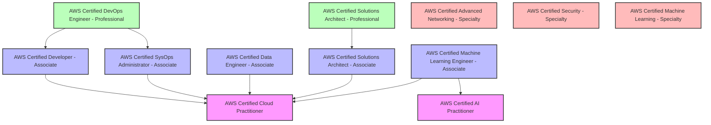

# AWS認定は投資か浪費か？全冠から見えた価値とは？


# AWS認定の概要

AWS認定とは、Amazon Web Services (AWS) に関する知識やスキルを証明する資格制度です。全部で12個の認定（2025年5月時点）があり難易度としても初級者向け、中級者向け、上級者向けと分かれています。

## AWS認定の全情報

AWS認定の情報をすべて表にまとめたものです。

| **カテゴリ** | **難易度** | **略称** | **資格名** | **料金** | **ダミー/問題数** | **合格点ライン** | **試験時間** | **試験ガイド** | **模擬問題** |
| --- | --- | --- | --- | --- | --- | --- | --- | --- | --- |
| Foundational | 初心者向け | CLF | [AWS Certified Cloud Practitioner](https://aws.amazon.com/jp/certification/certified-cloud-practitioner/?ch=sec&sec=rmg&d=1) | 15,000円 | 15問/65問 | 700点/1000点 | 90分 | [AWS-Certified-Cloud-Practitioner_Exam-Guide.pdf](https://d1.awsstatic.com/ja_JP/training-and-certification/docs-cloud-practitioner/AWS-Certified-Cloud-Practitioner_Exam-Guide.pdf) | [AWS Certified Cloud Practitioner Official Practice Question Set (CLF-C02- Japanese)](https://explore.skillbuilder.aws/learn/course/external/view/elearning/16792/aws-certified-cloud-practitioner-official-practice-question-set-clf-c02-japanese) |
| Foundational | 初心者向け | AIF | [AWS Certified AI Practitioner](https://aws.amazon.com/jp/certification/certified-ai-practitioner/?ch=sec&sec=rmg&d=1) | 15,000円 | 15問/65問 | 700点/1000点 | 90分 | [AWS-Certified-AI-Practitioner_Exam-Guide.pdf](https://d1.awsstatic.com/ja_JP/training-and-certification/docs-ai-practitioner/AWS-Certified-AI-Practitioner_Exam-Guide.pdf) | [Exam Prep Official Practice Question Set: AWS Certified AI Practitioner (AIF-C01 - Japanese)](https://explore.skillbuilder.aws/learn/course/external/view/elearning/19791/exam-prep-official-practice-question-set-aws-certified-ai-practitioner-aif-c01-japanese) |
| Associate | 中級者向け | SOA | [AWS Certified SysOps Administrator - Associate](https://aws.amazon.com/jp/certification/certified-sysops-admin-associate/?ch=sec&sec=rmg&d=1) | 20,000円 | 15問/65問 | 720点/1000点 | 130分 | [AWS-Certified-SysOps-Administrator-Associate_Exam-Guide.pdf](https://d1.awsstatic.com/ja_JP/training-and-certification/docs-sysops-associate/AWS-Certified-SysOps-Administrator-Associate_Exam-Guide.pdf) | [AWS Certified SysOps Administrator - Associate Official Practice Question Set (SOA-C02 - Japanese)](https://explore.skillbuilder.aws/learn/course/external/view/elearning/12555/aws-certified-sysops-administrator-associate-official-practice-question-set-soa-c02-japanese) |
| Associate | 中級者向け | DVA | [AWS Certified Developer - Associate](https://aws.amazon.com/jp/certification/certified-developer-associate/?ch=sec&sec=rmg&d=1) | 20,000円 | 15問/65問 | 720点/1000点 | 130分 | [AWS-Certified-Developer-Associate_Exam-Guide.pdf](https://d1.awsstatic.com/ja_JP/training-and-certification/docs-dev-associate/AWS-Certified-Developer-Associate_Exam-Guide.pdf) | [AWS Certified Developer - Associate Official Practice Question Set (DVA-C02 - Japanese)](https://explore.skillbuilder.aws/learn/course/external/view/elearning/14060/aws-certified-developer-associate-official-practice-question-set-dva-c02-japanese) |
| Associate | 中級者向け | SAA | [AWS Certified Solutions Architect - Associate](https://aws.amazon.com/jp/certification/certified-solutions-architect-associate/?ch=sec&sec=rmg&d=1) | 20,000円 | 15問/65問 | 720点/1000点 | 130分 | [AWS-Certified-Solutions-Architect-Associate_Exam-Guide.pdf](https://d1.awsstatic.com/ja_JP/training-and-certification/docs-sa-assoc/AWS-Certified-Solutions-Architect-Associate_Exam-Guide.pdf) | [AWS Certified Solutions Architect – Associate Official Practice Question Set (SAA-C03 - Japanese)](https://explore.skillbuilder.aws/learn/course/external/view/elearning/13269/aws-certified-solutions-architect-associate-official-practice-question-set-saa-c03-japanese) |
| Associate | 中級者向け | DEA | [AWS Certified Data Engineer - Associate](https://aws.amazon.com/jp/certification/certified-data-engineer-associate/?ch=sec&sec=rmg&d=1) | 20,000円 | 15問/65問 | 720点/1000点 | 130分 | [AWS-Certified-Data-Engineer-Associate_Exam-Guide.pdf](https://d1.awsstatic.com/ja_JP/training-and-certification/docs-data-engineer-associate/AWS-Certified-Data-Engineer-Associate_Exam-Guide.pdf) | [Exam Prep Official Practice Question Set: AWS Certified Data Engineer - Associate (DEA-C01 - Japanese)](https://explore.skillbuilder.aws/learn/course/external/view/elearning/18145/exam-prep-official-practice-question-set-aws-certified-data-engineer-associate-dea-c01-japanese) |
| Associate | 中級者向け | MLA | [AWS Certified Machine Learning Engineer - Associate](https://aws.amazon.com/jp/certification/certified-machine-learning-engineer-associate/?ch=sec&sec=rmg&d=1) | 20,000円 | 15問/65問 | 720点/1000点 | 130分 | [AWS-Certified-Machine-Learning-Engineer-Associate_Exam-Guide.pdf](https://d1.awsstatic.com/ja_JP/training-and-certification/docs-machine-learning-engineer-associate/AWS-Certified-Machine-Learning-Engineer-Associate_Exam-Guide.pdf) | [Exam Prep Official Practice Question Set: AWS Certified Machine Learning Engineer - Associate (MLA-C01 - Japanese)](https://explore.skillbuilder.aws/learn/course/external/view/elearning/19689/exam-prep-official-practice-question-set-aws-certified-machine-learning-engineer-associate-mla-c01-japanese) |
| Professional | 上級者向け | SAP | [AWS Certified Solutions Architect - Professional](https://aws.amazon.com/jp/certification/certified-solutions-architect-professional/?ch=sec&sec=rmg&d=1) | 40,000円 | 10問/75問 | 750点/1000点 | 180分 | [AWS-Certified-Solutions-Architect-Professional_Exam-Guide.pdf](https://d1.awsstatic.com/ja_JP/training-and-certification/docs-sa-pro/AWS-Certified-Solutions-Architect-Professional_Exam-Guide.pdf) | [AWS Certified Solutions Architect – Professional Official Practice Question Set (SAP-C02 - Japanese)](https://explore.skillbuilder.aws/learn/course/external/view/elearning/13272/aws-certified-solutions-architect-professional-official-practice-question-set-sap-c02-japanese) |
| Professional | 上級者向け | DOP | [AWS Certified DevOps Engineer - Professional](https://aws.amazon.com/jp/certification/certified-devops-engineer-professional/?ch=sec&sec=rmg&d=1) | 40,000円 | 10問/75問 | 750点/1000点 | 180分 | [AWS-Certified-DevOps-Engineer-Professional_Exam-Guide.pdf](https://d1.awsstatic.com/ja_JP/training-and-certification/docs-devops-pro/AWS-Certified-DevOps-Engineer-Professional_Exam-Guide.pdf) | [AWS Certified DevOps Engineer - Professional Official Practice Question Set (DOP-C02 - Japanese)](https://explore.skillbuilder.aws/learn/course/external/view/elearning/14541/aws-certified-devops-engineer-professional-official-practice-question-set-dop-c02-japanese) |
| Specialty | 上級者向け | ANS | [AWS Certified Advanced Networking - Specialty](https://aws.amazon.com/jp/certification/certified-advanced-networking-specialty/?ch=sec&sec=rmg&d=1) | 40,000円 | 15問/65問 | 750点/1000点 | 180分 | [AWS-Certified-Advanced-Networking-Specialty_Exam-Guide.pdf](https://d1.awsstatic.com/ja_JP/training-and-certification/docs-advnetworking-spec/AWS-Certified-Advanced-Networking-Specialty_Exam-Guide.pdf) | [AWS Certified Advanced Networking - Specialty Official Practice Question Set (ANS-C01 - Japanese)](https://explore.skillbuilder.aws/learn/course/external/view/elearning/14837/aws-certified-advanced-networking-specialty-official-practice-question-set-ans-c01-japanese) |
| Specialty | 上級者向け | SCS | [AWS Certified Security - Specialty](https://aws.amazon.com/jp/certification/certified-security-specialty/) | 40,000円 | 15問/65問 | 750点/1000点 | 180分 | [AWS-Certified-Security-Specialty_Exam-Guide.pdf](https://d1.awsstatic.com/ja_JP/training-and-certification/docs-security-spec/AWS-Certified-Security-Specialty_Exam-Guide.pdf) | [AWS Certified Security - Specialty Official Practice Question Set (SCS-C02 - Japanese)](https://explore.skillbuilder.aws/learn/course/external/view/elearning/15232/aws-certified-security-specialty-official-practice-question-set-scs-c02-japanese) |
| Specialty | 上級者向け | MLS | [AWS Certified Machine Learning - Specialty](https://aws.amazon.com/jp/certification/certified-machine-learning-specialty/) | 40,000円 | 15問/65問 | 750点/1000点 | 180分 | [AWS-Certified-Machine-Learning-Specialty_Exam-Guide.pdf](https://d1.awsstatic.com/ja_JP/training-and-certification/docs-ml/AWS-Certified-Machine-Learning-Specialty_Exam-Guide.pdf) | [Exam Prep Official Practice Question Set: AWS Certified Machine Learning - Specialty (MLS-C01 - Japanese)](https://explore.skillbuilder.aws/learn/course/external/view/elearning/12525/exam-prep-official-practice-question-set-aws-certified-machine-learning-specialty-mls-c01-japanese) |

表が見づらい場合はこちらの画像を確認してください。


### カテゴリ

Foundational, Associate, Professional, Specialty という４つのカテゴリに分けられています。

| **カテゴリ** | **難易度** | **説明** |
| --- | --- | :--- |
| Foundational | 初心者向け | AWS クラウドの基礎的な理解を目的とした知識ベースの認定です。**事前の経験は必要ありません。** |
| Associate | 中級者向け | AWS の知識とスキルを証明し、AWS クラウドのプロフェッショナルとしての信頼性を構築するロールベースの認定です。**クラウドおよび/または豊富なオンプレミスでの IT 経験があることが望ましいです。** |
| Professional | 上級者向け | AWS 上で安全かつ最適化された最新のアプリケーションを設計し、プロセスを自動化するために必要な高度なスキルと知識を証明するロールベースの認定です。2 年以上の AWS クラウドの経験があることが望ましいです。 |
| Specialty | 上級者向け | より深く掘り下げ、これらの戦略的領域において、ステークホルダーおよび/または顧客に信頼されるアドバイザーとしての地位を確立してください。**推奨される経験については、試験のページで試験ガイドを参照してください。** |

### 資格名

AWSの認定は３文字のアルファベットで表記されることが多いです。カテゴリと認定名を元に３文字のアルファベットで表記されます。

| **カテゴリ** | **略称** | **資格名** |
| --- | --- | --- |
| Foundational | CLF | [AWS Certified Cloud Practitioner](https://aws.amazon.com/jp/certification/certified-cloud-practitioner/?ch=sec&sec=rmg&d=1) |
| Foundational | AIF | [AWS Certified AI Practitioner](https://aws.amazon.com/jp/certification/certified-ai-practitioner/?ch=sec&sec=rmg&d=1) |
| Associate | SOA | [AWS Certified SysOps Administrator - Associate](https://aws.amazon.com/jp/certification/certified-sysops-admin-associate/?ch=sec&sec=rmg&d=1) |
| Associate | DVA | [AWS Certified Developer - Associate](https://aws.amazon.com/jp/certification/certified-developer-associate/?ch=sec&sec=rmg&d=1) |
| Associate | SAA | [AWS Certified Solutions Architect - Associate](https://aws.amazon.com/jp/certification/certified-solutions-architect-associate/?ch=sec&sec=rmg&d=1) |
| Associate | DEA | [AWS Certified Data Engineer - Associate](https://aws.amazon.com/jp/certification/certified-data-engineer-associate/?ch=sec&sec=rmg&d=1) |
| Associate | MLA | [AWS Certified Machine Learning Engineer - Associate](https://aws.amazon.com/jp/certification/certified-machine-learning-engineer-associate/?ch=sec&sec=rmg&d=1) |
| Professional | SAP | [AWS Certified Solutions Architect - Professional](https://aws.amazon.com/jp/certification/certified-solutions-architect-professional/?ch=sec&sec=rmg&d=1) |
| Professional | DOP | [AWS Certified DevOps Engineer - Professional](https://aws.amazon.com/jp/certification/certified-devops-engineer-professional/?ch=sec&sec=rmg&d=1) |
| Specialty | ANS | [AWS Certified Advanced Networking - Specialty](https://aws.amazon.com/jp/certification/certified-advanced-networking-specialty/?ch=sec&sec=rmg&d=1) |
| Specialty | SCS | [AWS Certified Security - Specialty](https://aws.amazon.com/jp/certification/certified-security-specialty/) |
| Specialty | MLS | [AWS Certified Machine Learning - Specialty](https://aws.amazon.com/jp/certification/certified-machine-learning-specialty/) |

### 試験バージョンについて（例： SAA-C03）

試験には「SAA-C03」や「SAP-C02」などの表記が付いています。
これはバージョン番号であり、クラウド技術の進化に合わせて、試験問題が定期的に改訂されていることを示します。

- SAA-C01 → 初版
- SAA-C02 → 2回目の改訂
- SAA-C03 → 3回目の改訂（最新）

AWS認定は **一度取れば一生モノ** ではなく、最新技術を学び続けることが前提になっています。


### 料金

すべて取得するためには結構なお金がかかります。

カテゴリごと値段が設定されています。全部で12個の認定をすべて取得するためには330,000円にプラスで消費税の10%を加えると **350,000円** が必要になります。  
実際には1つの認定をもらえると特典として次回の認定試験の半額バウチャーを貰えるので一番始めに Foundational の認定から始めた場合は合計で165,000円ににプラスで消費税の10%を加えると **175,000円** が必要となります。

| **カテゴリ** | **料金** | **半額バウチャー利用時** |
| --- | --- | --- |
| Foundational | 15,000円 | 7,500円 |
| Associate | 20,000円 | 10,000円 |
| Professional | 40,000円 | 20,000円 |
| Specialty | 40,000円 | 20,000円 |

料金については [試験前 | AWS 認定に関する情報とポリシー | AWS](https://aws.amazon.com/jp/certification/policies/before-testing/#Exam_pricing) を参照してください。

### 問題数/合格点/試験時間

| **カテゴリ** | **ダミー問題/問題数** | **合格点** | **試験時間** |
| --- | --- | --- | --- |
| Foundational | 15問/65問 | 700点/1000点 | 90分 |
| Associate | 15問/65問 | 720点/1000点 | 130分 |
| Professional | 10問/75問 | 750点/1000点 | 180分 |
| Specialty | 15問/65問 | 750点/1000点 | 180分 |

**ダミー問題/問題数**

カテゴリごとで問題数が微妙に異なっています。ダミー問題（どれがダミー問題か区別はできません）が含まれておりこれらの問題に回答して正解、不正解だったとしてもそれは点数に含まれないものになります。  
これらの問題はAWSがお試しで出しており今後認定資格に問題を含めるかどうかを検討するために行っている施策となります。

**合格点**

カテゴリごと合格ラインの点数が決まっており、難易度が上がっていくに連れて合格ラインの点数が上がっていきます。

**試験時間**

カテゴリごとに試験時間が異なっています。難易度が上がっていくにつれて問題が長文読解になりすぐの回答ができなくなってきます。一つの問題に対して数分かけることもあるため、Professional や Specialty の 180分でも足りないということは人によってはあります。自分も時間が足りなくてギリギリで回答し終わるということが何度もありました。

## 認定を取得するとどうなる？

認定を取得するとデジタル認定バッジと半額バウチャーの2点の特典が手に入ります。  

実際に認定を取得すると AWS からメールが以下のような形で送られてきます。こちらのメールの本文内のリンクから実際のスコアと獲得したバッジを見ることができます。

```
◯◯◯様

おめでとうございます。 AWS Certified Machine Learning - Specialty 認定を取得されました。この認定および関連するすべての特典は、Jul 07, 2027 まで有効となります。

完了した試験のスコアレポートとその関連結果を表示するには、AWS 認定アカウント (http://aws.training/certification) にログインして、[試験履歴] タブをクリックし、[スコアレポート] 列の適切な行の下にある [<strong">ダウンロード] リンクをクリックします。</strong">

AWS Certification アカウントにサインインして、AWS Certified Machine Learning - Specialty 認定に関連する次の特典を活用してください。 

デジタルバッジを獲得およびシェアする
ソーシャルメディアプロフィールや E メール署名などでデジタルバッジを使用して、AWS Certification 試験に合格したことがわかるようにしましょう。認知と証明に役立つ柔軟なオプションをご活用ください。 詳細はこちら。

次のチャレンジへのサポートを取得する
AWS トレーニングと練習リソースを使用して、次の AWS 認定の準備をしてください。すべての AWS 認定試験を見るページで試験を選択すると、準備に役立つリソースを確認できます。

次の AWS 認定試験を受ける準備ができたら、50% 割引の試験バウチャーをどの試験にも使用できます。これらのバウチャーは、Jul 07, 2027 が有効期限です。

Subject Matter Expert (SME) に申し込む
試験は見事合格でした。次は試験の作成を手伝っていただけますか? AWS Certification では、試験トピックの決定、質問の作成、合格スコアの決定を手伝っていただける SME を求めています。 詳細はこちら。

実績を示す
AWS 認定アカウントの [特典] タブをクリックすると、デジタルバッジを確認したり、試験バウチャーコードを受け入れたりできます。

特典にアクセスする

どうぞよろしくお願いいたします。

AWS Certification
```

### デジタル認定バッジがもらえる

有効期限としては3年なので再認定を受けるには3年経つ前に再取得が必要になります。
半年前ぐらいに再認定のリマインドメールが以下のような形で AWS から送られてきます。

```
◯◯◯様

再認定が必要となりました。 AWS Certified Solutions Architect - Professional は Nov 12, 2025 が有効期限となります。

重要:認定資格の廃止
AWS は 2024 年 4 月 9 日に AWS Certified Data Analytics - Specialty を廃止します。この試験の最終受験日は 2024 年 4 月 8 日です。認定資格の有効期限が切れる前、または 2024 年 4 月 9 日 (いずれか早い方) までに、この試験を受験して再認定を受けることをお勧めします。認定資格は、再認定を受けた日から 3 年間有効です。

割引を利用する
AWS Certified Solutions Architect - Professional を取得すると、今後の試験で使用できる 50% 割引のバウチャーが提供されます。これらの割引もまた Nov 12, 2025 に有効期限が切れますので、すぐにご利用ください。割引のステータスを確認するには、AWS Certification アカウントにサインインし、[特典] セクションを確認します。このバウチャーをまだ使用していない場合は、再認定の試験料金に適用するか、または Nov 12, 2025 までに今後受験予定の認定試験に適用できます。 

当社のウェブサイトで再認定ポリシーの詳細をご確認ください。

よろしくお願いします。
AWS Training and Certification
```

[Earn AWS 認定バッジ | デジタルバッジ | AWS](https://aws.amazon.com/jp/certification/certification-digital-badges/) のリンクからもログインすることでデジタル認定バッジの確認ができます。

### 半額バウチャーがもらえる

次回以降で認定試験を受ける時に料金が半額にすることができる権利をもらえます。  

## AWS認定の再認定

試験の有効期限が3年なので再度試験を受験する必要があります。詳しくは [AWS Recertification（再認定）](https://aws.amazon.com/jp/certification/recertification/) のページで内容を確認できます。

再認定で重要なことは **12個すべて再度受験する必要はない** ということです。認定の一部には親子関係があるものがありその場合は上位認定だけ更新すれば自動的に下位資格も再認定されることになります。  
関係図に表したものが以下ととなります。一番上の上位認定を受けていくことで全冠を維持することができます。

具体的には以下の認定のみ再度受験が必要です。

- [AWS Certified Data Engineer - Associate](https://aws.amazon.com/jp/certification/certified-data-engineer-associate/?ch=sec&sec=rmg&d=1)
- [AWS Certified Machine Learning Engineer - Associate](https://aws.amazon.com/jp/certification/certified-machine-learning-engineer-associate/?ch=sec&sec=rmg&d=1)
- [AWS Certified Solutions Architect - Professional](https://aws.amazon.com/jp/certification/certified-solutions-architect-professional/?ch=sec&sec=rmg&d=1)
- [AWS Certified DevOps Engineer - Professional](https://aws.amazon.com/jp/certification/certified-devops-engineer-professional/?ch=sec&sec=rmg&d=1)
- [AWS Certified Advanced Networking - Specialty](https://aws.amazon.com/jp/certification/certified-advanced-networking-specialty/?ch=sec&sec=rmg&d=1)
- [AWS Certified Security - Specialty](https://aws.amazon.com/jp/certification/certified-security-specialty/)
- [AWS Certified Machine Learning - Specialty](https://aws.amazon.com/jp/certification/certified-machine-learning-specialty/)



# AWS認定を受ける意義

AWS認定を受ける意義について以下の3つの視点を元にまとめています。
-  **AWS認定を受ける理由の公式の見解**、 
- **AWS認定の全冠達成者の希少性** 、 
- **全冠してわかった「AWS認定を取得する本当の意義」**

## AWS認定を受ける理由の公式の見解

公式ページにAWS認定を受ける理由が紹介されています。


参照: [AWS 認定 – AWS クラウドコンピューティング認定プログラム | AWS](https://aws.amazon.com/jp/certification/#AWS-%E8%AA%8D%E5%AE%9A%E3%82%92%E5%8F%97%E3%81%91%E3%82%8B%E7%90%86%E7%94%B1)

要約すると以下のように書かれています。
- 今後5年間でクラウドスキルの需要が急増すると多くの専門家が予測しており、AWS認定の学習はそのスキルを身につける最適な方法のひとつです。
- AWS認定を持つ人がいる組織では、AWSサービスを使った革新的な取り組みが進んでいるという報告が多く、認定取得が組織の成長にもつながっています。
- AWS認定を取得した後、スタッフの生産性が向上したと答えたITリーダーは多数。また、89%のリーダーが「トラブル対応が早くなった」とも回答しています。

つまり

**「AWS認定」は、個人のスキルアップだけでなく、組織全体のイノベーションと生産性の向上にもつながる重要な資格と書かれています。**

## AWS認定の全冠達成者の希少性

AWS認定の全冠達成者の希少性はどの程度だと思いますか？

2024年に日本における全冠の達成者（Japan AWS All Certifications Engineers）の総数は1,222名です。  
※AWS Partner Network (APN) に参加している会社のみ  
参照: [2024 Japan AWS All Certifications Engineers の発表 | AWS JAPAN APN ブログ](https://aws.amazon.com/jp/blogs/psa/2024-japan-aws-all-certifications-engineers/)

### Japan AWS All Certifications Engineers とは？

Japan AWS All Certifications Engineersは、AWS認定の全12種を取得した日本国内のエンジニアを対象に、AWS Japanが公式に紹介・表彰している制度です。  
取得要件などはこちらの [2025 Japan All AWS Certifications Engineers クライテリアのお知らせ | AWS JAPAN APN ブログ](https://aws.amazon.com/jp/blogs/psa/2025-japan-aws-all-certifications-engineers-criteria/) を確認してください。

### IT企業数とIT企業の従業員数からみる希少性について

[あえてIT中小企業という選択。時代を生き抜くための就活 | ITなび就活Magazine](https://itnabi.com/shukatsu/magazine/archives/1680#:~:text=%E7%8F%BE%E5%9C%A8%E3%81%AE%E6%97%A5%E6%9C%AC%E3%81%AB%E3%81%8A%E3%81%91%E3%82%8BIT,%E3%81%A8%E3%81%84%E3%81%86%E3%81%93%E3%81%A8%E3%81%AB%E3%81%AA%E3%82%8A%E3%81%BE%E3%81%99%E3%80%82) の記事によるとIT企業数は43,006社、IT企業の従業員数が1,575,414人みたいです。  
この数字から考えると日本のIT企業の従業員数に対して全冠達成者は **全体の約0.077%** に相当しIT企業で考えても **全体の約2.8%** に相当します。  


参照: [あえてIT中小企業という選択。時代を生き抜くための就活 | ITなび就活Magazine](https://itnabi.com/shukatsu/magazine/archives/1680#:~:text=%E7%8F%BE%E5%9C%A8%E3%81%AE%E6%97%A5%E6%9C%AC%E3%81%AB%E3%81%8A%E3%81%91%E3%82%8BIT,%E3%81%A8%E3%81%84%E3%81%86%E3%81%93%E3%81%A8%E3%81%AB%E3%81%AA%E3%82%8A%E3%81%BE%E3%81%99%E3%80%82)

IT企業の従業員がすべてエンジニアではないですしAWSを使用していない企業もありますが数字から見ても非常に希少な存在であることがわかります。  
IT企業100社のうち97社には全冠達成者が居ない計算になるため　**「どの企業に行っても全冠者としてオンリーワンの存在になれる」** という圧倒的希少性があります。

このように **「ポジショニングとしての価値」** が際立つのも、AWS認定全冠の大きな特徴の1つだと思います。

## 全冠してわかった「AWS認定を取得する本当の意義」

AWS認定は「肩書きのために取る資格」と思われがちですが、実際にはもっと深い意義があると感じました。  
ここでは、全冠を目指して実感した、AWS認定を取得する5つの意義を紹介します。

### 体系的にクラウドを学ぶ絶好の機会

普段の業務では触れるサービスに偏りがちで、使っていないサービスを体系的に学ぶ機会はなかなかありません。
AWS認定を通じて学ぶことで、セキュリティ・ネットワーク・アーキテクチャ・災害戦略・運用設計など、広範な領域をバランスよくカバーできます。

### 実務と知識をつなぐ「意味の言語化」ができる

普段の業務で何気なく行っていた設計や運用について、「なぜその構成にするのか？」「他にどんな選択肢があるのか？」を認定の学習を通じて 言語化できるようになった と感じました。  
結果として、技術選定や設計の場面で 知識に裏打ちされた判断 ができるようになり、経験と知識がつながる感覚を得られるようになりました。

### 継続力・粘り強さが鍛えられる

全冠達成は、決して簡単なチャレンジではありません。日々の学習を計画的に積み重ね、反復して定着させることが求められます。  
諦めずに勉強を続ける経験は、資格取得以上に「自分を信じる力」を育ててくれました。

### 社内外での信頼を得るきっかけになる

AWS認定を取得したからといって、すぐに待遇や役割が大きく変わるわけではありません。それでも「努力できる人」「継続できる人」としての信頼を得る材料になります。  
話のきっかけとしても役立つことがありました。

### 将来を見据えた「学びの土台作り」

AWS認定はゴールではなく、次に進むための「土台」でもあります。例えば Terraform などの IaC コードを深く理解するためのインフラ知識など。  
「認定を取った後」が、本当の学びのスタートだと今では感じています。

# 全冠までの道のり

# 勉強方法

# 全冠して得られたこと

# 投資だったのか？浪費だったのか？

# 全冠して見えたAWS認定の価値

# これから挑戦する人へ

# まとめ
