# 後の修正でいいが修正しないといけなそうなもの

- PMとプロジェクトマネジメントのゆらぎ
- リスクマネジメントではなくリスクエンジニアリングという言葉を使う（これかっこいい

# プロジェクトを円滑に進めたいならタスクではなくリスクを見よ！

PMO(Project Management Office: プロジェクトにおける組織内の個々のプロジェクトマネジメントを支援するための部門)の一員として、プロジェクトマネジメントに関わる立場になりました。

その中で **「リスク登録簿」を運用する役割** を担うことになったのですが、当初の私は「リスク」という言葉を漠然と使っており **何を指し、どう扱うべきものなのかを明確に理解できていません** でした。

そんなときに出会ったのが [EM.FM Re.44 プロジェクトマネジメント：タスクから見るか、リスクから見るか](https://www.youtube.com/watch?v=o8Mfd2ougS4) という Podcast でした。  
このエピソードをきっかけに **「リスク」という存在が単なる脅威ではなく、プロジェクトを成功に導くための見えない本質** なのではないかと気づきが生まれました。

そこからリスクマネジメントについて深く学び直し、体系的に整理し、現場で使える知見としてまとめたのが本記事となります。

# そもそもリスクとは何か？

リスクという言葉はよく聞きますが「実際には何を指しているのか？」と問われると、曖昧なまま使っている人も多いのではないでしょうか？  
[プロジェクトマネジメント知識体系ガイド（PMBOKガイド）第7版＋プロジェクトマネジメント標準](https://www.pmi-japan.shop/shopdetail/000000000028/) ではリスクのことについて以下のように定義されています。

> リスクは不確かさの一側面である。リスクは発生が不確かなイベントまたは状態であり、もし発生したら、プロジェクト目標にプラスあるいはマイナスの影響を及ぼす。マイナスのリスクは脅威と呼ばれ、プラスのリスクは好機と呼ばれる。すべてのプロジェクトにリスクがある。プロジェクトには独自性があり、程度の差こそあれ、不確かさがあるからである。  

参照: [プロジェクトマネジメント知識体系ガイド（PMBOKガイド）第7版＋プロジェクトマネジメント標準](https://www.pmi-japan.shop/shopdetail/000000000028/) 2.8.5 リスク より抜粋

この定義からわかる通り、リスクとは「悪いこと」だけを指すのではなく **「不確実なこと全般」** を意味します。またマイナスの影響を与えるものを **脅威** といい、プラスの影響を与えるものを **好機** といいます。

このようにリスクとは単なる「問題」ではなく、プロジェクトが進む過程における **未来の揺らぎ** です。  
この揺らぎを無視するか、事前に捉えて設計に組み込めるかが、PMの腕の見せ所と言えるでしょう。

## 似ているようで違う「リスク」「課題」「問題」

プロジェクトを進める中で「それってリスク？」「いや、もう課題では？」などという会話がされることがあります。  
一見似ているこれらの言葉ですが **決定的に違うのは時間軸** です。

|概念  | 定義                             | 状態     | 例                                   |
|:-----|:---------------------------------|:---------|:-------------------------------------|
|リスク|将来起こるかもしれない不確実な事象|未来      |「エンジニアが退職するかもしれない」  |
|課題  |発生が確定し、対処が必要な事象    |現在      |「◯◯さんの退職が決まり、対応が必要」|
|問題  |課題によって既に影響が出ている状態|過去〜現在|「退職により開発遅延が発生した」      |

これらは単なる言葉の違いではなく **対応フェーズや関与すべきステークホルダー、意思決定の質にも影響を与える重要な区別** です。  
この違いを正しく理解することで、リスクと課題と問題を適切に切り分け、プロジェクトの混乱や責任の曖昧化を未然に防ぐことができます。

# リスクの性質を理解する

リスクを適切に扱うには「どんなふるまいをするのか？」という性質への理解が欠かせません。  
ここでは、PMBOKやIPAの資料を参考にしながら、リスクの本質的な特徴を捉えていきます。

プロジェクトにおいてリスクは単なる「出来事の一覧」ではなく **構造的な性質や観測しづらい性質**、**マネジメントの難しさ** を引き起こす特徴を内包しています。  
リスクの性質を正しく捉えることで「どのリスクにどう対応すべきか」という判断がブレなくなり、リスクマネジメントの土台を形作る第一歩となります。

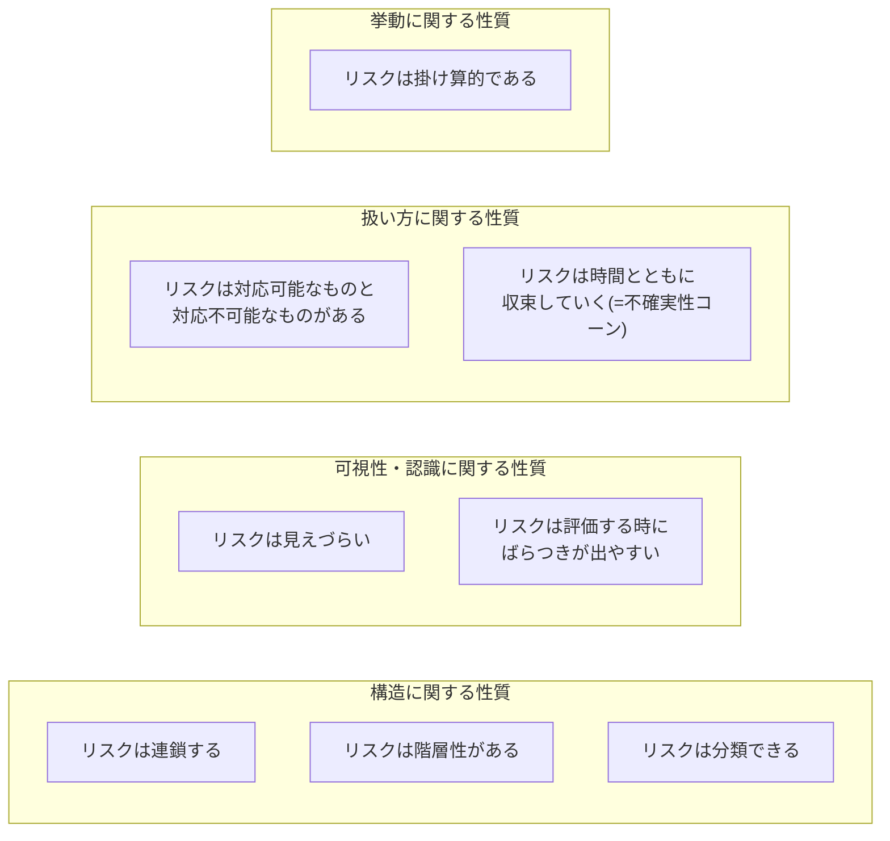

## リスクの構造に関する性質

リスクそのものの **構造や関係性** に着目した性質群です。

### リスクは連鎖する

リスクは **ドミノ倒し** のように連鎖しひとつの倒れが次々に別の倒れを誘発します。

リスクは単体で完結するとは限らず、あるリスクが原因となって、さらに別のリスクを引き起こすという **連鎖の性質** を持ちます。  
この点はIPAの資料[『ITプロジェクトのリスク予防への実践的アプローチ』](https://www.ipa.go.jp/archive/digital/iot-en-ci/hjuojm000000m6de-att/000026834.pdf)でも強調されておりリスクを **点** ではなく **つながり** として捉える視点が重要になります。

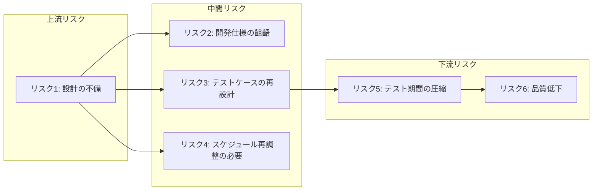

例えば上記の例では **設計の不備** というリスクが発端となり

- 「開発仕様の齟齬」
- 「テストケースの再設計」→「テスト期間の圧縮」→「品質低下」
- 「スケジュール再調整の必要」

といった複数のリスクを **芋づる式に引き起こす** 可能性があります。

このような連鎖は放置すると下流にいくほど影響が深刻化し修復が困難になる可能性があります。  
逆に言えば **上流のリスク（根本原因）を早期に発見・対処できれば後続リスクの発生そのものを予防できる** という利点もあります。

そのためにはリスク同士の因果関係を可視化し **連鎖の起点** を見極める視点が求められます。  
単なるリストアップに終わらず **リスク構造のマッピング** を意識することでより効果的なリスクマネジメントにつながります。

### リスクは階層性がある

リスクは **マトリョーシカのように、内側に潜む構造で現れる**。

表面的なリスクの背後には、より抽象的な根本原因が隠れていることが多く、また逆に、一つの大きなリスクが複数の具体的リスクを包含している場合もあります。  
このように、リスクは **階層構造を持つ性質** があり、異なる粒度・抽象度で複数のリスクが連なり合って存在します。

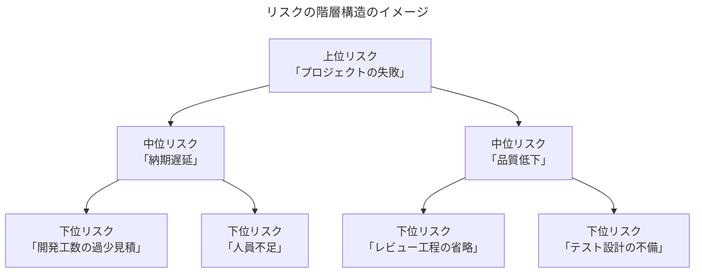

このように、一見すると「納期遅延」や「品質低下」といった中位のリスクも実際にはその下に具体的な要因（リスク）がぶら下がっており、またそれらが集まって「プロジェクト失敗」といった上位リスクを形成しています。

リスクを階層的に捉えることは、実践的なリスクマネジメントにおいて極めて重要です。なぜなら **上位レベルの抽象的なリスクだけを見ていると、その対処が曖昧になり実効性のある対応策に結びつきにくくなる** からです。

たとえば「品質が悪い」というリスクを挙げても、その原因や対策を掘り下げなければ、現場で何を改善すればよいのかは見えてきません。  
一方で、下位の具体的なリスクだけを洗い出していると、全体像を見誤る可能性があります。
「レビューが漏れた」「仕様の認識にズレがあった」といった細かなリスクは重要ですが、それが全体としてどのようなリスクに集約され、プロジェクト全体にどの程度の影響を与えるかを見失いがちです。

このように、上位から下位まで、リスクを多層的に捉える視点を持つことで **上位リスクには原因の深掘りと戦略的対策** を **下位リスクには具体的な改善策や再発防止策を講じる** といった、リスクマネジメントの精度と実効性を高めるアプローチが可能になります。

### リスクは分類できる

リスクは **名前を与えた瞬間、管理可能**になる。

分類によってリスクは 構造的に把握しやすくなり、**抜け漏れのない洗い出しや優先度付け** に役立ちます。  
分類方法にさまざまな考え方があります。さまざまな分類方法が存在するようにリスクは体系的に **分類可能な性質** を持っています。

IPAの資料によるのアプローチ例では

- [『ITプロジェクトのリスク予防への実践的アプローチ』](https://www.ipa.go.jp/archive/digital/iot-en-ci/hjuojm000000m6de-att/000026834.pdf) ではリスク（正確にはリスク事象ドライバー）を「主プロセス」「支援・管理プロセス」「組織的プロセス」の３領域に分類している
- [『ITプロジェクトの「見える化」 〜上流工程編〜』](https://www.ipa.go.jp/archive/publish/qv6pgp0000000xvu-att/000030719.pdf)ではPMBOKの「知識エリア」（第7版ではパフォーマンス領域と定義されています）に基づいて分類する「リスク分類表」が紹介されています。

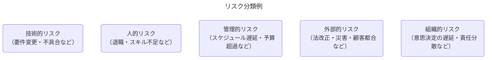

たとえば「納期遅延」というリスクが発生した場合、その背景には次のような **複合的なリスクの混在** があるかもしれません。

- 担当者の退職 -> 「人的リスク」
- 顧客からの仕様変更 -> 「外部的リスク」
- 管理工数の見積もり不足 -> 「管理的リスク」

このように分類しておくことで、次のような戦略的マネジメントが可能となります。

- 抜け漏れなくリスクを洗い出す
- 優先度や影響範囲ごとに対応を割り当てる
- 特定カテゴリに偏る傾向（弱点）を発見する

## リスクの挙動に関する性質

リスクがプロジェクトの中で **どのように振る舞い、影響を広げていくか** に関する性質群です。

### リスクは掛け算的である

リスクは **スパイス** のように、プロジェクト全体に **予測不能な風味（ゆらぎ）** を振りかけてくる。

リスクは単なる「イベント」ではなく、プロジェクト全体の所要時間や成果に対して **乗算的な影響** を与える要因です。  
たとえば、あるリスクが「作業を1.1倍に増やす」要因であり、それが複数積み重なると、プロジェクト全体に **掛け算でゆらぎが波及** します。  
このようにリスクはタスクのように「加算的」に積み上がるのではなく、プロジェクト全体の成果や所要時間に対して **乗算的に作用する性質** を持ちます。  
これは「ある工程が1.1倍になる」「次の工程が1.2倍になる」といった影響が **全体に累積される構造** を意味し、結果的に **プロジェクト全体を1.32倍（=1.1×1.2）に押し広げる** ような波及効果を持ちます。


参照: [エンジニアリングマネージャーのロードマップ エンジニアリングマネジメントの4次元と生成AI時代の戦い方 スライド27](https://hirokidaichi.github.io/presentation/emconf.html#27)

**乗算的に作用する性質** により、プロジェクト全体の成果や工数は想定の範囲を超えて **大きく膨らむ可能性を孕んだ分布（ロングテール構造）** を持ちます。  
これは「平均的な見積もり」だけではカバーしきれない、稀だが重大な遅延やコスト超過の可能性があることを意味しています。

[EM.FM Re.44 プロジェクトマネジメント：タスクから見るか、リスクから見るか](https://www.youtube.com/watch?v=o8Mfd2ougS4S4&t=445s) にて広木大地さんは、タスクとリスクの違いは次のように語っています。

<details><summary>Podcastでの該当部分の全文の抜粋</summary>

> タスク管理として、捉えるプロジェクトマネジメントをする場合、タスクって、どんどん足し算です。」  
> これが例えば、10ポイントのタスクと、10ポイントのタスク、5ポイントのタスクを全部足したら25ポイントだよね。だから25ポイント分のタスクだよね。  

> それぞれが完了する間の触れ幅がどんな分布であれ、タスクをつまみ食いしてたら足し算になっていって、足し算をずっと繰り返していくと中心極限定理で正規分布になるんですよね。  
> 元がどんな分布であっても、なのでタスク1個1個がどんな分布をしていても、それを引き取って全部足し算で捉えてる限り、それでプロジェクトを考えるとプロジェクトは綺麗な正規分布になるはずです。

> でも、そんなことないっていうのがポイントで、実はリスクっていうのは、プロジェクトの中の掛け算的性質を持っているものだっていう風に思ってます。  

> これがどうなるかで、全体のプロジェクトが10%増えるかもしれないし10%減るかもしれない。全体の5%遅れるかもしれないし5%早まるかもしれない。みたいな掛け算的な性質を持ってる要因っていうのがプロジェクトの中にはいくつかあって、そのプロジェクトの中の掛け算的要因のことを僕はリスクていう風に呼んでいます。

> この掛け算的要因がいっぱい足し合わせれていくとどんな分布になるかっていうと、対数正規分布って言われるような、裾野が後ろに長いロングテール的な形になった分布になります。  

</details>  

- タスクは「足し算」で進捗を積み上げる性質があり、たとえ各タスクの完了時間にバラつきがあっても、**数が多ければ全体は正規分布的に収束する**（中心極限定理）
- 一方リスクは、各所に「1.1倍になる」「5%遅れる」などの **掛け算的な増減要因** として現れる
- 掛け算的なリスクが多数重なると、全体として **ロングテール（対数正規分布）** のような分布になりやすく **平均的な予測では外れ値に対応できない**

プロジェクトマネジメントにおいては **「リスクを足し算で積み上げて評価すれば十分」といった常識** を一度疑ってみる必要があります。  
リスクが掛け算的にプロジェクト全体へ波及する構造を持つ以上 **「平均ではなく、外れ値にどう備えるか」** という視点で設計と判断を行うことが重要となります。

中心極限定理についてはこちらを参照してください。

- [中心極限定理の例とメリットを分かりやすく解説 ｜AVILEN](https://avilen.co.jp/personal/knowledge-article/central-limit-theorem/)

## リスクの可視性・認識に関する性質

リスクが **どのように見えにくいのか、どう扱われやすいか** に関する性質群です。

### リスクは見えづらい

リスクは **地中に埋まった地雷** のように、発見されにくく、気づいたときにはすでに被害が出ています。

リスクは常に表面化しているとは限らず、潜在的に存在しているにもかかわらず **見落とされやすい性質** を持っています。
特に初期段階や問題が発生する前の状況では「問題がないように見える」ために軽視されたり、明文化されずに放置されるケースが多く見受けられます。

このように、リスクは **見落とされやすい性質** を持ち、プロジェクトの進行や変化の中で顕在化していく傾向があります。

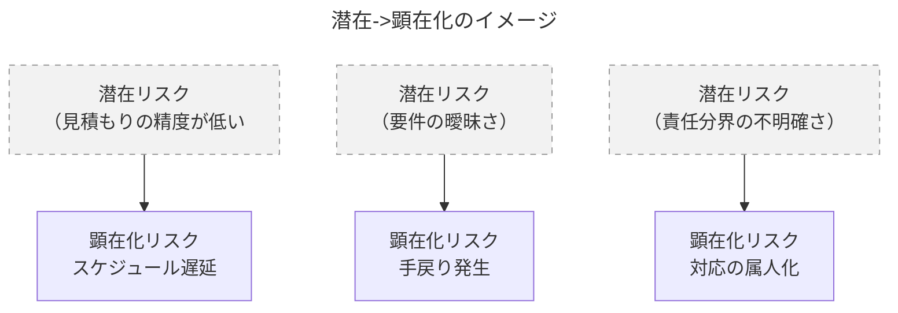

たとえば以下のようなケースが「見えづらいリスク」として典型的です。

- 不確かな要件定義 → 開発後に仕様の食い違いが発覚
- メンバー間の役割認識のズレ → 不要な作業の重複や抜け漏れ
- 関係者の温度差 → 意思決定の遅延や方針転換による影響拡大

これらは「今は問題なさそう」に見えるため、リスクと認識されないまま進行してしまう危うさを含んでいます。

この「リスクは見えづらい」ということを理解しておくことで、以下のような実践的アプローチが可能になります。

- リスクの兆候（シグナル）を拾う感度を高める
- 「まだ起きていない課題」にも耳を傾ける文化をつくる
- レビューやチェックリストで潜在リスクを可視化する
- 形式だけでなく実質的な「リスク会話」をチーム内で持つ

リスクは見えづらい。だからこそ、意識的に可視化・共有する努力がリスクマネジメントには求められます。

### リスクは評価する時にばらつきが出やすい

リスクは **万華鏡** のように、見る人の視点や角度によって見え方がまったく変わります。

リスクの評価は **「誰が」「いつ」「どの立場」で見るかによって結果が大きく異なる** という特徴があります。  
たとえば同じリスクに対して、開発者は「技術的な困難性」を重視し、マネージャーは「工数への影響」を重視するかもしれません。

このように、リスクは評価に主観が入りやすく **ばらつきが生じる性質** を持っています。

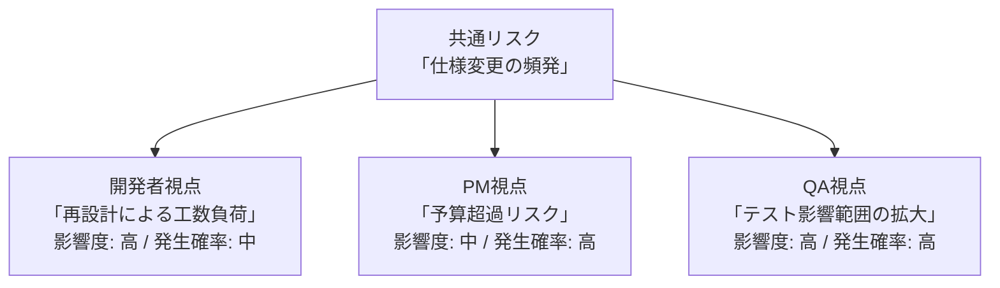

このように、同じリスクであっても評価者の立場により「影響度」や「発生可能性」の評価に大きな差異が生まれます。

この評価に **「ばらつきが生じる性質」** を理解しておくことで、以下のような具体的対応が可能になります。

- 共通の評価軸（スケール）を設ける
    - 例：影響度は「コスト」「品質」「納期」の3軸で評価する
- 関係者の主観を可視化する
    - 複数メンバーでのリスクレビューを通じ、評価のばらつきを認識・調整する
- 評価を一元化せず「複数視点」で残す
    - 評価者のロールごとのコメントを明示して記録する

この性質を踏まえたうえで、チームとして統一感のあるリスク評価を行うための仕組みづくりが不可欠です。  
ばらつくことを前提に見える化し、合意形成を通じて共通理解に収束させていくのが効果的なリスクマネジメントの第一歩です。

## リスクの扱い方に関する性質

リスクを **どうマネジメントし対策・戦略を立てるか** に関する性質群です。

### リスクは対応可能なものと対応不可能なものがある

すべてのリスクは救えない。だからこそ **見極め** が命を分ける。

リスク対応は **有限なリソース（人・時間・コスト）をどう配分し「どのリスクに向き合うか」を判断すること**にあります。  
たとえば 為替変動や自然災害のように、組織の努力では回避が難しいリスクも存在します。このように、リスクは **対応可能性によって整理できる性質** を持ちます。

PMBOKでは、こうした対応が困難なリスク”に対して取るべき戦略として **受容** が定義されています。  
これは、積極的にコントロールできないリスクに対し、事前の備えや発生時対応に集中する方針です。

> **受容** 脅威の受容では、脅威の存在を認めるが、いかなる積極的な行動も計画されない。リスクの受容には、イベントが発生した時に発動するコンティンジェンシー計画の作成が含まれる能動的受容、及び事前には何もしないという受動的受容が含まれる。

参照: [プロジェクトマネジメント知識体系ガイド（PMBOKガイド）第7版＋プロジェクトマネジメント標準](https://www.pmi-japan.shop/shopdetail/000000000028/) 2.8.5.1 脅威 より抜粋

このような視点でリスクを分類すると、以下のように整理できます。

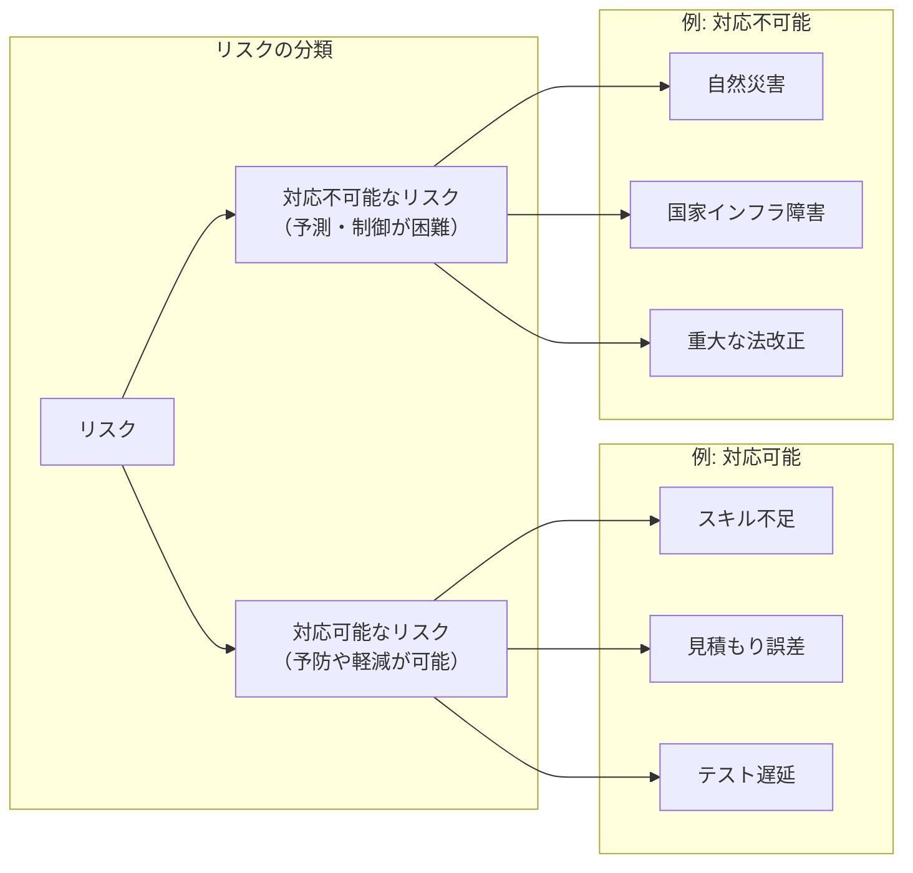

たとえば「納期遅延」というリスクが発生した場合

- スキル不足 → 対応可能（教育やリソースの再配分）
- 災害による出社不可 → 対応不可能（BCPなどの受容策が重要）

このように **対応可能かどうかでリスクを分類しておくと、次のようなメリット** があります。

- 優先的に対処すべきリスクを明確にできる
- 対応困難なリスクに対しては、受容・回復計画（BCP）を設けられる
- 対応可能なリスクへの対策集中により、実効性の高いリスクマネジメントが可能になる

すべてのリスクに備えるのではなく「対応できるかどうか」でリスクを見極め、戦略的にリスクに向き合うことが重要です。

BCP（事業継続計画）についてはこちらを参照してください。

- [1.1 BCP（事業継続計画）とは](https://www.chusho.meti.go.jp/bcp/contents/level_c/bcpgl_01_1.html)

### リスクは時間とともに収束していく(=不確実性コーン)

リスクは霧のようなもの。**時間とともに** 晴れていく。

プロジェクトの初期段階では情報が限られており、リスクや見積もりの不確実性が最も高くなります。  
逆にプロジェクトが進行していくことで不確実性が減少していきます。このようにリスクは時間の経過とともに不確実性が減少するという **収束の性質** を持ちます。

この「時間とともに不確実性が収束する」現象はソフトウェア見積もりの分野では「不確実性コーン（Cone of Uncertainty）」というモデルで知られています。  

  
[参照: プロジェクトの本質とはなにか | 日経クロステック（xTECH）](https://xtech.nikkei.com/it/article/COLUMN/20131001/508039/zu01_s.jpg?__scale=w:500,h:325&_sh=03d02a0d80)

「不確実性コーン（Cone of Uncertainty）」とはプロジェクトの初期には見積もりの誤差幅が大きく、進行とともにその幅が狭まっていくことを示すモデルです。

つまりプロジェクトの進行とともに情報が蓄積されリスクの不確実性は徐々に減少していく。  
これが「時間とともに収束していく」というリスクの性質です。

PMBOKではこの現象を **段階的詳細化** と呼び、得られる情報の増加に応じて計画や見積もりの精度を高めていく **反復的な取り組み** として位置づけています。

> **段階的詳細化** 得られる情報が増え、より正確な見積もりが可能になるにつれ、プロジェクトマネジメント計画書をより詳細化していく反復プロセス。  

参照: [プロジェクトマネジメント知識体系ガイド（PMBOKガイド）第7版＋プロジェクトマネジメント標準](https://www.pmi-japan.shop/shopdetail/000000000028/) 2.8.2 曖昧さ より抜粋

> 段階的詳細化を使って計画を練り直し続ける。また、脅威や好機が顕在化すると、計画も更新される。  

参照: [プロジェクトマネジメント知識体系ガイド（PMBOKガイド）第7版＋プロジェクトマネジメント標準](https://www.pmi-japan.shop/shopdetail/000000000028/) 2.3.7 他のパフォーマンス領域との相互作用 より抜粋

## リスクの性質から洞察するとリスクは「構造」で捉えられる

これまで整理してきたように、リスクには次のような多面的な性質があります。

| リスクの性質                                        | 意味する構造的観点                 |
|:----------------------------------------------------|:-----------------------------------|
| リスクは **連鎖する**                               | 因果関係による構造                 |
| リスクは **時間とともに収束していく**               | プロジェクト進行との相互関係       |
| リスクは **分類できる**                             | カテゴリによるマッピング可能な構造 |
| リスクは **対応可能なものと対応不可能なものがある** | 対応戦略と資源配分に基づく構造     |
| リスクは **階層性がある**                           | 抽象度・粒度の違いによる階層構造   |
| リスクは **見えづらい**                             | 可視化・観測の困難さ（潜在性）     |
| リスクは **評価する時にばらつきが出やすい**         | 主観・コンテキスト依存の曖昧性     |
| リスクは **掛け算的である**                         | 全体影響が乗算的に累積する波及構造 |

これらの性質を見渡すと、リスクは単なる「点」や「リスト」ではなく、構造的・網状的に捉えるべき対象であることが分かります。  
構造として捉えることで、リスクの **発生要因、影響範囲、対応戦略** を整理でき、マネジメントの精度も格段に向上します。

### 標準リスクモデルが示す「構造としてのリスク」

こうしたリスクの構造的な捉え方を形式的に表現したのが **標準リスクモデル** です。  
これは古典的ですが本質を突いたモデルで、以下のように **リスクは構成要素と因果関係のネットワークとして整理される** ことを示しています。

※ **標準リスクモデル** はリスクを構造的に扱うためのフレームワークの１つです。


> 事実がリスクの尤度を決定する。  
> リスク事象のドライバーがリスク事象に影響を与え、影響のドライバーが影響と総損失量に影響を与える。  

出典: [プレストン・G・スミス、ガイ・M・メリット（澤田美樹子訳）『実践・リスクマネジメント ―製品開発の不確実性をコントロールする５つのステップ―』](https://bookstore.jpc-net.jp/detail/books/goods002016.html) 図5-2 より抜粋

| 構成要素               | 説明                                                                                                                                                                                                                                            |
|:-----------------------|:------------------------------------------------------------------------------------------------------------------------------------------------------------------------------------------------------------------------------------------------|
| リスク事象             | 損失を引き起こす事象そのもの                                                                                                                                                                                                                    |
| リスク事象のドライバー | リスクの発生を引き起こす背景的要因（例: スキル不足）<br> サンプルは [『ITプロジェクトのリスク予防への実践的アプローチ』](https://www.ipa.go.jp/archive/digital/iot-en-ci/hjuojm000000m6de-att/000026834.pdf) の第２部(資料編)にまとまっています |
| リスク事象の発生確率   | そのリスクが実際に発生する確率（尤度）                                                                                                                                                                                                          |
| 影響                   | リスクが実現したときの影響（例: 品質低下）                                                                                                                                                                                                      |
| 影響のドライバー       | 影響の大きさに影響する要因（例: テスト省略）                                                                                                                                                                                                    |
| 影響の発生確率         | 影響が実際に起きる確率                                                                                                                                                                                                                          |
| 総損失量               | リスクが発生したときの最終的な被害（例: 顧客クレームや再開発コスト）                                                                                                                                                                            |

このモデルの要点は、リスクを単なる「発生するか／しないか」ではなく **背景要因（ドライバー）・発生確率・影響・損失まで含めて因果関係で構造的に捉える** ということにあります。

尤度（ゆうど）についてはこちらを参照してください。

- [【統計学】尤度って何？をグラフィカルに説明してみる。 #Python - Qiita](https://qiita.com/kenmatsu4/items/b28d1b3b3d291d0cc698)

### 構造で捉えることで「変えられるリスク」が見える

このモデルの本質的な価値は **「構造を見抜けば、変えられるリスクがわかる」** ことにあります。

- **発生確率が高いリスク** → リスク事象ドライバーを調整すれば、発生可能性を下げられる
- **影響が深刻なリスク** → 影響ドライバーを調整することで、被害の範囲を狭められる
- **予防できないリスク** → 発生後の損失量を抑えるように対策を組む

つまり、リスクを構造として捉えることは、「リスクを変えられるものにする」ための第一歩となります。

### 標準リスクモデルとリスクの性質の関係について

標準リスクモデルとリスクの性質をそれぞれ対応表としてまとめたものが以下です。

| リスクの性質                                   | 標準リスクモデルにおける該当要素                                             |
|:-----------------------------------------------|:-----------------------------------------------------------------------------|
| リスクは連鎖する                               | リスク事象 → 影響 → 総損失量（因果関係）                                   |
| リスクは階層性がある                           | ドライバー → リスク事象・影響（抽象度・粒度の違い）                         |
| リスクは見えづらい                             | 潜在的なドライバーの存在、可視化困難な因果構造                               |
| リスクは評価にばらつきがある                   | 発生確率・影響度・ドライバーへの主観的判断                                   |
| リスクは対応可能なものと対応不可能なものがある | ドライバーへの制御可能性、戦略の選択                                         |
| リスクは分類できる                             | リスク事象・ドライバーなどをカテゴリごとに整理が可能                         |
| リスクは時間とともに収束していく               | 時間経過での情報更新により発生確率が変化しうる                               |
| リスクは掛け算的である                         | 影響 → 総損失量 の関係における「伝播の構造」および 影響ドライバーによる増幅 |

この表を見ることでリスクの性質ごとに「見るべき場所」「働きかけられる箇所」が明確になり、感覚的なリスク認識を構造的・分析的に取り扱えるようになります。

### すべてを構造で捉える必要はない。必要に応じて使い分ける

標準リスクモデルはリスクを「構造」として理解するためのフレームワークですが **常にすべてのリスクを構造化する必要があるわけではありません**。  
むしろ、構造的に扱った方がよいリスクと、直感的・経験則で対応できるリスクを **使い分ける視点** が重要です。

このモデルを「すべてに適用すべき正解」として捉えるのではなく **複雑さ・不確実性・影響度が高いリスクに対して、構造的な思考を導入するためのレンズ** として柔軟に活用することが、本質的なリスクマネジメントにつながります。

#### 結局どういうユースケースの時にリスクを構造として捉えるべきか？

どのような時にリスクを構造として捉えるべきかの適用シーンをまとめています。

| 適用シーン                                             | 説明                                                                                                                              |
|:-------------------------------------------------------| ----------------------------------------------------------------------------------------------------------------------------------|
| **リスクが複雑に連鎖しているとき**                     | 例: 1つの遅延が他の複数の工程に波及するような場合。<br>因果関係を構造として可視化する必要がある。                                 |
| **損失が大きくなりうる重大リスクの対応時**             | 例: 品質問題による再設計コストや顧客損害など、最終的な損失が大きくなる懸念があるとき。<br>影響ドライバーまで追いかける必要がある。|
| **リスクの発生確率や影響がチーム内で分かれているとき** | 認識にバラつきがあるときは、構造化して認識を揃える必要がある。<br>ドライバーごとに意見を出しやすくなる。                          |
| **対応方針を検討しても「打ち手が見えない」とき**       | どこをどう変えればリスクが下がるのか分からないとき、モデルを使うと「働きかける対象（ドライバー）」が見える。                      |
| **リスクレビューや説明責任が求められる場面**           | ステークホルダーや経営層へリスク説明をする際に、構造的に因果を説明できると説得力がある。                                          |


# リスクの代表的な分類を知る

リスクの性質を理解したうえで、次に重要なのは **どんなリスクがあるのか？** を知ることです。

プロジェクトにおけるリスクは千差万別ですが、まずは代表的なカテゴリを押さえることで、全体を俯瞰しやすくなります。  
ここでは、Asanaが紹介する[「7 つの一般的なプロジェクトリスクとその防止策」](https://asana.com/ja/resources/project-risks)、[「リスク登録簿とは？プロジェクトマネージャー向けガイド (実例付)」](https://asana.com/ja/resources/risk-register)）をベースによく挙げられる具体例も併せて紹介します。

## 7つの代表的なプロジェクトリスク

Asanaが紹介する[「7 つの一般的なプロジェクトリスクとその防止策」](https://asana.com/ja/resources/project-risks)では結果をベースに整理されていますがこちらでは一部、原因をベースにカテゴライズしています。  
そのためAsanaの整理とは微妙に違いが出ております。

| カテゴリ               | 概要                                             | 代表的な具体例（リスク登録簿より）                                     |
|:-----------------------|:-------------------------------------------------|:-----------------------------------------------------------------------|
| **スコープリスク**     | 要件やゴールが途中で変更され、計画が崩れるリスク<br>Asanaの資料では [スコープクリープ](https://asana.com/ja/resources/what-is-scope-creep), [明確性の欠如](https://asana.com/ja/resources/project-risks#7-%E6%98%8E%E7%A2%BA%E6%80%A7%E3%81%AE%E6%AC%A0%E5%A6%82) に該当する                                                      | ・機能追加により仕様が頻繁に変わる<br>・ステークホルダー間の要件不一致 |
| **スケジュールリスク** | 納期遅延や工程ズレによるプロジェクトの遅れ<br>Asanaの資料では [プロジェクトスケジュールリスク](https://asana.com/ja/resources/project-risks#4-%E6%99%82%E9%96%93%E4%B8%8D%E8%B6%B3) に該当する                                                                                                                                    | ・レビュー待ちで進捗が止まる<br>・意思決定が遅れる                     |
| **コストリスク**       | 予算超過・コスト見積もりミスによる影響<br>Asanaの資料では [コストのリスク](https://asana.com/ja/resources/project-risks#3-%E9%AB%98%E3%82%B3%E3%82%B9%E3%83%88) に該当する                                                                                                                                                        | ・外注費が想定より高騰<br>・契約条件の見落としによる追加請求           |
| **リソースリスク**     | 人材や設備が足りずプロジェクトに支障が出るリスク<br>Asanaの資料では [リソースのリスク](https://asana.com/ja/resources/project-risks#5-%E3%83%AA%E3%82%BD%E3%83%BC%E3%82%B9%E4%B8%8D%E8%B6%B3), [業務上のリスク](https://asana.com/ja/resources/project-risks#6-%E6%A5%AD%E5%8B%99%E4%B8%8A%E3%81%AE%E5%A4%89%E6%9B%B4) に該当する | ・キーパーソンが離脱予定<br>・テスト環境が不足している                 |
| **技術リスク**         | 技術的な不確実性や障害に起因するリスク                                                                                                                                                                                                                                                                                            | ・新技術の採用による習熟不足<br>・既存システムとの統合が困難           |
| **品質リスク**         | 品質基準が満たされない、再作業が発生する可能性<br>Asanaの資料では [パフォーマンスリスク](https://asana.com/ja/resources/project-risks#2-%E4%BD%8E%E3%83%91%E3%83%95%E3%82%A9%E3%83%BC%E3%83%9E%E3%83%B3%E3%82%B9) に該当する                                                                                                      | ・テスト工数の圧縮による品質低下<br>・仕様理解のずれにより再修正       |
| **外部リスク**         | 自チームの外部に起因する、制御困難なリスク<br>Asanaの資料では [業務上のリスク](https://asana.com/ja/resources/project-risks#6-%E6%A5%AD%E5%8B%99%E4%B8%8A%E3%81%AE%E5%A4%89%E6%9B%B4) に該当する                                                                                                                                  | ・法改正による影響<br>・取引先企業のスケジュール変更                   |

※Asanaの分類では「技術リスク」という項目は明示されていませんが、実務上はスケジュール遅延やパフォーマンス低下の背景に技術的課題が存在することが多いため独立して扱っています。

## なぜ分類が重要なのか？

リスクを分類する目的は、「抜け漏れなく洗い出す」ことだけではありません。  
**分類ごとに異なる対応方針が求められる** ため「リスク登録簿」や「対応優先順位」を整理するうえでも重要です。

- 技術リスク → 技術選定やPoCを早期に進めて軽減
- 外部リスク → 契約や調整、早期通知体制で移転・回避
- スケジュールリスク → マイルストーンの明確化やバッファ設計で対応

このように、「分類 × 具体例」で捉えることで、単なる抽象的なリストではなく **チームで共有・議論できる実践的な視点** に変えることができます。  
リスクを分類しておくことで、チーム内での共通言語としての整理が可能になり、「これはスケジュールリスク？それとも技術リスク？」といった議論も建設的になります。

こうしたリスクの分類を踏まえつつ、実際にどのようにリスクを洗い出していくべきなのか？  
次のセクションでは、**チームでの洗い出しに役立つ、実践的なリスク発見手法** を紹介します。

# リスク洗い出し手法を学ぶ

プロジェクトに潜むリスクを管理するためには、まず「そもそも何がリスクになり得るのか？」を洗い出すことが第一歩です。  
ここでは、リスクを発見・顕在化するための代表的な手法を紹介します。

## リスクの洗い出し手法の使い分け早見表

代表的な洗い出し手法の早見表です。

| 手法名                                                                                       | 適したアプローチ                         | 使うときの意図                                                           |
|:---------------------------------------------------------------------------------------------|:-----------------------------------------|:-------------------------------------------------------------------------|
| [プレモーテム](#プレモーテム)                                                                | 仮想未来から逆算する                     | プロジェクトが失敗した未来を想定し、「今どこにリスクがあったか？」を探る |
| [象・死んだ魚・嘔吐](#象死んだ魚嘔吐)                                                        | 感情的・非言語的な懸念を引き出す         | 言いにくいこと、過去のしこり、言語化されていない懸念を可視化する         |
| [RBS（リスク・ブレーク・ダウンストラクチャ）](#rbsリスクブレークダウンストラクチャ)          | リスクカテゴリごとに着実に拾っていく     | 抜け漏れなく、全体をカテゴリでカバーする                                 |
| [フォルトツリー解析（FTA: Fault Tree Analysis）](#フォルトツリー解析fta-fault-tree-analysis) | リスクの起因や連鎖の可能性をたどって探る | 発生しそうなリスクの「原因のさらに奥」にある潜在リスクを探り出す         |
| [IPAリスク事象ドライバー一覧](#ipaのリスク事象ドライバー一覧を活用する)                      | チェックリストで発想を補助しながら拾う   | 「こういうのもあるかも」と気づくための発想起点として活用                 |

## どの手法を選ぶ？リスク洗い出しチャート

リスクの洗い出しチャートです。こちらを元にどの手法を使って洗い出していくべきか検討することができます。

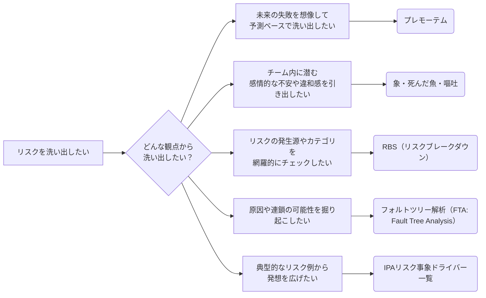

## プレモーテム

**未来の失敗を想像して、予測ベースでリスクを洗い出す**


プレモーテム（事前分析）は、プロジェクト開始前に **「このプロジェクトは失敗した」と仮定し、なぜそうなったのか？** を逆算で考える手法です。  
チーム全員で「失敗の原因」を洗い出すことで、将来起こり得るリスクを感情や直感も交えて多角的に発見することができます。

| 項目           | 内容                                                                                                                               |
|:---------------|:-----------------------------------------------------------------------------------------------------------------------------------|
| **目的**       | チームの想像力を活かし、プロジェクト初期に潜在的なリスクを洗い出す                                                                 |
| **実施の流れ** | ・プロジェクトが失敗したという前提を共有する<br>・その原因をブレスト形式で出し合う<br>・出てきた内容を「リスク候補」として整理する |
| **効果**       | 言語化されていない不安や直感的な懸念を表面化し、リスク登録簿に反映できる                                                           |

一言で言えば **「タイムマシンに乗って未来にダイブする」** 感覚で未来を疑似体験し、今すべき備えを見つける手法です。  

プレモーテムに関しては Asana や Atlassian でも紹介されています。

- [終わりを意識して始める: プロジェクトのプレモーテムを行う方法 [2025] • Asana](https://asana.com/ja/resources/premortem)
- [事前分析演習の実行方法 [テンプレート付き] | Atlassian](https://www.atlassian.com/ja/team-playbook/plays/pre-mortem)

## RBS（リスク・ブレーク・ダウンストラクチャ）

**カテゴリから体系的にリスクを洗い出す構造的アプローチ**

RBSは、リスクを階層構造（ブレークダウン構造）で整理しながら、カテゴリ別に網羅的にリスクを洗い出していく手法です。  
WBS（Work Breakdown Structure）のように、**構造を分解していくことで、見落としを防ぎ、体系的な発見が可能**になります。

| 項目           | 内容                                                                                                                                 |
|:---------------|:-------------------------------------------------------------------------------------------------------------------------------------|
| **目的**       | プロジェクトに潜むリスクをカテゴリ別に構造的に洗い出し、抜け漏れを防止する                                                           |
| **実施の流れ** | ・あらかじめ用意されたリスクカテゴリ（例：技術、リソース、品質など）を参照する<br>・カテゴリごとに具体的なリスク事象を洗い出していく |
| **効果**       | 抜け漏れを防ぎ、リスクを体系的に整理できる。カテゴリごとの傾向把握や、対応策立案の優先順位付けにも役立つ                             |

このようにRBSは、「構造で考える」ことで洗い出しの精度と網羅性を高める手法です。  
他の感覚的・直感的アプローチ（プリモーテムなど）と組み合わせて使うことで、より多面的なリスクの抽出が可能になります。

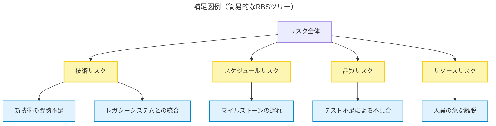

このようにRBSは、「構造で考える」ことで洗い出しの精度と網羅性を高める手法です。  
他の感覚的・直感的アプローチ（プリモーテムなど）と **組み合わせて使う** ことで、より多面的なリスクの抽出が可能になります。

参考にすると良いサイト

- [「リスクマネジメント・ツールボックス (4)」](https://www.pmaj.or.jp/online/1101/message4.html)
- [「リスクマネジメント・ツールボックス (5)」](https://www.pmaj.or.jp/online/1102/message4.html)
- [RBS（Risk Breakdown Structure）とは？ - 2025](https://saycon.co.jp/archives/neta/rbs%EF%BC%88risk-breakdown-structure%EF%BC%89%E3%81%A8%E3%81%AF%EF%BC%9F)

PMBOK でも以下のように紹介されています。

> リスク・ブレークダウン・ストラクチャー（RBS） (Risk Breakdown Structure (RBS))　潜在的リスク源の階層表示。  

参照: [プロジェクトマネジメント知識体系ガイド（PMBOKガイド）第7版＋プロジェクトマネジメント標準](https://www.pmi-japan.shop/shopdetail/000000000028/) 用語集 3.定義 より抜粋

## フォルトツリー解析（FTA: Fault Tree Analysis）

**リスクを原因の連なりとして構造化する可視化アプローチ**

フォルトツリー解析（FTA：Fault Tree Analysis）は、 **あるリスク（障害や失敗）がなぜ起こるのか？をツリー構造で原因ごとに掘り下げていく分析手法** です。  
上から下に向かって「なぜ？」を繰り返し、**複合的なリスクの因果関係や連鎖** を可視化することで、本質的なリスクの洗い出しや対応策の特定に役立ちます。

| 項目           | 内容                                                                                                                                                                           |
|:---------------|:-------------------------------------------------------------------------------------------------------------------------------------------------------------------------------|
| **目的**       | リスクの背後にある複数の原因・要因を構造的に明らかにする                                                                                                                       |
| **実施の流れ** | ・トップに分析対象となる「リスク（障害）」を置く<br>・「なぜそれが起こるのか？」をブレストし、下に原因を展開<br>・原因がさらに別の原因に起因する場合はツリー状に深掘りしていく |
| **効果**       | リスクの連鎖や根本原因を見える化でき、断ち切るための有効な対策ポイントが見えてくる                                                                                             |

このように、フォルトツリー解析のアプローチは **「原因を因果構造として可視化する」** 洗い出し手法です。  
カテゴリで広く拾うRBSとは異なり、**一つひとつのリスクを深掘りして因果構造を明らかにする** という点でRBSと一緒に使うことでお互いの欠けている部分を補って使えます。

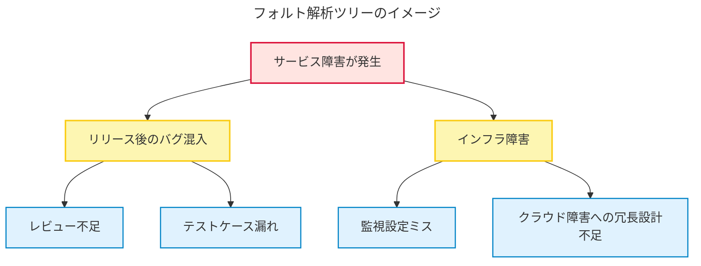

参考にすると良いサイト

- [土木研究センター 用語解説](https://www.pwrc.or.jp/yougo_g/pdf_g/y1308-P054-054.pdf)
- [フォルトツリー解析 - Wikipedia](https://ja.wikipedia.org/wiki/%E3%83%95%E3%82%A9%E3%83%AB%E3%83%88%E3%83%84%E3%83%AA%E3%83%BC%E8%A7%A3%E6%9E%90)

## 象・死んだ魚・嘔吐

**チームの感情・暗黙知から課題やリスクを引き出す対話型アプローチ**

一般に「象・死んだ魚・嘔吐」は振り返りの文脈で使われる手法ですが、チームが抱える暗黙的な違和感や懸念を掘り起こす点で、リスクや課題の洗い出しにも効果的です。

「象・死んだ魚・嘔吐」は、**チームメンバーの中にある「言いづらさ」や「違和感」といった感情的・非言語的な懸念を課題やリスクとして顕在化する** ことを目的としたワークショップ手法です。  
形式的なチェックリストや構造的な分析では拾いにくい、**現場特有の空気に潜む課題やリスク** を可視化するのに効果的です。

| 項目           | 内容                                                                                                                                        |
|:---------------|:--------------------------------------------------------------------------------------------------------------------------------------------|
| **目的**       | チームメンバーが抱える **暗黙的な不安・未解決の問題・感情的な懸念** を表面化し、課題やリスク候補として整理する                                    |
| **実施の流れ** | ・3つのカテゴリ「象」「死んだ魚」「嘔吐」を使って対話を促進<br>・自由記述や付箋ワークで話題を収集<br>・話題を課題やリスク候補として整理・分類する |
| **効果**       | 形式的なレビューでは見えない **心理的・文化的な課題やリスク** を拾うことができる。<br>チームの信頼関係や心理的安全性の向上にもつながる            |

このように「象・死んだ魚・嘔吐」は **感覚・雰囲気・感情** から拾い上げる直感的アプローチです。  
構造的なRBSや論理的なFTAと組み合わせることで、**形式と感覚の両面からリスクを網羅的に抽出**できます。

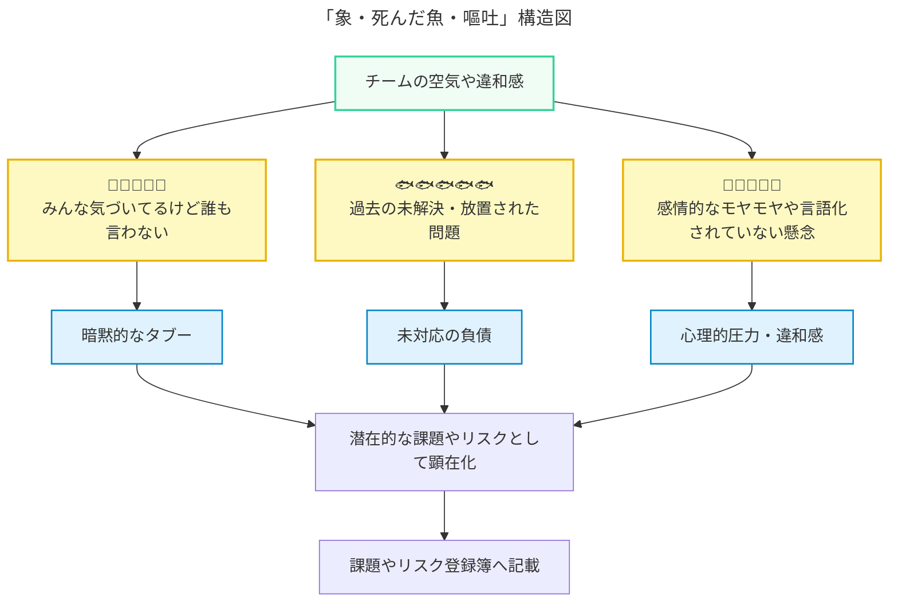

「象」「死んだ魚」「嘔吐」にはそれぞれ以下のような意味があります。

| 項目         | 意味                                                                         | 例                                                                   |
|:-------------|:-----------------------------------------------------------------------------|:---------------------------------------------------------------------|
| **象**       | みんなが気づいているのに誰も口にしない「チーム内のタブー」                   | 「プロダクトオーナーがよく仕様を変えるけど、誰も指摘できない」       |
| **死んだ魚** | 過去に起きた問題で、もう忘れ去られたり放置されたが、今なお影響している事象   | 「前回リリースのバグの振り返りが有耶無耶になったまま放置されている」 |
| **嘔吐**     | チームメンバーが感じているモヤモヤ・不満・違和感など、言語化されていない感情 | 「方針が二転三転してついていけない」「とにかく焦っていて怖い」       |

※もともとはチーム振り返りの手法ですが、「潜在的な課題の兆候」＝「将来起こりうるリスクの種」と捉えることで、リスクマネジメントにも応用できます。

参考にすると良いサイト

- [ふりかえり手法「象、死んだ魚、嘔吐」でチームの闇と向き合おう - Qiita](https://qiita.com/piyonakajima/items/ad3c44d1dc377e41d394)

## IPAのリスク事象ドライバー一覧を活用する

**チェックリストから網羅的に拾い上げるアプローチ**

リスク事象ドライバー一覧は、IPAの資料[『ITプロジェクトのリスク予防への実践的アプローチ』](https://www.ipa.go.jp/archive/digital/iot-en-ci/hjuojm000000m6de-att/000026834.pdf)を活用し、プロジェクトで起こり得るリスクを洗い出す手法です。  
網羅性の高いリストを **チェックリスト的に参照** することで **見落としていたリスクや発想の盲点を補う** ことができます。

| 項目           | 内容                                                                                                                                                                                                                                                             |
|:---------------|:--------------------------------------------------------------------------------------------------------------------------------------------------------------------------------------------------------------------------------------------------------|
| **目的**       | 既存の知見をベースに、想定外のリスクを見落とさずに拾い上げる                                                                                                                                                                                            |
| **実施の流れ** | ・IPAの資料[『ITプロジェクトのリスク予防への実践的アプローチ』](https://www.ipa.go.jp/archive/digital/iot-en-ci/hjuojm000000m6de-att/000026834.pdf)のリスク事象ドライバー一覧を活用<br>・自プロジェクトに該当する項目をチェックしながらリスクを洗い出す |
| **効果**       | 自力では発想が及ばないリスクもカバーできる。<br>過去事例や標準知見をもとに **網羅性・信頼性を高められる**。チームの経験差を補うのにも有効                                                                                                               |

このように、「リスク事象ドライバー一覧」は トップダウン型の発想支援ツールとして優れた補助になります。
プレモーテムや「像・死んだ魚・嘔吐」のようなボトムアップ型手法と組み合わせることで、 **主観と客観の両側からリスクを網羅的に抽出** できます。

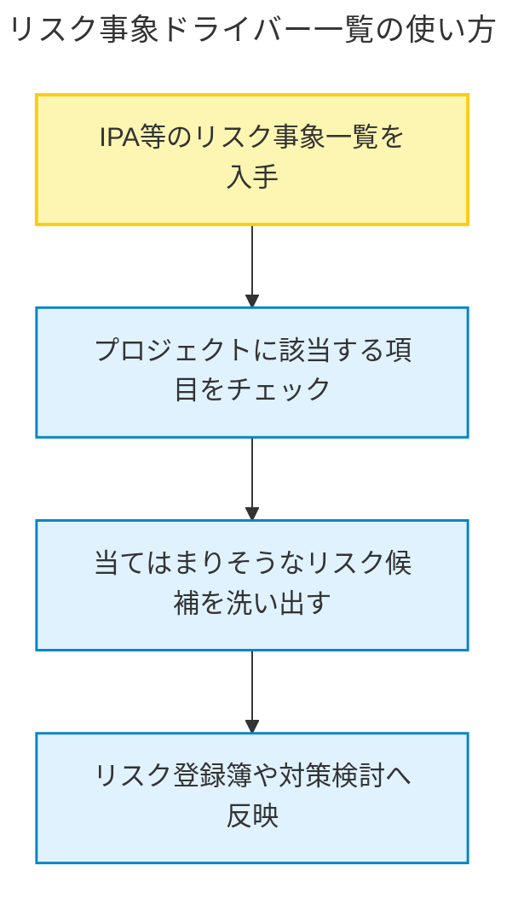

参考リンク

- [『ITプロジェクトのリスク予防への実践的アプローチ』](https://www.ipa.go.jp/archive/digital/iot-en-ci/hjuojm000000m6de-att/000026834.pdf) 第2部(資料編) を参照

# プロジェクトマネジメントにおける「リスク」の立ち位置は？

ここまで「リスクとは何か？」という定義からはじまり、その性質や分類、さらには具体的な洗い出し手法について確認してきました。  
この「リスク」という存在は、プロジェクトマネジメント全体の中でどのような意味を持ち、どのように位置づけられているのでしょうか？

こちらでは、プロジェクトマネジメントにおいて「リスク」がどのように位置づけられているのかを整理しています。

プロジェクトにおけるリスクへの対応は、単なる **トラブル対応** ではなく、成果を守り、価値を届けるための戦略的な活動です。これを実現する体系的なアプローチが **リスクマネジメント** です。

リスクマネジメントとは、プロジェクトに内在する不確実性（リスク）に対応し、成果物や目標に対する悪影響を最小化し、好機を最大化するための継続的な活動のことです。

リスクマネジメントは、プロジェクト成功のための **単なる補助的活動** ではなく、**体系的に位置づけられた中核的な活動** です。  
[プロジェクトマネジメント知識体系ガイド（PMBOKガイド）第7版＋プロジェクトマネジメント標準](https://www.pmi-japan.shop/shopdetail/000000000028/) では、プロジェクトマネジメントを支える枠組みとして以下の2つの視点を提示しており、リスクは **両方に明確に組み込まれています**。

- プロジェクトマネジメントの原理・原則
- プロジェクト・パフォーマンス領域

以下の図はそれらの構造と、リスクに関連する要素（強調部分）を示したものです。

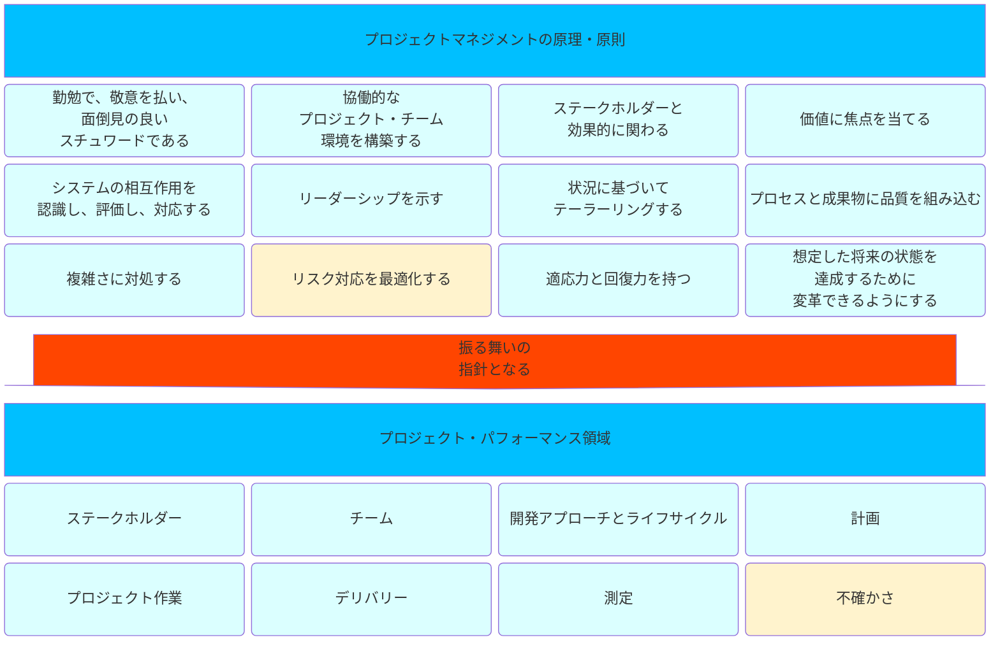
参照: [プロジェクトマネジメント知識体系ガイド（PMBOKガイド）第7版＋プロジェクトマネジメント標準](https://www.pmi-japan.shop/shopdetail/000000000028/) 図1-1. プロジェクトマネジメントの原理・原則とプロジェクト・パフォーマンス領域の関係

## プロジェクトマネジメントの原理・原則におけるリスクの位置付け

[プロジェクトマネジメント知識体系ガイド（PMBOKガイド）第7版＋プロジェクトマネジメント標準](https://www.pmi-japan.shop/shopdetail/000000000028/) において、プロジェクトマネジメントを導くための12の原理・原則が定められており、その中のひとつが以下です。

- **リスク対応を最適化する**

これは、リスクを脅威・好機の両面で捉え、プロジェクト成果に対する **ポジティブな影響を最大化し、ネガティブな影響を最小化する** ための行動が求められることを意味します。

> プロジェクトとその成果へのプラスの影響を最大限に高め、マイナスの影響を最小限に抑えるため、好機と脅威の両方のリスク・エクスポージャーを継続的に評価する。

参照: [プロジェクトマネジメント知識体系ガイド（PMBOKガイド）第7版＋プロジェクトマネジメント標準](https://www.pmi-japan.shop/shopdetail/000000000028/) 図3-11. リスク対応を最適化すること より抜粋

この原理は、**リスクへの対応は一度限りでなく、継続的に最適化すべき行為である** という考え方を示しています。

## プロジェクト・パフォーマンス領域

一方、パフォーマンス領域にもリスクに該当する領域があります。  
8つのパフォーマンス領域のひとつにあたるのが **不確かさ** です。

> 不確かさパフォーマンス領域は、リスクと不確かさに関連する活動と機能に対応する。

参照: [プロジェクトマネジメント知識体系ガイド（PMBOKガイド）第7版＋プロジェクトマネジメント標準](https://www.pmi-japan.shop/shopdetail/000000000028/) 図2-32. 不確かさパフォーマンス領域 より抜粋

この領域は、プロジェクトに内在する不確実性。つまりリスクをどう捉え、どう行動するかという **実践的な観点** を担っています。  
成果・納期・コスト・品質などの主要なマネジメント指標すべてが、**リスクとの向き合い方に左右されること**を示しているのです。

# リスクマネジメントにおけるプロセスは？

これまでに「リスクとは何か？」や「リスクをどう洗い出すか？」に加え、リスクがプロジェクト全体のパフォーマンスや価値にどう関わるのかを見てきました。

ここからは、**実務上どのようにリスクに向き合っていくか** を理解するために、リスクマネジメントの全体プロセスを紹介します。

## PMBOK で定義されているプロセス

PMBOK 第6版では、リスクマネジメントは以下のような **7つのプロセス** によって構成されています。

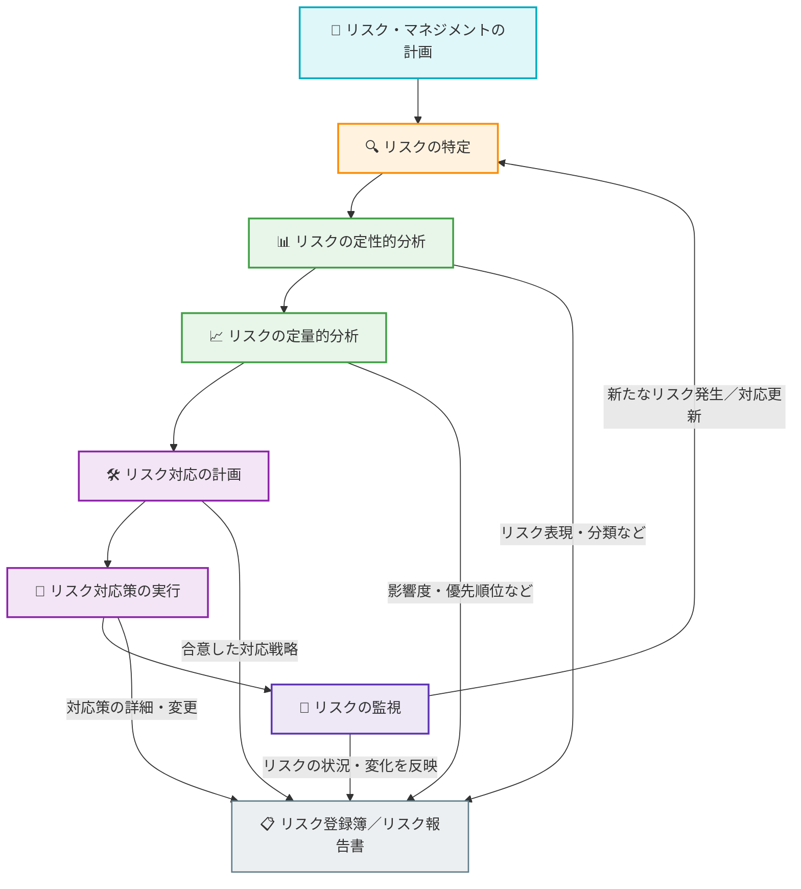

出典: [PMBOK ®ガイド第6版概要解説 - 日本プロジェクトマネジメント協会](https://www.pmaj.or.jp/sympo/2020/docs/2cgr/h_3.pdf) スライド26 より抜粋

## リスクマネジメントの全体像を5ステップで理解する

PMBOKでは7つのプロセスに細分化されていますが、実務上は次の5つの大きな流れで把握するのが分かりやすく、扱いやすいです。

※ 一般的に「管理」はプロセス前半（計画〜分析）を、「運用」は後半（対応〜監視）を指します。

| ステップ   | PMBOKにおけるステップ                    | 管理 or 運用 |説明                                            |
|:----------:|:-----------------------------------------|:------------:|:-----------------------------------------------|
|計画        | リスクマネジメントの計画                 | 管理         | リスクをどう扱っていくかの方針・ルールを決める |
|特定        | リスクの特定                             | 管理         | どんなリスクがあるかを洗い出す                 |
|分析（評価）| リスクの定性的分析, リスクの定量的分析   | 管理         | リスクの深刻度や影響を見積もる（定性・定量）   |
|対応        | リスクの対応の計画, リスクの対応策の実行 | 運用         | 対策を立てて実行する                           |
|監視        | リスクの監視                             | 運用         | 状況を継続的に追いかけ、変化があれば見直す     |

この5ステップは、それぞれが独立しているわけではなく **「管理」と「運用」が役割を分担しながら、プロジェクトを取り巻く不確実性に対処する流れ** を構成しています。  
特に、計画〜分析までは「整える力（管理）」、対応〜監視は「動かす力（運用）」と捉えると、チーム内の責任分担やプロセス設計も明確になります。

Asanaの資料ではPMBOKとは違ったリスクマネジメントのステップが紹介されています。内容としてはかなり似通っています。

- [リスクマネジメントの基本と 6 つのステップを徹底解説 [2025] • Asana](https://asana.com/ja/resources/project-risk-management-process)

# リスクをどのように管理するか

リスクマネジメントにおけるプロセスの中の計画、特定、分析（評価）がリスクの管理フェーズにあたります。

リスクの管理フェーズ」において、**具体的にリスクマネジメントをどのように計画し、どのように優先順位をつけ、どのように対応方針を決めていくのか**を詳しくみていきます。

## リスクマネジメントの計画

リスクを管理するためにそもそもリスクマネジメントとしてどういった管理をしていくのか計画を立てる必要があります。  
リスクマネジメントの計画における主な目的は

- プロジェクトにおける **リスクマネジメントの枠組みを決定する**
- 関係者間で **リスクへの向き合い方の共通認識を形成する**
- 後続の「特定」「分析」「対応」「監視」のプロセスに**一貫性をもたらす**

となります。そのためリスクマネジメントの計画がわかるようにリスクマネジメント計画書を作成することになります。  
リスクマネジメント計画書には「リスク対応全体のルールと方針」、「リスクの評価軸」、「役割」、「レビュー方法」などが記載されていること望ましいです。

リスクマネジメント計画書のサンプル例です。

```markdown
# リスクマネジメント計画書（例）

## 目的
本プロジェクトにおけるリスクへの対応方針を明文化する。

## 体制・責任
- リスク責任者：PM（山田太郎）
- 各リスクオーナーはリスクごとに明記

## 評価基準
- 発生確率：低 / 中 / 高
- 影響度：低 / 中 / 高
- リスクスコア：確率 × 影響度

## レビュー
- 毎週の定例MTGにて

## 成果物
- リスク登録簿

## 更新ルール
- 新規リスクの追加はSlackで報告
- 毎月の見直しで登録簿を更新
```

このリスクマネジメント計画書は、プロジェクト立ち上げ時の初期段階で策定され、以降のすべてのリスク関連活動の基盤となります。  
この計画を元に、実際のリスク情報をまとめた「リスク登録簿」が作成・更新されていくことになります。

以下のサイトはPMBOKの内容を元にリスクマネジメント計画書について説明されているものです。

- [リスク・マネジメント計画書とは何か？PMBOKの用語を解説 | Promapedia（プロマペディア）](https://ssaits.jp/promapedia/documents/risk-management-plan-2.html)

## リスク登録簿とは何か？

リスク登録簿は **リスクマネジメント活動の成果物** であり、管理フェーズのあらゆる情報がここに集約される。  
言い換えれば、「計画」→「特定」→「分析（評価）」のプロセスは、この登録簿を作るためにあると言っても過言ではない。

PMBOKでは以下のように解説されています。

> **リスク登録簿**　リスク登録簿は、リスク・マネジメント・プロセスのアウトプットが記録されたリポジトリである。リスク登録簿の情報には、リスクをマネジメントする責任者、発生確率、影響度、リスク・スコア、計画されたリスク対応のほか、個別リスクの概要を理解するために使用されるその他の情報が含まれることがある。

参照: [プロジェクトマネジメント知識体系ガイド（PMBOKガイド）第7版＋プロジェクトマネジメント標準](https://www.pmi-japan.shop/shopdetail/000000000028/) 4.6.2 ログと登録簿 より抜粋

### リスク登録簿の例

Asanaにリスク登録簿について記載されています。そちらを参考にリスク登録簿で管理する情報をまとめてみました。  
内容としてはAsanaで紹介されているものの項目名を変えただけで内容自体はほぼ同じです。

| 項目名               | 説明                                                                                 |
|:---------------------|:-------------------------------------------------------------------------------------|
| **リスク名**         | リスクを識別しやすい名称。簡潔かつ具体的に記述する                                   |
| **説明**             | リスクの内容や背景を簡潔に記述する。どのような状況で発生するかを明示する             |
| **カテゴリ**         | リスクの種類を分類（例：スケジュール、コスト、品質など）                             |
| **発生確率**         | リスクが発生する可能性の高さ。定性（高・中・低）または数値で表現                     |
| **影響度**           | 発生時にプロジェクトへ与える影響の大きさ。こちらも定性（高・中・低）または数値で評価 |
| **優先度**           | 発生確率×影響度に基づいてリスクの対応優先度を設定。スコアやランクで表現する         |
| **担当者**           | リスクを管理・対応する責任者（リスクオーナー）を明記                                 |
| **ステータス**       | 現在の状況（例：未対応、対応中、完了、監視中など）                                   |
| **軽減策**           | リスクを回避・軽減するための具体的なアクションや方針                                 |
| **対応スケジュール** | 対応策を実施するタイミングやスケジュールの詳細。必要に応じてマイルストーンも記載     |

参考: [リスク登録簿とは？プロジェクトマネージャー向けガイド (実例付)](https://asana.com/ja/resources/risk-register#%E3%83%AA%E3%82%B9%E3%82%AF%E7%99%BB%E9%8C%B2%E7%B0%BF%E3%81%AE%E4%BD%9C%E6%88%90%E6%96%B9%E6%B3%95-%E5%AE%9F%E4%BE%8B%E4%BB%98)

このようなリスク登録簿を活用することで、次のようなメリットが得られます。

- リスク対応漏れの防止（誰が何をいつまでにやるか明確化）
- 高リスク領域の早期発見と対応優先順位の明確化
- プロジェクト会議やレビューでの進捗確認がスムーズに

### リスク登録簿は作って終わりではない

リスク登録簿を作って終わりではなく、作ったら運用していかなければいけません。

- プロジェクトの進行に合わせて**継続的に更新・メンテナンス** 
- 情報が古くならないよう、**レビュー日や次回見直し予定** も記載

といった **運用ルールの整備** が成功のカギになります。

## リスクの特定

リスクマネジメント計画に基づき、最初に行うべき管理活動が「リスクの特定」です。  
これは、プロジェクトに影響を及ぼす可能性のある事象や状況を洗い出し、明確にするプロセスです。

### なぜリスクを「特定」するのか？

リスクは **見えない不確実性** としてプロジェクトに潜んでいます。この段階では、それを可視化・言語化することが重要です。  
「○○のレビューが漏れそう」「この人が抜けたら困るかも」といった **何となくの懸念** を明文化し、責任や対応策を決められる **管理可能なリスク** に変えるのがこのプロセスの目的です。

### 特定のために用いる手法

「[リスクの洗い出し手法を学ぶ](#リスク洗い出し手法を学ぶ)」で紹介した内容を、ここでは実際の活用という観点から再整理します。

| 手法名                                                                                       | 適したアプローチ                   | 活用シーン・効果的な活用観点                                                                                                                     |
|:---------------------------------------------------------------------------------------------|:-----------------------------------|:-------------------------------------------------------------------------------------------------------------------------------------------------|
| [プレモーテム](#プレモーテム)                                                                | 仮想未来から逆算する               | プロジェクト初期に**想像力を広げたいとき**。<br>「盲点となる潜在的リスク」や**チーム内の温度差の可視化**にも有効。                               |
| [象・死んだ魚・嘔吐](#象死んだ魚嘔吐)                                                        | 感情的・非言語的な懸念を引き出す   | **チームの過去の経験・もやもや・対人関係の火種**を掘り起こすときに有効。心理的安全性が確保された場で使うと効果的。                               |
| [RBS（リスク・ブレーク・ダウンストラクチャ）](#rbsリスクブレークダウンストラクチャ)          | リスクカテゴリごとに着実に拾う     | **抜け漏れなく定型的リスクを網羅**したいとき。<br>レビューや**品質保証的な観点での精査**に向いている。                                           |
| [フォルトツリー解析（FTA: Fault Tree Analysis）](#フォルトツリー解析fta-fault-tree-analysis) | リスクの起因や連鎖の可能性をたどる | システム障害や技術的な不具合など、**構造的・因果的に掘り下げたいリスク**に。論理的な分析が求められる領域で有効。                                 |
| [IPAリスク事象ドライバー一覧](#ipaのリスク事象ドライバー一覧を活用する)                      | チェックリストで発想を補助する     | 日本の失敗事例から学ぶ体系的なリスト。「**愚者は経験に学び、賢者は歴史に学ぶ**」を実践できる。<br>**過去事例を活かして網羅性を高めたいとき**に。 |

上記はリスクの性質やチームの状況によって使い分けることが重要です。  
複数の手法を組み合わせることで、網羅性と実行性を高められます。

### 特定したリスクはリスク登録簿へ

特定されたリスクは、計画に従って **リスク登録簿** に記録します。  
この際、少なくとも以下の情報を明記する必要があります。

| 記載項目     | 内容のポイント                      |
|:-------------|:------------------------------------|
| リスク名     | 簡潔かつ識別しやすい名前にする      |
| 説明         | 背景や影響の可能性を明確にする      |
| カテゴリ     | スケジュール、コスト、品質など分類  |

これらの情報をもとに、次の「リスクの分析（評価）」プロセスへとつながっていきます。

## リスクの分析（評価）

リスクの特定が終わったら、次に行うのが「リスクの分析（評価）」です。
これは、特定されたリスクの **発生確率** と **影響度** を評価し **対応の優先順位** をつけるための重要なプロセスです。

### なぜリスクを「分析」するのか？

リスクはすべて同じ重みではありません。発生確率が高くても影響が小さいもの、逆に可能性は低いが致命的なものなどさまざまです。  
それらを見極めて **どのリスクに注力すべきかを明確にする** のがこの分析ステップの目的です。

また、ここで言うリスクとは **「脅威」だけでなく「好機」も含む** ことに注意が必要です。

- 脅威: 起きるとプロジェクトにマイナスの影響を与える可能性のある事象
- 好機: 起きればプロジェクトにプラスの影響を与える可能性のある事象

参照: [そもそもリスクとは何か？](#そもそもリスクとは何か)

どちらも **「発生確率 × 影響度」** という同じ評価軸で扱うことができます。

### 優先順位をつける（「発生確率 x 影響度」でリスクを評価する）

リスクの評価は通常、以下の2軸で行います。

| 評価軸       | 内容例                                                         |
|:-------------|:---------------------------------------------------------------|
| **発生確率** | そのリスクが起こる可能性（例：高・中・低／数値1〜5など）       |
| **影響度**   | リスクが実際に起きたときの影響（例：高・中・低／数値1〜5など） |

この2つを掛け合わせた **「リスクスコア（リスクの重み）」** を算出し、対応優先度を判断します。

#### 複数人で評価するときのコツ

- **共通の評価基準** をあらかじめ共有しておく（定義が曖昧だとバラつく）
- **ワークショップ形式** でチームメンバーと一緒に評価すると納得感が生まれやすい
- 複数人でスコアをつけ **平均値** や **最大値** を採用する手法もある

### 優先順位付けの可視化

発生確率や影響度を元に評価したものを図でわかりやすく可視化することができます。

#### リスクの4象限で可視化

以下のように、リスクを **発生確率（横軸） と 影響度（縦軸）** にマッピングして分類することで **どのリスクに優先的に対応すべきか** を視覚的に判断できます。

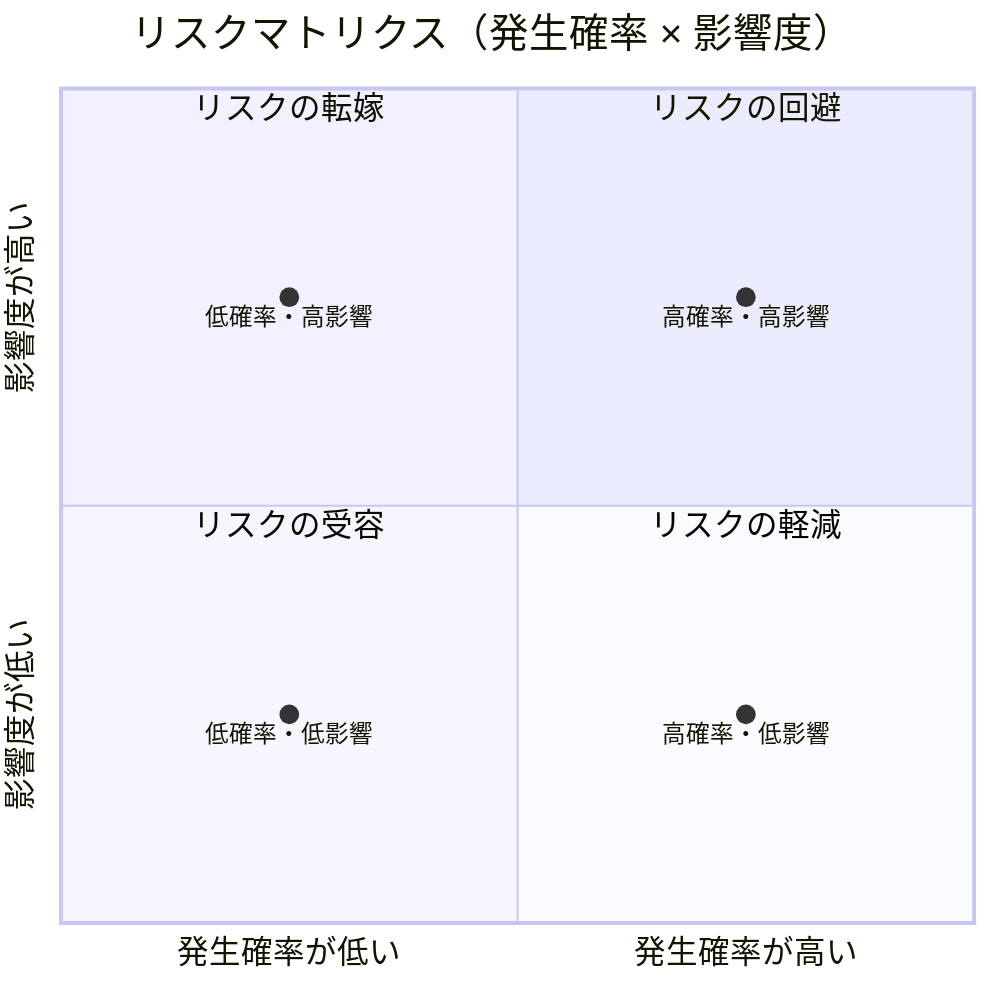

| 発生確率 | 影響度 | 優先度 | 対応戦略 | 解説                                                                                                     |
|:--------:|:------:|:------:|:---------|:---------------------------------------------------------------------------------------------------------|
| 高       |  高    | 最優先 | **回避** | プロジェクトの致命傷になる可能性があるリスク。発生自体をなくすために、設計変更などの抜本対策を行う。     |
| 低       |  高    | 中優先 | **転嫁** | 起こる可能性は低いが、発生時のダメージが大きい。保険、契約、アウトソースなどにより影響を他者へ移す。     |
| 高       |  低    | 中優先 | **軽減** | 頻出するが影響が小さいリスク。品質低下や遅延の温床になるため、予防措置や早期検知で影響度・頻度を下げる。 |
| 低       |  低    | 低優先 | **受容** | 起きたとしても軽微な影響しか与えないため、特に対応せず様子を見る。定期的に確認し、状況に応じて見直す。   |

#### ヒートマップで可視化

リスクの「リスクスコア（＝発生確率×影響度）」を元に、数値で優先順位を視覚化するのがヒートマップです。


どこが危険？

- **赤（右上に寄るほど）** ＝優先対応すべきリスク
- **白（左下によるほど）** ＝受容または定期確認程度でもよい

数値的な指標を用いて、複数のリスクの優先度を一目で比較が可能です。ExcelやGoogleSpreadSheet等でも作成可能なため、日常のレビューや進捗会議に活用しやすい。  
リスクスコアのランク定義（Aランク=15以上, Bランク=10〜14……）を行うことで管理がしやすくなります。

Asanaでもリスクマトリクスとして紹介されています。

- [リスクマトリクスのテンプレート: プロジェクトの成功のためにリスクをどのように評価するか [2025] • Asana](https://asana.com/ja/resources/risk-matrix-template#%E3%83%AA%E3%82%B9%E3%82%AF%E3%82%A2%E3%82%BB%E3%82%B9%E3%83%A1%E3%83%B3%E3%83%88%E3%83%9E%E3%83%88%E3%83%AA%E3%82%AF%E3%82%B9%E3%81%AE%E3%83%86%E3%83%B3%E3%83%97%E3%83%AC%E3%83%BC%E3%83%88)

#### 好機リスクへの応用

脅威だけでなく、**好機リスク** に対しても同じく「発生確率 × 影響度」で評価し、どの機会を積極的に活かすべきかを判断できます。

| 好機リスク例                               | 活用アイデア                               |
|:-------------------------------------------|:-------------------------------------------|
| コアメンバーの知人が参画を希望している     | 採用を前倒しして戦力を強化                 |
| 技術的ブレイクスルーが社内で起きている     | 横展開するチャンスを探り、パイロットを試す |
| ベンダーが想定より早く成果物を納品できそう | 他工程を前倒し、納期短縮や品質確保に活かす |

リスクの4象限（発生確率 x 影響度）を好機として用いる場合も **基本の構造は同じ** ですが「脅威」の時とは **意味合いが逆転** します。

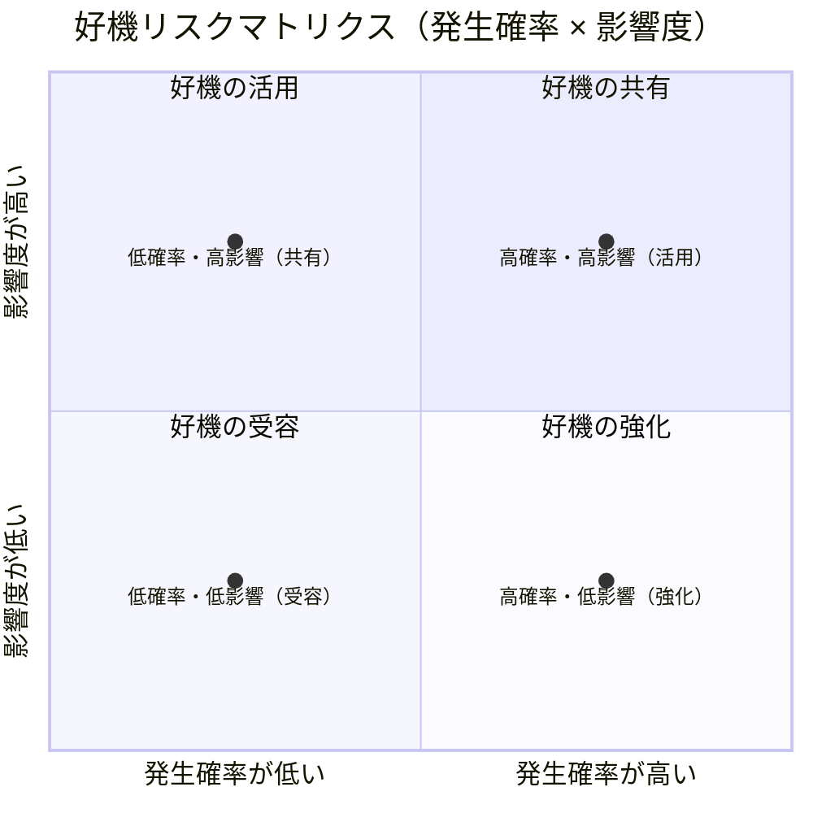

| 発生確率 | 影響度 | 優先度 | 対応戦略  | 解説                                                                                                 |
|:--------:|:------:|:------:| ----------|:-----------------------------------------------------------------------------------------------------|
| 高       | 高     | 最優先 | **活用**  | 必ず成功させたい好機。確実に手に入れるためにリソースを投じて実現を目指す。                           |
| 低       | 高     | 中優先 | **共有**  | 自社だけでは確実化が難しい。パートナーや関係者とチャンスを共有し、達成確率を上げる。                 |
| 高       | 低     | 中優先 | **強化**  | 頻繁に起こる小さなチャンス。効果は小さいが積み重ねで全体効率に寄与。発生頻度や影響度を上げる工夫を。 |
| 低       | 低     | 低優先 | **受容**  | 起きたらラッキー程度の小チャンス。特に何もしないが、起きたら享受する。                               |

#### 「脅威」と「好機」の4象限の比較

| 区分   | 脅威                             | 好機                             |
|:-------|:---------------------------------|:---------------------------------|
| 高×高 | **回避**: 損害を避ける           | **活用**: 機会を確実にモノにする |
| 高×低 | **軽減**: 頻出リスクを抑える     | **強化**: 影響を拡大する         |
| 低×高 | **転嫁**: 保険や契約で備える     | **共有**: 他者と共有し実現を狙う |
| 低×低 | **受容**: 特に対応せず様子を見る | **受容**: 発生すれば活かす       |

### 定性評価と定量評価

分析には定性評価と定量評価の2つがあります。

| 評価手法     | 内容                                     | 特徴・活用シーン                                           |
|:-------------|:-----------------------------------------|------------------------------------------------------------|
| **定性評価** | 高・中・低など主観的な判断               | スピーディな評価が可能。初期段階での粗い仕分けに向いている |
| **定量評価** | 数値によるスコア化や損失額の見積もりなど | 影響の大きいリスクや、金銭的損失が関わる場面で有効         |

定量評価の例として……  
評価した結果「発生確率（30%） × 影響額（500万円） = 期待損失額 150万円」という場合、対応コストが150万円以下であれば、実行する価値あり。

通常は定性評価から入り、重要なリスクのみ定量的に深堀りするのが一般的です。  
PMBOKのプロセスでもまずは「📊 リスクの定性的分析」、「📈 リスクの定量的分析」というフローです。

以下のサイトはPMBOKの内容を元に定量分析について説明されているものです。

- [リスクの定量的分析とは何か？PMBOKに沿ったリスク・マネジメントのプロセスを解説 | Promapedia（プロマペディア）](https://ssaits.jp/promapedia/concepts/perform-quantitative-risk-analysis.html)

### 分析（評価）結果をリスク登録簿へ

分析と評価が完了したら、以下のような情報を **リスク登録簿** に追加・更新します。

| 追記項目     | 説明例                                                                                          |
|:-------------|:------------------------------------------------------------------------------------------------|
| 発生確率     | 高／中／低、または1〜5で数値化                                                                  |
| 影響度       | 高／中／低、または1〜5で数値化                                                                  |
| 優先度       | リスクスコア（発生確率 × 影響度（例：3×4＝12））に基づく対応順位（例：Aランク、緊急対応など） |

# リスク対応を仕組みとして回す

リスクを特定し、分析（評価）し、優先順位をつけたら終わりではありません。  
実際に **「どう対応するか」を考え、行動に落とし込み、継続的に対応策が回る仕組み** にしてはじめて、リスクマネジメントは機能します。

以下は、リスクを特定してから課題化・改善するまでの全体フローです。

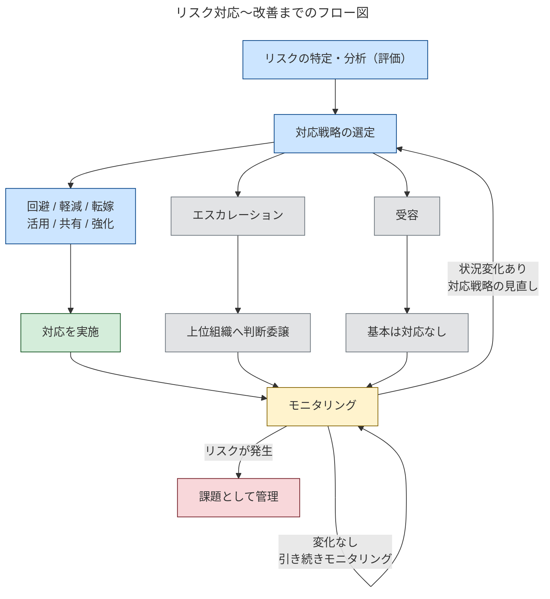
※実際にリスクが発生した場合、それは「リスク」ではなく「課題」として管理対象が切り替わります

**対応計画 → 実行 → モニタリング → 改善**

このサイクルが回ることで、リスク対応は **場当たり** ではなく **継続的なマネジメント** になります。

## リスクの対応計画を行う

PMBOKでは、「リスク（脅威と好機）」それぞれに対する **具体的な対応戦略** が提示されています。
どの戦略を選ぶかは、リスクの性質（発生確率・影響度）やプロジェクトの状況、関係者の意向によって判断します。

この内容は [リスクの4象限で可視化](#リスクの4象限で可視化) の整理とも対応しています。唯一違う点としては「エスカレーション」が追加されています。

### 脅威における戦略

| 戦略             | 説明                                                                                                                                                                                                                                 |
|:-----------------|:-------------------------------------------------------------------------------------------------------------------------------------------------------------------------------------------------------------------------------------|
| 回避             | 脅威の回避とは、脅威を除去する、または脅威の影響からプロジェクトを保護するためにプロジェクト・チームが対応することである。                                                                                                           |
| 転嫁             | 転嫁には、リスクをマネジメントし、脅威が発生した場合にその影響に耐えるために、脅威のオーナーシップを第三者に移転することが含まれる。                                                                                                 |
| 軽減             | 脅威の軽減では、脅威が発生する確率や脅威の影響を低減するための処置が講じられる。脅威が発生してから被害を修復するよりも、早期の軽減処置の方が効果的なことが多い。                                                                     |
| 受容             | 脅威の受容では、脅威の存在を認めるが、いかなる積極的な行動も計画されない。リスクの受容には、イベントが発生したときに発動するコンティンジェンシー計画の作成が含まれる能動的受容、および事前には何もしないという受動的受容が含まれる。 |
| エスカレーション | エスカレーションが適切であるのは、プロジェクト・チームまたはプロジェクトのスポンサーが、脅威はプロジェクト・スコープの外部にあるか、または提案された対応策がプロジェクト・マネジャーの権限を越えていることに同意するときである。     |

参照: [プロジェクトマネジメント知識体系ガイド（PMBOKガイド）第7版＋プロジェクトマネジメント標準](https://www.pmi-japan.shop/shopdetail/000000000028/) 2.8.5.1 脅威 より抜粋

### 好機における戦略

| 戦略             | 説明                                                                                                                                                                                                                                         |
|:-----------------|:---------------------------------------------------------------------------------------------------------------------------------------------------------------------------------------------------------------------------------------------|
| 活用             | 対応戦略の一つ。プロジェクト・チームは、この戦略に基づいて確実に好機がもたらされるように取り組む。                                                                                                                                           |
| 共有             | 好機の共有には、ある好機の便益を最大限に捉えることのできる第三者にそのオーナーシップを割り当てることが含まれる。                                                                                                                             |
| 強化             | 好機の強化では、プロジェクト・チームが好機の発生確率または影響度を増加させるように行動する。好機が発生した後に活かそうとするよりも、早期の強化処置の方が効果的なことが多い。                                                                 |
| 受容             | 脅威と同様に、好機の受容では、好機の存在を認めるが、いかなる積極的な行動も計画されない。                                                                                                                                                     |
| エスカレーション | 脅威と同様に、この好機対応戦略が使われるのは、プロジェクト・チームまたはプロジェクトのスポンサーが、好機はプロジェクト・スコープの外部にあるか、または提案された対応策がプロジェクト・マネジャーの権限を越えていることに同意するときである。 |

参照: [プロジェクトマネジメント知識体系ガイド（PMBOKガイド）第7版＋プロジェクトマネジメント標準](https://www.pmi-japan.shop/shopdetail/000000000028/) 2.8.5.2 好機 より抜粋

### 効果的なリスク対応を行うためには？

PMBOKでは、リスク対応を計画・選定するにあたり、以下の5つの観点から **その妥当性を検討する** ことが推奨されています。  
これらは「良いリスク対応策」であるための判断基準です。

| 観点                                           | 解説                                                                |
|:-----------------------------------------------|:--------------------------------------------------------------------|
| リスクの重大さに見合って、**適時なもの**である | 影響の小さいリスクに過剰対応していないか？ 対応が遅すぎていないか？ |
| **費用対効果が高い**                           | 対応コストがリスク発生時の影響に見合っているか？                    |
| プロジェクトの状況に照らして**現実的である**   | チームのリソース・状況に対して無理のない内容か？                    |
| **関連ステークホルダーの同意を得ている**       | 関係者が納得・協力しているか？                                      |
| **責任者が任命されている**                     | 誰がやるのかが不明確では実行されないリスクがある                    |

参照: [プロジェクトマネジメント知識体系ガイド（PMBOKガイド）第7版＋プロジェクトマネジメント標準](https://www.pmi-japan.shop/shopdetail/000000000028/) 3.10 リスク対応を最適化すること より抜粋

もしこれらの基準のいずれかを満たしていない場合は、そのリスク対応策は **「再検討すべきシグナル」** として受け止めましょう。  
チーム内で対応方針を共有し、必要に応じて優先度・方法・責任体制の見直しを行うことが重要です。

## リスクの対応計画を元に実行

戦略（リスクの対応計画）を決めたあとは、それを **具体的なタスクに落とし込み、実際に実行することが重要** です。  
どれほど立派な対応戦略でも、行動に移されなければリスクマネジメントは機能しません。

### 対応計画の実行ポイント

| 実行ポイント                                                             | 説明                                                                                                                                            |
|:-------------------------------------------------------------------------|:------------------------------------------------------------------------------------------------------------------------------------------------|
| **対応策をタスク化する**                                                 | 各リスクに対して「やるべきこと」「担当者」「期限」などを明確にし、プロジェクト管理ツール（Backlog, Jira, Asana など）にタスクとして登録します。 |
| **対応の優先度に応じて実行順を決定する**                                 | 優先度（リスクスコアが高い）に対しては速やかに実行計画を立て、チーム内での合意形成を図ります。                                                  |
| **受容やエスカレーションのような「何もしない／上位判断」も記録しておく** | 明示的な判断がなされていることが重要です。ドキュメント化し、関係者に共有しておきます。                                                          |

## 対応後のモニタリングと継続的な改善

対応を実施したあとは、**効果の確認（モニタリング）と、必要に応じた戦略の見直し** を行います。  
プロジェクトが進行するにつれて、リスクの状況は変化しますし、ときには実際に **リスクが発生することもあります**。

このとき、そのリスクは「リスクのまま」ではなく、**課題に昇格し、別の管理対象として追跡** していく必要があります。
リスクマネジメントにおいて、**「発生したら課題化する」ことは基本的な運用ルール** として徹底すべきです。

### モニタリングで見るべきポイント

| ポイント                                     | 説明                                                                                                                             |
|:---------------------------------------------|:---------------------------------------------------------------------------------------------------------------------------------|
| **リスクが発生していないか？**               | 発生していれば、対応が機能しなかった可能性があります。そのリスクは「課題」として扱い、影響範囲の特定・解決タスクの整理に移行する |
| **対応が計画通りに実行されているか？**       | 未着手や遅延があれば、影響が波及する前にリマインドまたは調整を行う                                                               |
| **リスクの発生確率や影響度に変化がないか？** | 状況の変化に応じて、対応戦略の見直しや優先度の更新を行う                                                                         |

### モニタリングの実践例

| 実践例                                            | 説明                                                                                           |
|:--------------------------------------------------|:-----------------------------------------------------------------------------------------------|
| **定例ミーティングでの進捗確認**                  | 優先度の高いのリスク（リスクスコアが高い）について、対応状況を週次でレビュー                   |
| **リスク登録簿の更新**                            | 発生状況や対応の完了状況を記録し、「いつ・何をしたか」を明確にする                             |
| **振り返り（KPTなど）でリスク対応の有効性を検証** | プロジェクト終盤や節目で「どのリスク対応が効果的だったか」を整理し、ナレッジとして次回に活かす |

リスクマネジメントが **特別な活動** でなく、日常のプロジェクト運営の一部となれば、プロジェクト全体の健全性は大きく向上します。

# なぜプロジェクトマネジメントにとってリスクが重要なのか？

- 「PMはタスク管理者ではない。リスクと向き合うプロである。」
- タスク管理に偏重しがちな誤解を解く
- プロジェクトは不確実性に包まれており、リスク対応力がPMの本質
- 予定通り進むことは例外、だからこそ「見えないもの（リスク）」を意識する必要がある
-  （hiroki daichiさんのスライドを参照し、「リスクこそがPMの本丸」という視点を補強）


# まとめ 〜リスクと向き合うことは、未来のプロジェクトを守ること〜

- リスクを避けるのでなく、管理することがプロジェクト成功の鍵
- 小さくてもよいので、まずはリスク洗い出し（プリモーテムなど）を実施してみよう
- リスクに向き合う力が、PMとしての真の信頼を築く
