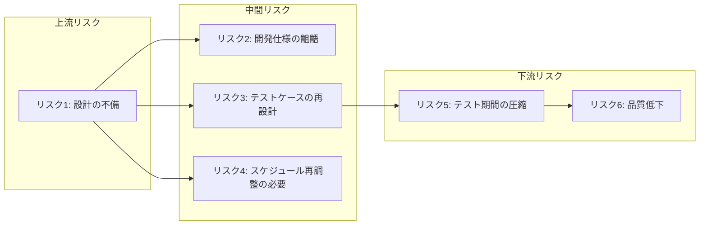

# プロジェクトを円滑に進めたいならタスクではなくリスクを見よ！

PMO(Project Management Office: プロジェクトにおける組織内の個々のプロジェクトマネジメントを支援するための部門)の一員として、プロジェクトマネジメントに関わる立場になりました。

その中で **「リスク管理表」を運用する役割** を担うことになったのですが、当初の私は「リスク」という言葉を漠然と使っており **何を指し、どう扱うべきものなのかを明確に理解できていません** でした。

そんなときに出会ったのが [EM.FM Re.44 プロジェクトマネジメント：タスクから見るか、リスクから見るか](https://www.youtube.com/watch?v=o8Mfd2ougS4) という Podcast でした。

このエピソードをきっかけに **「リスク」という存在が単なる脅威ではなく、プロジェクトを成功に導くための見えない本質** なのではないかと気づきが生まれました。

そこからリスクマネジメントについて深く学び直し、体系的に整理し、現場で使える知見としてまとめたのが本記事となります。

# そもそもリスクとは何か？

リスクという言葉はよく聞きますが「実際には何を指しているのか？」と問われると、曖昧なまま使っている人も多いのではないでしょうか？  
[プロジェクトマネジメント知識体系ガイド（PMBOKガイド）第7版＋プロジェクトマネジメント標準](https://www.pmi-japan.shop/shopdetail/000000000028/) ではリスクのことについて以下のように定義されています。

> リスクは不確かさの一側面である。リスクは発生が不確かなイベントまたは状態であり、もし発生したら、プロジェクト目標にプラスあるいはマイナスの影響を及ぼす。マイナスのリスクは脅威と呼ばれ、プラスのリスクは好機と呼ばれる。すべてのプロジェクトにリスクがある。プロジェクトには独自性があり、程度の差こそあれ、不確かさがあるからである。  

参照: [プロジェクトマネジメント知識体系ガイド（PMBOKガイド）第7版＋プロジェクトマネジメント標準](https://www.pmi-japan.shop/shopdetail/000000000028/) 2.8.5 リスク より抜粋

この定義からわかる通り、リスクとは「悪いこと」だけを指すのではなく **「不確実なこと全般」** を意味します。またマイナスの影響を与えるものを **脅威** といい、プラスの影響を与えるものを **好機** といいます。

このようにリスクとは単なる「問題」ではなく、プロジェクトが進む過程における **未来の揺らぎ** です。  
この揺らぎを無視するか、事前に捉えて設計に組み込めるかが、PMの腕の見せ所と言えるでしょう。

## 似ているようで違う「リスク」「課題」「問題」

プロジェクトを進める中で「それってリスク？」「いや、もう課題では？」などという会話がされることがあります。  
一見似ているこれらの言葉ですが **決定的に違うのは時間軸** です。

|概念  | 定義                             | 状態     | 例                                   |
|:-----|:---------------------------------|:---------|:-------------------------------------|
|リスク|将来起こるかもしれない不確実な事象|未来      |「エンジニアが退職するかもしれない」  |
|課題  |発生が確定し、対処が必要な事象    |現在      |「◯◯さんの退職が決まり、対応が必要」|
|問題  |課題によって既に影響が出ている状態|過去〜現在|「退職により開発遅延が発生した」      |

詳しくは後ほど解説します。

ここでは、まずはそれぞれが **全くの別物** であるということだけ押さえておいてください。  
この違いを理解しておくことで、プロジェクトマネジメント上の混乱や誤解を防ぐことができます。

# リスクの性質について

リスクを適切に扱うには「どんなふるまいをするのか？」という性質への理解が欠かせません。  
ここでは、PMBOKやIPAが示す理論的な構造性と、現場の経験から導かれる実践的性質の両面からリスクへの理解を深めます。  
リスクへの理解を深めることで対応すべきリスクを正しく捉えるための第ー歩となります。

## 「構造と挙動」から見るリスクの性質

こちらではPMBOKやIPAの資料に見られる公式的なリスクの性質をまとめています。

### リスクは連鎖する

リスクは **ドミノ倒し** のように連鎖しひとつの倒れが次々に別の倒れを誘発します。

リスクは単体で完結するとは限らず、あるリスクが原因となって、さらに別のリスクを引き起こすという **連鎖の性質** を持ちます。  
この点はIPAの資料[『ITプロジェクトのリスク予防への実践的アプローチ』](https://www.ipa.go.jp/archive/digital/iot-en-ci/hjuojm000000m6de-att/000026834.pdf)でも強調されておりリスクを **点** ではなく **つながり** として捉える視点が重要になります。

例えば上記の例では **設計の不備(R1)** というリスクが発端となり

- 「開発仕様の齟齬(R2)」
- 「テストケースの再設計(R3)」→「テスト期間の圧縮(R5)」→「品質低下(R6)」
- 「スケジュール再調整の必要(R4)」

といった複数のリスクを **芋づる式に引き起こす** 可能性があります。

このような連鎖は放置すると下流にいくほど影響が深刻化し修復が困難になる可能性があります。  
逆に言えば **上流のリスク（根本原因）を早期に発見・対処できれば後続リスクの発生そのものを予防できる** という利点もあります。

そのためにはリスク同士の因果関係を可視化し **連鎖の起点** を見極める視点が求められます。  
単なるリストアップに終わらず **リスク構造のマッピング** を意識することでより効果的なリスクマネジメントにつながります。

### リスクは時間とともに収束していく(=不確実性コーン)

時間とともにリスクは **見える化** し徐々に収束していきます。

プロジェクトの初期段階では情報が限られており、リスクや見積もりの不確実性が最も高くなります。  
この「時間とともに不確実性が収束する」現象はソフトウェア見積もりの分野では「不確実性コーン（Cone of Uncertainty）」というモデルで知られています。  

  
[参照: プロジェクトの本質とはなにか | 日経クロステック（xTECH）](https://xtech.nikkei.com/it/article/COLUMN/20131001/508039/zu01_s.jpg?__scale=w:500,h:325&_sh=03d02a0d80)

「不確実性コーン（Cone of Uncertainty）」とはプロジェクトの初期には見積もりの誤差幅が大きく、進行とともにその幅が狭まっていくことを示すモデルです。

つまりプロジェクトの進行とともに情報が蓄積されリスクの不確実性は徐々に減少していく。  
これが「時間とともに収束していく」というリスクの性質です。

PMBOKではこの現象を **段階的詳細化** と呼び、得られる情報の増加に応じて計画や見積もりの精度を高めていく **反復的な取り組み** として位置づけています。

> **段階的詳細化** 得られる情報が増え、より正確な見積もりが可能になるにつれ、プロジェクトマネジメント計画書をより詳細化していく反復プロセス。  

参照: [プロジェクトマネジメント知識体系ガイド（PMBOKガイド）第7版＋プロジェクトマネジメント標準](https://www.pmi-japan.shop/shopdetail/000000000028/) 2.8.2 曖昧さ より抜粋

> 段階的詳細化を使って計画を練り直し続ける。また、脅威や好機が顕在化すると、計画も更新される。  

参照: [プロジェクトマネジメント知識体系ガイド（PMBOKガイド）第7版＋プロジェクトマネジメント標準](https://www.pmi-japan.shop/shopdetail/000000000028/) 2.3.7 他のパフォーマンス領域との相互作用 より抜粋

### リスクは分類できる

### リスクは対応可能なものと対応不可能なものがある

## 「観測と実践」から見るリスクの性質

こちらでは現場でプロジェクトを動かす中で体感されるより肌感覚に近いリスクの性質をまとめています。

### リスクは階層性がある

### リスクは見えづらい

### リスクは評価する時にばらつきが出やすい

## リスクの性質から洞察するとリスクは「構造」で捉えられる

# リスクの種類と対応優先順位

- 技術リスク、外部リスク、人的リスク、マネジメントリスクなど分類
- リスクの4象限モデル（確率×影響度）で優先度をつける
- 対応方針：回避、軽減、移転、受容の使い分け

# リスク洗い出しの実践手法

- 「何が起きるか」ではなく、「何が起こりうるか」を掘り起こす手法群。

## プリモーテム（Pre-Mortem）

- プロジェクトが失敗した未来を仮定して、原因を逆算で洗い出す
- チームの率直な声や見落としがちな懸念を引き出すのに効果的

## RBS（リスクブレークダウンストラクチャ）

- リスクをカテゴリ・階層構造で体系的に洗い出す
- 抜け漏れを防ぐ網羅性の高いアプローチ

## リスクツリー分析（FTA型）

- あるリスクの原因・結果をツリー構造で整理する
- リスク連鎖マップで全体波及関係を俯瞰、因果ツリーで根本原因を深掘り
- 対象リスクを構造的に捉え、断ち切るポイントを明確化

## リスク登録簿とリスク事象ドライバー

- 洗い出したリスクはリスク管理簿に記録する
- 発生確率・影響度・対応策・担当者・リスク事象ドライバーを明確に記録
- ドライバーを明記することで予防策設計が具体的になる

## チームベースの洗い出し：「象・死んだ魚・嘔吐」ワークショップ

- 象（みんな気づいてるけど誰も言わない）、死んだ魚（過去の未解決）、嘔吐（感情的な吐き出し）
- チームの潜在的な不安や未整理なリスクを顕在化するための対話ベースアプローチ

# プロジェクトマネジメントにおけるリスクの重要性

- 「PMはタスク管理者ではない。リスクと向き合うプロである。」
- タスク管理に偏重しがちな誤解を解く
- プロジェクトは不確実性に包まれており、リスク対応力がPMの本質
- 予定通り進むことは例外、だからこそ「見えないもの（リスク）」を意識する必要がある
-  （hiroki daichiさんのスライドを参照し、「リスクこそがPMの本丸」という視点を補強）

## リスクと課題の違い

- リスク＝未来の不確実性、課題＝既に発生した問題
- リスクが顕在化すると「課題」になる（リスク管理→課題管理へ移行）
- 両者のステータス遷移（発生前と発生後）を理解し、連携させることが重要

# まとめ 〜リスクと向き合うことは、未来のプロジェクトを守ること〜

- リスクを避けるのでなく、管理することがプロジェクト成功の鍵
- 小さくてもよいので、まずはリスク洗い出し（プリモーテムなど）を実施してみよう
- リスクに向き合う力が、PMとしての真の信頼を築く
