# 後の修正でいいが修正しないといけなそうなもの

- PMとプロジェクトマネジメントのゆらぎ
- リスクマネジメントではなくリスクエンジニアリングという言葉を使う（これかっこいい
- リスクの管理方法と運用方法が抜けていたのでそれを追加する

# プロジェクトを円滑に進めたいならタスクではなくリスクを見よ！

PMO(Project Management Office: プロジェクトにおける組織内の個々のプロジェクトマネジメントを支援するための部門)の一員として、プロジェクトマネジメントに関わる立場になりました。

その中で **「リスク管理表」を運用する役割** を担うことになったのですが、当初の私は「リスク」という言葉を漠然と使っており **何を指し、どう扱うべきものなのかを明確に理解できていません** でした。

そんなときに出会ったのが [EM.FM Re.44 プロジェクトマネジメント：タスクから見るか、リスクから見るか](https://www.youtube.com/watch?v=o8Mfd2ougS4) という Podcast でした。

このエピソードをきっかけに **「リスク」という存在が単なる脅威ではなく、プロジェクトを成功に導くための見えない本質** なのではないかと気づきが生まれました。

そこからリスクマネジメントについて深く学び直し、体系的に整理し、現場で使える知見としてまとめたのが本記事となります。

# そもそもリスクとは何か？

リスクという言葉はよく聞きますが「実際には何を指しているのか？」と問われると、曖昧なまま使っている人も多いのではないでしょうか？  
[プロジェクトマネジメント知識体系ガイド（PMBOKガイド）第7版＋プロジェクトマネジメント標準](https://www.pmi-japan.shop/shopdetail/000000000028/) ではリスクのことについて以下のように定義されています。

> リスクは不確かさの一側面である。リスクは発生が不確かなイベントまたは状態であり、もし発生したら、プロジェクト目標にプラスあるいはマイナスの影響を及ぼす。マイナスのリスクは脅威と呼ばれ、プラスのリスクは好機と呼ばれる。すべてのプロジェクトにリスクがある。プロジェクトには独自性があり、程度の差こそあれ、不確かさがあるからである。  

参照: [プロジェクトマネジメント知識体系ガイド（PMBOKガイド）第7版＋プロジェクトマネジメント標準](https://www.pmi-japan.shop/shopdetail/000000000028/) 2.8.5 リスク より抜粋

この定義からわかる通り、リスクとは「悪いこと」だけを指すのではなく **「不確実なこと全般」** を意味します。またマイナスの影響を与えるものを **脅威** といい、プラスの影響を与えるものを **好機** といいます。

このようにリスクとは単なる「問題」ではなく、プロジェクトが進む過程における **未来の揺らぎ** です。  
この揺らぎを無視するか、事前に捉えて設計に組み込めるかが、PMの腕の見せ所と言えるでしょう。

## 似ているようで違う「リスク」「課題」「問題」

プロジェクトを進める中で「それってリスク？」「いや、もう課題では？」などという会話がされることがあります。  
一見似ているこれらの言葉ですが **決定的に違うのは時間軸** です。

|概念  | 定義                             | 状態     | 例                                   |
|:-----|:---------------------------------|:---------|:-------------------------------------|
|リスク|将来起こるかもしれない不確実な事象|未来      |「エンジニアが退職するかもしれない」  |
|課題  |発生が確定し、対処が必要な事象    |現在      |「◯◯さんの退職が決まり、対応が必要」|
|問題  |課題によって既に影響が出ている状態|過去〜現在|「退職により開発遅延が発生した」      |

これらは単なる言葉の違いではなく **対応フェーズや関与すべきステークホルダー、意思決定の質にも影響を与える重要な区別** です。  
この違いを正しく理解することで、リスクと課題と問題を適切に切り分け、プロジェクトの混乱や責任の曖昧化を未然に防ぐことができます。

# リスクの性質を理解する

リスクを適切に扱うには「どんなふるまいをするのか？」という性質への理解が欠かせません。  
ここでは、PMBOKやIPAの資料を参考にしながら、リスクの本質的な特徴を捉えていきます。

プロジェクトにおいてリスクは単なる「出来事の一覧」ではなく **構造的な性質や観測しづらい性質**、**マネジメントの難しさ** を引き起こす特徴を内包しています。  
リスクの性質を正しく捉えることで「どのリスクにどう対応すべきか」という判断がブレなくなり、リスクマネジメントの土台を形作る第一歩となります。

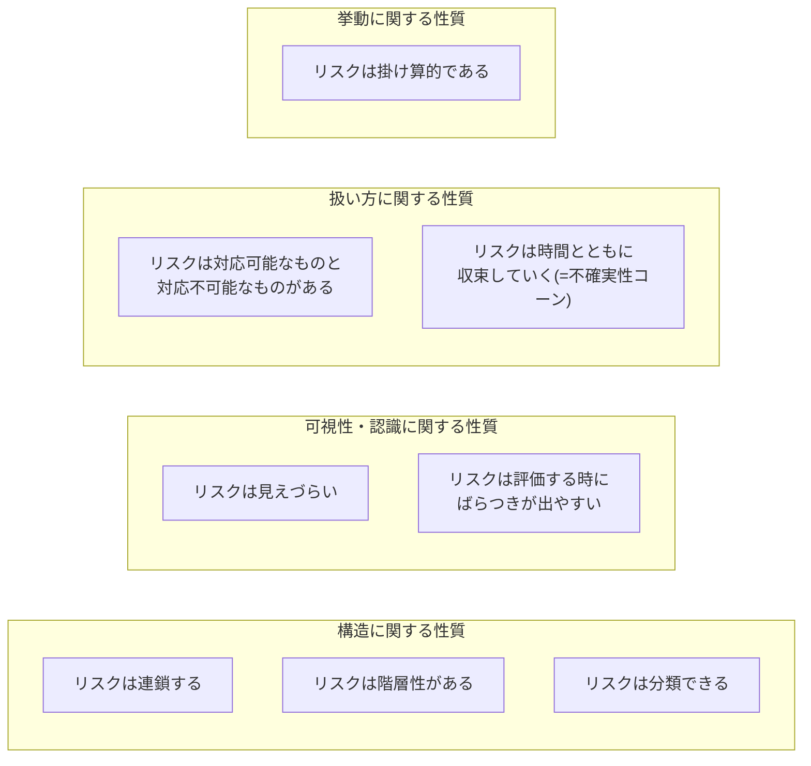

## リスクの構造に関する性質

リスクそのものの **構造や関係性** に着目した性質群です。

### リスクは連鎖する

リスクは **ドミノ倒し** のように連鎖しひとつの倒れが次々に別の倒れを誘発します。

リスクは単体で完結するとは限らず、あるリスクが原因となって、さらに別のリスクを引き起こすという **連鎖の性質** を持ちます。  
この点はIPAの資料[『ITプロジェクトのリスク予防への実践的アプローチ』](https://www.ipa.go.jp/archive/digital/iot-en-ci/hjuojm000000m6de-att/000026834.pdf)でも強調されておりリスクを **点** ではなく **つながり** として捉える視点が重要になります。

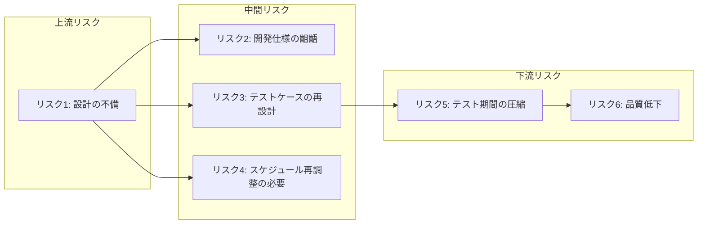

例えば上記の例では **設計の不備** というリスクが発端となり

- 「開発仕様の齟齬」
- 「テストケースの再設計」→「テスト期間の圧縮」→「品質低下」
- 「スケジュール再調整の必要」

といった複数のリスクを **芋づる式に引き起こす** 可能性があります。

このような連鎖は放置すると下流にいくほど影響が深刻化し修復が困難になる可能性があります。  
逆に言えば **上流のリスク（根本原因）を早期に発見・対処できれば後続リスクの発生そのものを予防できる** という利点もあります。

そのためにはリスク同士の因果関係を可視化し **連鎖の起点** を見極める視点が求められます。  
単なるリストアップに終わらず **リスク構造のマッピング** を意識することでより効果的なリスクマネジメントにつながります。

### リスクは階層性がある

リスクは **マトリョーシカのように、内側に潜む構造で現れる**。

表面的なリスクの背後には、より抽象的な根本原因が隠れていることが多く、また逆に、一つの大きなリスクが複数の具体的リスクを包含している場合もあります。  
このように、リスクは **階層構造を持つ性質** があり、異なる粒度・抽象度で複数のリスクが連なり合って存在します。

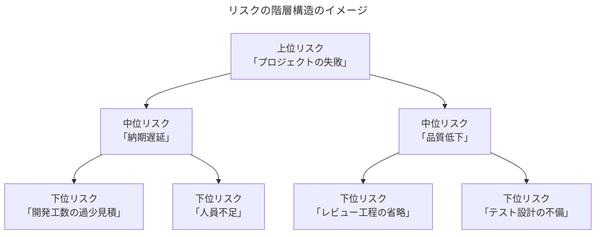

このように、一見すると「納期遅延」や「品質低下」といった中位のリスクも実際にはその下に具体的な要因（リスク）がぶら下がっており、またそれらが集まって「プロジェクト失敗」といった上位リスクを形成しています。

リスクを階層的に捉えることは、実践的なリスクマネジメントにおいて極めて重要です。なぜなら **上位レベルの抽象的なリスクだけを見ていると、その対処が曖昧になり実効性のある対応策に結びつきにくくなる** からです。

たとえば「品質が悪い」というリスクを挙げても、その原因や対策を掘り下げなければ、現場で何を改善すればよいのかは見えてきません。  
一方で、下位の具体的なリスクだけを洗い出していると、全体像を見誤る可能性があります。
「レビューが漏れた」「仕様の認識にズレがあった」といった細かなリスクは重要ですが、それが全体としてどのようなリスクに集約され、プロジェクト全体にどの程度の影響を与えるかを見失いがちです。

このように、上位から下位まで、リスクを多層的に捉える視点を持つことで **上位リスクには原因の深掘りと戦略的対策** を **下位リスクには具体的な改善策や再発防止策を講じる** といった、リスクマネジメントの精度と実効性を高めるアプローチが可能になります。

### リスクは分類できる

リスクは **名前を与えた瞬間、管理可能**になる。

分類によってリスクは 構造的に把握しやすくなり、**抜け漏れのない洗い出しや優先度付け** に役立ちます。  
分類方法にさまざまな考え方があります。さまざまな分類方法が存在するようにリスクは体系的に **分類可能な性質** を持っています。

IPAの資料によるのアプローチ例では

- [『ITプロジェクトのリスク予防への実践的アプローチ』](https://www.ipa.go.jp/archive/digital/iot-en-ci/hjuojm000000m6de-att/000026834.pdf) ではリスク（正確にはリスク事象ドライバー）を「主プロセス」「支援・管理プロセス」「組織的プロセス」の３領域に分類している
- [『ITプロジェクトの「見える化」 〜上流工程編〜』](https://www.ipa.go.jp/archive/publish/qv6pgp0000000xvu-att/000030719.pdf)ではPMBOKの「知識エリア」（第7版ではパフォーマンス領域と定義されています）に基づいて分類する「リスク分類表」が紹介されています。

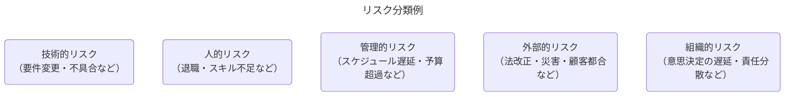

たとえば「納期遅延」というリスクが発生した場合、その背景には次のような **複合的なリスクの混在** があるかもしれません。

- 担当者の退職 -> 「人的リスク」
- 顧客からの仕様変更 -> 「外部的リスク」
- 管理工数の見積もり不足 -> 「管理的リスク」

このように分類しておくことで、次のような戦略的マネジメントが可能となります。

- 抜け漏れなくリスクを洗い出す
- 優先度や影響範囲ごとに対応を割り当てる
- 特定カテゴリに偏る傾向（弱点）を発見する

## リスクの挙動に関する性質

リスクがプロジェクトの中で **どのように振る舞い、影響を広げていくか** に関する性質群です。

### リスクは掛け算的である

リスクは **スパイス** のように、プロジェクト全体に **予測不能な風味（ゆらぎ）** を振りかけてくる。

リスクは単なる「イベント」ではなく、プロジェクト全体の所要時間や成果に対して **乗算的な影響** を与える要因です。  
たとえば、あるリスクが「作業を1.1倍に増やす」要因であり、それが複数積み重なると、プロジェクト全体に **掛け算でゆらぎが波及** します。  
このようにリスクはタスクのように「加算的」に積み上がるのではなく、プロジェクト全体の成果や所要時間に対して **乗算的に作用する性質** を持ちます。  
これは「ある工程が1.1倍になる」「次の工程が1.2倍になる」といった影響が **全体に累積される構造** を意味し、結果的に **プロジェクト全体を1.32倍（=1.1×1.2）に押し広げる** ような波及効果を持ちます。

参照: [エンジニアリングマネージャーのロードマップ エンジニアリングマネジメントの4次元と生成AI時代の戦い方 スライド27](https://hirokidaichi.github.io/presentation/emconf.html#27)

**乗算的に作用する性質** により、プロジェクト全体の成果や工数は想定の範囲を超えて **大きく膨らむ可能性を孕んだ分布（ロングテール構造）** を持ちます。  
これは「平均的な見積もり」だけではカバーしきれない、稀だが重大な遅延やコスト超過の可能性があることを意味しています。

[EM.FM Re.44 プロジェクトマネジメント：タスクから見るか、リスクから見るか](https://www.youtube.com/watch?v=o8Mfd2ougS4S4&t=445s) にて広木大地さんは、タスクとリスクの違いは次のように語っています。

Podcastでの該当部分の全文の抜粋

> タスク管理として、捉えるプロジェクトマネジメントをする場合、タスクって、どんどん足し算です。」  
> これが例えば、10ポイントのタスクと、10ポイントのタスク、5ポイントのタスクを全部足したら25ポイントだよね。だから25ポイント分のタスクだよね。  

> それぞれが完了する間の触れ幅がどんな分布であれ、タスクをつまみ食いしてたら足し算になっていって、足し算をずっと繰り返していくと中心極限定理で正規分布になるんですよね。  
> 元がどんな分布であっても、なのでタスク1個1個がどんな分布をしていても、それを引き取って全部足し算で捉えてる限り、それでプロジェクトを考えるとプロジェクトは綺麗な正規分布になるはずです。

> でも、そんなことないっていうのがポイントで、実はリスクっていうのは、プロジェクトの中の掛け算的性質を持っているものだっていう風に思ってます。  

> これがどうなるかで、全体のプロジェクトが10%増えるかもしれないし10%減るかもしれない。全体の5%遅れるかもしれないし5%早まるかもしれない。みたいな掛け算的な性質を持ってる要因っていうのがプロジェクトの中にはいくつかあって、そのプロジェクトの中の掛け算的要因のことを僕はリスクていう風に呼んでいます。

> この掛け算的要因がいっぱい足し合わせれていくとどんな分布になるかっていうと、対数正規分布って言われるような、裾野が後ろに長いロングテール的な形になった分布になります。  

  

- タスクは「足し算」で進捗を積み上げる性質があり、たとえ各タスクの完了時間にバラつきがあっても、**数が多ければ全体は正規分布的に収束する**（中心極限定理）
- 一方リスクは、各所に「1.1倍になる」「5%遅れる」などの **掛け算的な増減要因** として現れる
- 掛け算的なリスクが多数重なると、全体として **ロングテール（対数正規分布）** のような分布になりやすく **平均的な予測では外れ値に対応できない**

プロジェクトマネジメントにおいては **「リスクを足し算で積み上げて評価すれば十分」といった常識** を一度疑ってみる必要があります。  
リスクが掛け算的にプロジェクト全体へ波及する構造を持つ以上 **「平均ではなく、外れ値にどう備えるか」** という視点で設計と判断を行うことが重要となります。

中心極限定理についてはこちらを参照してください。

- [中心極限定理の例とメリットを分かりやすく解説 ｜AVILEN](https://avilen.co.jp/personal/knowledge-article/central-limit-theorem/)

## リスクの可視性・認識に関する性質

リスクが **どのように見えにくいのか、どう扱われやすいか** に関する性質群です。

### リスクは見えづらい

リスクは **地中に埋まった地雷** のように、発見されにくく、気づいたときにはすでに被害が出ています。

リスクは常に表面化しているとは限らず、潜在的に存在しているにもかかわらず **見落とされやすい性質** を持っています。
特に初期段階や問題が発生する前の状況では「問題がないように見える」ために軽視されたり、明文化されずに放置されるケースが多く見受けられます。

このように、リスクは **見落とされやすい性質** を持ち、プロジェクトの進行や変化の中で顕在化していく傾向があります。

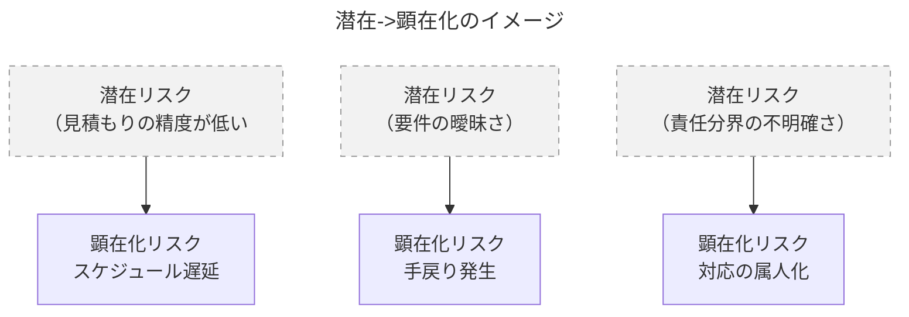

たとえば以下のようなケースが「見えづらいリスク」として典型的です。

- 不確かな要件定義 → 開発後に仕様の食い違いが発覚
- メンバー間の役割認識のズレ → 不要な作業の重複や抜け漏れ
- 関係者の温度差 → 意思決定の遅延や方針転換による影響拡大

これらは「今は問題なさそう」に見えるため、リスクと認識されないまま進行してしまう危うさを含んでいます。

この「リスクは見えづらい」ということを理解しておくことで、以下のような実践的アプローチが可能になります。

- リスクの兆候（シグナル）を拾う感度を高める
- 「まだ起きていない課題」にも耳を傾ける文化をつくる
- レビューやチェックリストで潜在リスクを可視化する
- 形式だけでなく実質的な「リスク会話」をチーム内で持つ

リスクは見えづらい。だからこそ、意識的に可視化・共有する努力がリスクマネジメントには求められます。

### リスクは評価する時にばらつきが出やすい

リスクは **万華鏡** のように、見る人の視点や角度によって見え方がまったく変わります。

リスクの評価は **「誰が」「いつ」「どの立場」で見るかによって結果が大きく異なる** という特徴があります。  
たとえば同じリスクに対して、開発者は「技術的な困難性」を重視し、マネージャーは「工数への影響」を重視するかもしれません。

このように、リスクは評価に主観が入りやすく **ばらつきが生じる性質** を持っています。

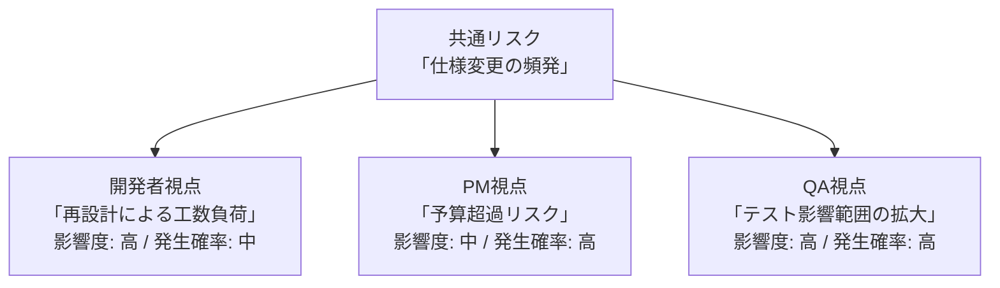

このように、同じリスクであっても評価者の立場により「影響度」や「発生可能性」の評価に大きな差異が生まれます。

この評価に **「ばらつきが生じる性質」** を理解しておくことで、以下のような具体的対応が可能になります。

- 共通の評価軸（スケール）を設ける
    - 例：影響度は「コスト」「品質」「納期」の3軸で評価する
- 関係者の主観を可視化する
    - 複数メンバーでのリスクレビューを通じ、評価のばらつきを認識・調整する
- 評価を一元化せず「複数視点」で残す
    - 評価者のロールごとのコメントを明示して記録する

この性質を踏まえたうえで、チームとして統一感のあるリスク評価を行うための仕組みづくりが不可欠です。  
ばらつくことを前提に見える化し、合意形成を通じて共通理解に収束させていくのが効果的なリスクマネジメントの第一歩です。

## リスクの扱い方に関する性質

リスクを **どうマネジメントし対策・戦略を立てるか** に関する性質群です。

### リスクは対応可能なものと対応不可能なものがある

すべてのリスクは救えない。だからこそ **見極め** が命を分ける。

リスク対応は **有限なリソース（人・時間・コスト）をどう配分し「どのリスクに向き合うか」を判断すること**にあります。  
たとえば 為替変動や自然災害のように、組織の努力では回避が難しいリスクも存在します。このように、リスクは **対応可能性によって整理できる性質** を持ちます。

PMBOKでは、こうした対応が困難なリスク”に対して取るべき戦略として **受容** が定義されています。  
これは、積極的にコントロールできないリスクに対し、事前の備えや発生時対応に集中する方針です。

> **受容** 脅威の受容では、脅威の存在を認めるが、いかなる積極的な行動も計画されない。リスクの受容には、イベントが発生した時に発動するコンティンジェンシー計画の作成が含まれる能動的受容、及び事前には何もしないという受動的受容が含まれる。

参照: [プロジェクトマネジメント知識体系ガイド（PMBOKガイド）第7版＋プロジェクトマネジメント標準](https://www.pmi-japan.shop/shopdetail/000000000028/) 2.8.5.1 脅威 より抜粋

このような視点でリスクを分類すると、以下のように整理できます。

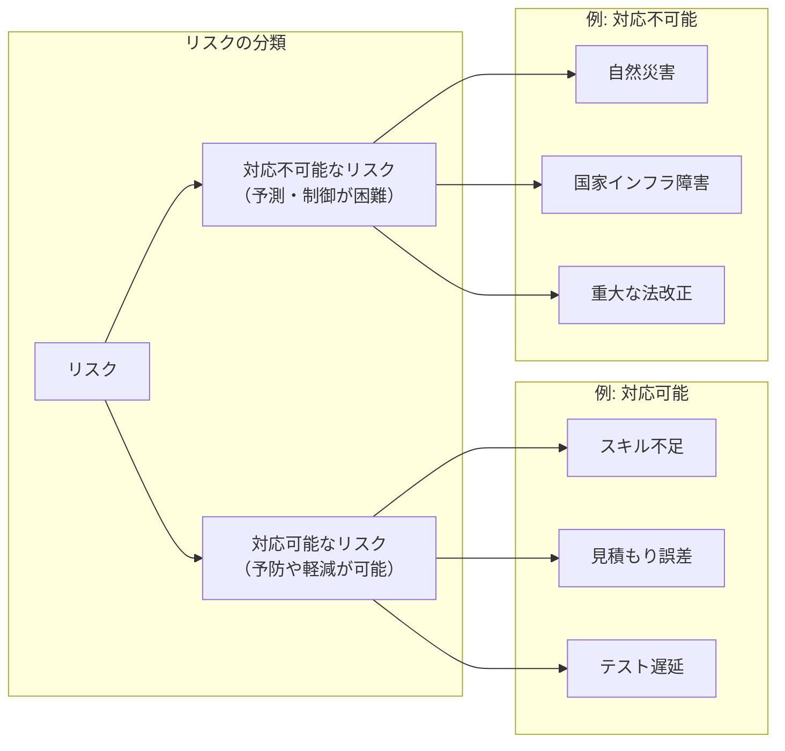

たとえば「納期遅延」というリスクが発生した場合

- スキル不足 → 対応可能（教育やリソースの再配分）
- 災害による出社不可 → 対応不可能（BCPなどの受容策が重要）

このように **対応可能かどうかでリスクを分類しておくと、次のようなメリット** があります。

- 優先的に対処すべきリスクを明確にできる
- 対応困難なリスクに対しては、受容・回復計画（BCP）を設けられる
- 対応可能なリスクへの対策集中により、実効性の高いリスクマネジメントが可能になる

すべてのリスクに備えるのではなく「対応できるかどうか」でリスクを見極め、戦略的にリスクに向き合うことが重要です。

BCP（事業継続計画）についてはこちらを参照してください。

- [1.1 BCP（事業継続計画）とは](https://www.chusho.meti.go.jp/bcp/contents/level_c/bcpgl_01_1.html)

### リスクは時間とともに収束していく(=不確実性コーン)

リスクは霧のようなもの。**時間とともに** 晴れていく。

プロジェクトの初期段階では情報が限られており、リスクや見積もりの不確実性が最も高くなります。  
逆にプロジェクトが進行していくことで不確実性が減少していきます。このようにリスクは時間の経過とともに不確実性が減少するという **収束の性質** を持ちます。

この「時間とともに不確実性が収束する」現象はソフトウェア見積もりの分野では「不確実性コーン（Cone of Uncertainty）」というモデルで知られています。  

  
[参照: プロジェクトの本質とはなにか | 日経クロステック（xTECH）](https://xtech.nikkei.com/it/article/COLUMN/20131001/508039/zu01_s.jpg?__scale=w:500,h:325&_sh=03d02a0d80)

「不確実性コーン（Cone of Uncertainty）」とはプロジェクトの初期には見積もりの誤差幅が大きく、進行とともにその幅が狭まっていくことを示すモデルです。

つまりプロジェクトの進行とともに情報が蓄積されリスクの不確実性は徐々に減少していく。  
これが「時間とともに収束していく」というリスクの性質です。

PMBOKではこの現象を **段階的詳細化** と呼び、得られる情報の増加に応じて計画や見積もりの精度を高めていく **反復的な取り組み** として位置づけています。

> **段階的詳細化** 得られる情報が増え、より正確な見積もりが可能になるにつれ、プロジェクトマネジメント計画書をより詳細化していく反復プロセス。  

参照: [プロジェクトマネジメント知識体系ガイド（PMBOKガイド）第7版＋プロジェクトマネジメント標準](https://www.pmi-japan.shop/shopdetail/000000000028/) 2.8.2 曖昧さ より抜粋

> 段階的詳細化を使って計画を練り直し続ける。また、脅威や好機が顕在化すると、計画も更新される。  

参照: [プロジェクトマネジメント知識体系ガイド（PMBOKガイド）第7版＋プロジェクトマネジメント標準](https://www.pmi-japan.shop/shopdetail/000000000028/) 2.3.7 他のパフォーマンス領域との相互作用 より抜粋

## リスクの性質から洞察するとリスクは「構造」で捉えられる

これまで整理してきたように、リスクには次のような多面的な性質があります。

| リスクの性質                                        | 意味する構造的観点                 |
|:----------------------------------------------------|:-----------------------------------|
| リスクは **連鎖する**                               | 因果関係による構造                 |
| リスクは **時間とともに収束していく**               | プロジェクト進行との相互関係       |
| リスクは **分類できる**                             | カテゴリによるマッピング可能な構造 |
| リスクは **対応可能なものと対応不可能なものがある** | 対応戦略と資源配分に基づく構造     |
| リスクは **階層性がある**                           | 抽象度・粒度の違いによる階層構造   |
| リスクは **見えづらい**                             | 可視化・観測の困難さ（潜在性）     |
| リスクは **評価する時にばらつきが出やすい**         | 主観・コンテキスト依存の曖昧性     |
| リスクは **掛け算的である**                         | 全体影響が乗算的に累積する波及構造 |

これらの性質を見渡すと、リスクは単なる「点」や「リスト」ではなく、構造的・網状的に捉えるべき対象であることが分かります。  
構造として捉えることで、リスクの **発生要因、影響範囲、対応戦略** を整理でき、マネジメントの精度も格段に向上します。

### 標準リスクモデルが示す「構造としてのリスク」

こうしたリスクの構造的な捉え方を形式的に表現したのが **標準リスクモデル** です。  
これは古典的ですが本質を突いたモデルで、以下のように **リスクは構成要素と因果関係のネットワークとして整理される** ことを示しています。

※ **標準リスクモデル** はリスクを構造的に扱うためのフレームワークの１つです。

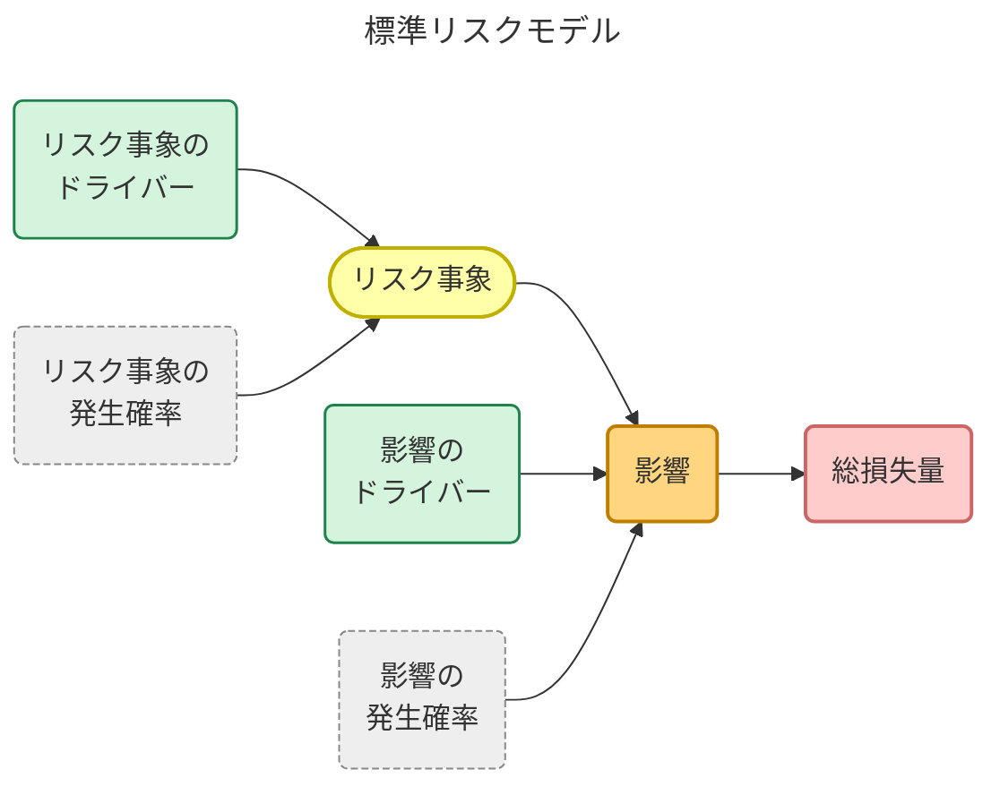
> 事実がリスクの尤度を決定する。  
> リスク事象のドライバーがリスク事象に影響を与え、影響のドライバーが影響と総損失量に影響を与える。  

出典: [プレストン・G・スミス、ガイ・M・メリット（澤田美樹子訳）『実践・リスクマネジメント ―製品開発の不確実性をコントロールする５つのステップ―』](https://bookstore.jpc-net.jp/detail/books/goods002016.html) 図5-2 より抜粋

| 構成要素               | 説明                                                                                                                                                                                                                                            |
|:-----------------------|:------------------------------------------------------------------------------------------------------------------------------------------------------------------------------------------------------------------------------------------------|
| リスク事象             | 損失を引き起こす事象そのもの                                                                                                                                                                                                                    |
| リスク事象のドライバー | リスクの発生を引き起こす背景的要因（例: スキル不足）  サンプルは [『ITプロジェクトのリスク予防への実践的アプローチ』](https://www.ipa.go.jp/archive/digital/iot-en-ci/hjuojm000000m6de-att/000026834.pdf) の第２部(資料編)にまとまっています |
| リスク事象の発生確率   | そのリスクが実際に発生する確率（尤度）                                                                                                                                                                                                          |
| 影響                   | リスクが実現したときの影響（例: 品質低下）                                                                                                                                                                                                      |
| 影響のドライバー       | 影響の大きさに影響する要因（例: テスト省略）                                                                                                                                                                                                    |
| 影響の発生確率         | 影響が実際に起きる確率                                                                                                                                                                                                                          |
| 総損失量               | リスクが発生したときの最終的な被害（例: 顧客クレームや再開発コスト）                                                                                                                                                                            |

このモデルの要点は、リスクを単なる「発生するか／しないか」ではなく **背景要因（ドライバー）・発生確率・影響・損失まで含めて因果関係で構造的に捉える** ということにあります。

尤度（ゆうど）についてはこちらを参照してください。

- [【統計学】尤度って何？をグラフィカルに説明してみる。 #Python - Qiita](https://qiita.com/kenmatsu4/items/b28d1b3b3d291d0cc698)

### 構造で捉えることで「変えられるリスク」が見える

このモデルの本質的な価値は **「構造を見抜けば、変えられるリスクがわかる」** ことにあります。

- **発生確率が高いリスク** → リスク事象ドライバーを調整すれば、発生可能性を下げられる
- **影響が深刻なリスク** → 影響ドライバーを調整することで、被害の範囲を狭められる
- **予防できないリスク** → 発生後の損失量を抑えるように対策を組む

つまり、リスクを構造として捉えることは、「リスクを変えられるものにする」ための第一歩となります。

### 標準リスクモデルとリスクの性質の関係について

標準リスクモデルとリスクの性質をそれぞれ対応表としてまとめたものが以下です。

| リスクの性質                                   | 標準リスクモデルにおける該当要素                                             |
|:-----------------------------------------------|:-----------------------------------------------------------------------------|
| リスクは連鎖する                               | リスク事象 → 影響 → 総損失量（因果関係）                                   |
| リスクは階層性がある                           | ドライバー → リスク事象・影響（抽象度・粒度の違い）                         |
| リスクは見えづらい                             | 潜在的なドライバーの存在、可視化困難な因果構造                               |
| リスクは評価にばらつきがある                   | 発生確率・影響度・ドライバーへの主観的判断                                   |
| リスクは対応可能なものと対応不可能なものがある | ドライバーへの制御可能性、戦略の選択                                         |
| リスクは分類できる                             | リスク事象・ドライバーなどをカテゴリごとに整理が可能                         |
| リスクは時間とともに収束していく               | 時間経過での情報更新により発生確率が変化しうる                               |
| リスクは掛け算的である                         | 影響 → 総損失量 の関係における「伝播の構造」および 影響ドライバーによる増幅 |

この表を見ることでリスクの性質ごとに「見るべき場所」「働きかけられる箇所」が明確になり、感覚的なリスク認識を構造的・分析的に取り扱えるようになります。

### すべてを構造で捉える必要はない。必要に応じて使い分ける

標準リスクモデルはリスクを「構造」として理解するためのフレームワークですが **常にすべてのリスクを構造化する必要があるわけではありません**。  
むしろ、構造的に扱った方がよいリスクと、直感的・経験則で対応できるリスクを **使い分ける視点** が重要です。

このモデルを「すべてに適用すべき正解」として捉えるのではなく **複雑さ・不確実性・影響度が高いリスクに対して、構造的な思考を導入するためのレンズ** として柔軟に活用することが、本質的なリスクマネジメントにつながります。

#### 結局どういうユースケースの時にリスクを構造として捉えるべきか？

どのような時にリスクを構造として捉えるべきかの適用シーンをまとめています。

| 適用シーン                                             | 説明                                                                                                                              |
|:-------------------------------------------------------| ----------------------------------------------------------------------------------------------------------------------------------|
| **リスクが複雑に連鎖しているとき**                     | 例: 1つの遅延が他の複数の工程に波及するような場合。 因果関係を構造として可視化する必要がある。                                 |
| **損失が大きくなりうる重大リスクの対応時**             | 例: 品質問題による再設計コストや顧客損害など、最終的な損失が大きくなる懸念があるとき。 影響ドライバーまで追いかける必要がある。|
| **リスクの発生確率や影響がチーム内で分かれているとき** | 認識にバラつきがあるときは、構造化して認識を揃える必要がある。 ドライバーごとに意見を出しやすくなる。                          |
| **対応方針を検討しても「打ち手が見えない」とき**       | どこをどう変えればリスクが下がるのか分からないとき、モデルを使うと「働きかける対象（ドライバー）」が見える。                      |
| **リスクレビューや説明責任が求められる場面**           | ステークホルダーや経営層へリスク説明をする際に、構造的に因果を説明できると説得力がある。                                          |

# リスクの代表的な分類を知る

リスクの性質を理解したうえで、次に重要なのは **どんなリスクがあるのか？** を知ることです。

プロジェクトにおけるリスクは千差万別ですが、まずは代表的なカテゴリを押さえることで、全体を俯瞰しやすくなります。  
ここでは、Asanaが紹介する[「7 つの一般的なプロジェクトリスクとその防止策」](https://asana.com/ja/resources/project-risks)、[「リスク登録簿とは？プロジェクトマネージャー向けガイド (実例付)」](https://asana.com/ja/resources/risk-register)）をベースによく挙げられる具体例も併せて紹介します。

## 7つの代表的なプロジェクトリスク

Asanaが紹介する[「7 つの一般的なプロジェクトリスクとその防止策」](https://asana.com/ja/resources/project-risks)では結果をベースに整理されていますがこちらでは一部、原因をベースにカテゴライズしています。  
そのためAsanaの整理とは微妙に違いが出ております。

| カテゴリ               | 概要                                             | 代表的な具体例（リスク登録簿より）                                     |
|:-----------------------|:-------------------------------------------------|:-----------------------------------------------------------------------|
| **スコープリスク**     | 要件やゴールが途中で変更され、計画が崩れるリスク Asanaの資料では [スコープクリープ](https://asana.com/ja/resources/what-is-scope-creep), [明確性の欠如](https://asana.com/ja/resources/project-risks#7-%E6%98%8E%E7%A2%BA%E6%80%A7%E3%81%AE%E6%AC%A0%E5%A6%82) に該当する                                                      | ・機能追加により仕様が頻繁に変わる ・ステークホルダー間の要件不一致 |
| **スケジュールリスク** | 納期遅延や工程ズレによるプロジェクトの遅れ Asanaの資料では [プロジェクトスケジュールリスク](https://asana.com/ja/resources/project-risks#4-%E6%99%82%E9%96%93%E4%B8%8D%E8%B6%B3) に該当する                                                                                                                                    | ・レビュー待ちで進捗が止まる ・意思決定が遅れる                     |
| **コストリスク**       | 予算超過・コスト見積もりミスによる影響 Asanaの資料では [コストのリスク](https://asana.com/ja/resources/project-risks#3-%E9%AB%98%E3%82%B3%E3%82%B9%E3%83%88) に該当する                                                                                                                                                        | ・外注費が想定より高騰 ・契約条件の見落としによる追加請求           |
| **リソースリスク**     | 人材や設備が足りずプロジェクトに支障が出るリスク Asanaの資料では [リソースのリスク](https://asana.com/ja/resources/project-risks#5-%E3%83%AA%E3%82%BD%E3%83%BC%E3%82%B9%E4%B8%8D%E8%B6%B3), [業務上のリスク](https://asana.com/ja/resources/project-risks#6-%E6%A5%AD%E5%8B%99%E4%B8%8A%E3%81%AE%E5%A4%89%E6%9B%B4) に該当する | ・キーパーソンが離脱予定 ・テスト環境が不足している                 |
| **技術リスク**         | 技術的な不確実性や障害に起因するリスク                                                                                                                                                                                                                                                                                            | ・新技術の採用による習熟不足 ・既存システムとの統合が困難           |
| **品質リスク**         | 品質基準が満たされない、再作業が発生する可能性 Asanaの資料では [パフォーマンスリスク](https://asana.com/ja/resources/project-risks#2-%E4%BD%8E%E3%83%91%E3%83%95%E3%82%A9%E3%83%BC%E3%83%9E%E3%83%B3%E3%82%B9) に該当する                                                                                                      | ・テスト工数の圧縮による品質低下 ・仕様理解のずれにより再修正       |
| **外部リスク**         | 自チームの外部に起因する、制御困難なリスク Asanaの資料では [業務上のリスク](https://asana.com/ja/resources/project-risks#6-%E6%A5%AD%E5%8B%99%E4%B8%8A%E3%81%AE%E5%A4%89%E6%9B%B4) に該当する                                                                                                                                  | ・法改正による影響 ・取引先企業のスケジュール変更                   |

※Asanaの分類では「技術リスク」という項目は明示されていませんが、実務上はスケジュール遅延やパフォーマンス低下の背景に技術的課題が存在することが多いため独立して扱っています。

## なぜ分類が重要なのか？

リスクを分類する目的は、「抜け漏れなく洗い出す」ことだけではありません。  
**分類ごとに異なる対応方針が求められる** ため「リスク登録簿」や「対応優先順位」を整理するうえでも重要です。

- 技術リスク → 技術選定やPoCを早期に進めて軽減
- 外部リスク → 契約や調整、早期通知体制で移転・回避
- スケジュールリスク → マイルストーンの明確化やバッファ設計で対応

このように、「分類 × 具体例」で捉えることで、単なる抽象的なリストではなく **チームで共有・議論できる実践的な視点** に変えることができます。  
リスクを分類しておくことで、チーム内での共通言語としての整理が可能になり、「これはスケジュールリスク？それとも技術リスク？」といった議論も建設的になります。

こうしたリスクの分類を踏まえつつ、実際にどのようにリスクを洗い出していくべきなのか？  
次のセクションでは、**チームでの洗い出しに役立つ、実践的なリスク発見手法** を紹介します。

# リスク洗い出し手法を学ぶ

プロジェクトに潜むリスクを管理するためには、まず「そもそも何がリスクになり得るのか？」を洗い出すことが第一歩です。  
ここでは、リスクを発見・顕在化するための代表的な手法を紹介します。

## リスクの洗い出し手法の使い分け早見表

代表的な洗い出し手法の早見表です。

| 手法名                                             | 適したアプローチ                         | 使うときの意図                                                           |
|:---------------------------------------------------|:-----------------------------------------|:-------------------------------------------------------------------------|
| **プレモーテム**                                   | 仮想未来から逆算する                     | プロジェクトが失敗した未来を想定し、「今どこにリスクがあったか？」を探る |
| **象・死んだ魚・嘔吐ワーク**                       | 感情的・非言語的な懸念を引き出す         | 言いにくいこと、過去のしこり、言語化されていない懸念を可視化する         |
| **RBS（リスク・ブレーク・ダウンストラクチャ）**    | リスクカテゴリごとに着実に拾っていく     | 抜け漏れなく、全体をカテゴリでカバーする                                 |
| **フォルトツリー解析（FTA: Fault Tree Analysis）** | リスクの起因や連鎖の可能性をたどって探る | 発生しそうなリスクの「原因のさらに奥」にある潜在リスクを探り出す         |
| **IPAリスク事象ドライバー一覧**                    | チェックリストで発想を補助しながら拾う   | 「こういうのもあるかも」と気づくための発想起点として活用                 |

## どの手法を選ぶ？リスク洗い出しチャート

リスクの洗い出しチャートです。こちらを元にどの手法を使って洗い出していくべきか検討することができます。

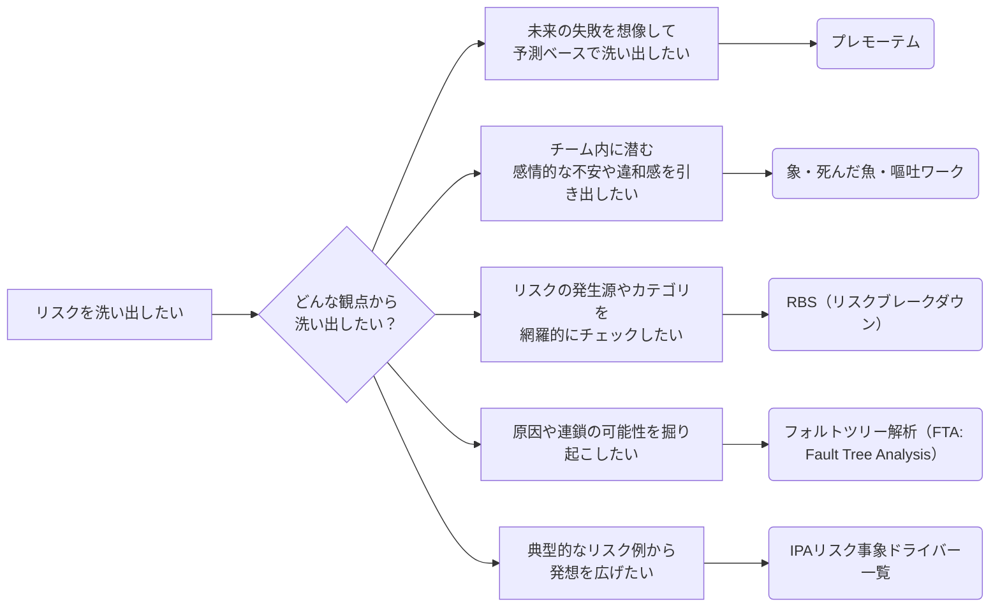

## プレモーテム（Pre-Mortem）

**未来の失敗を想像して、予測ベースでリスクを洗い出す**

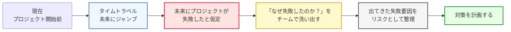

プレモーテム（事前分析）は、プロジェクト開始前に **「このプロジェクトは失敗した」と仮定し、なぜそうなったのか？** を逆算で考える手法です。  
チーム全員で「失敗の原因」を洗い出すことで、将来起こり得るリスクを感情や直感も交えて多角的に発見することができます。

| 項目           | 内容                                                                                                                               |
|:---------------|:-----------------------------------------------------------------------------------------------------------------------------------|
| **目的**       | チームの想像力を活かし、プロジェクト初期に潜在的なリスクを洗い出す                                                                 |
| **実施の流れ** | ・プロジェクトが失敗したという前提を共有する ・その原因をブレスト形式で出し合う ・出てきた内容を「リスク候補」として整理する |
| **効果**       | 言語化されていない不安や直感的な懸念を表面化し、リスク登録簿に反映できる                                                           |

一言で言えば **「タイムマシンに乗って未来にダイブする」** 感覚で未来を疑似体験し、今すべき備えを見つける手法です。  

プレモーテムに関しては Asana や Atlassian でも紹介されています。

- [終わりを意識して始める: プロジェクトのプレモーテムを行う方法 [2025] • Asana](https://asana.com/ja/resources/premortem)
- [事前分析演習の実行方法 [テンプレート付き] | Atlassian](https://www.atlassian.com/ja/team-playbook/plays/pre-mortem)

## RBS（リスク・ブレーク・ダウンストラクチャ）

**カテゴリから体系的にリスクを洗い出す構造的アプローチ**

RBSは、リスクを階層構造（ブレークダウン構造）で整理しながら、カテゴリ別に網羅的にリスクを洗い出していく手法です。  
WBS（Work Breakdown Structure）のように、**構造を分解していくことで、見落としを防ぎ、体系的な発見が可能**になります。

| 項目           | 内容                                                                                                                                 |
|:---------------|:-------------------------------------------------------------------------------------------------------------------------------------|
| **目的**       | プロジェクトに潜むリスクをカテゴリ別に構造的に洗い出し、抜け漏れを防止する                                                           |
| **実施の流れ** | ・あらかじめ用意されたリスクカテゴリ（例：技術、リソース、品質など）を参照する ・カテゴリごとに具体的なリスク事象を洗い出していく |
| **効果**       | 抜け漏れを防ぎ、リスクを体系的に整理できる。カテゴリごとの傾向把握や、対応策立案の優先順位付けにも役立つ                             |

このようにRBSは、「構造で考える」ことで洗い出しの精度と網羅性を高める手法です。  
他の感覚的・直感的アプローチ（プリモーテムなど）と組み合わせて使うことで、より多面的なリスクの抽出が可能になります。

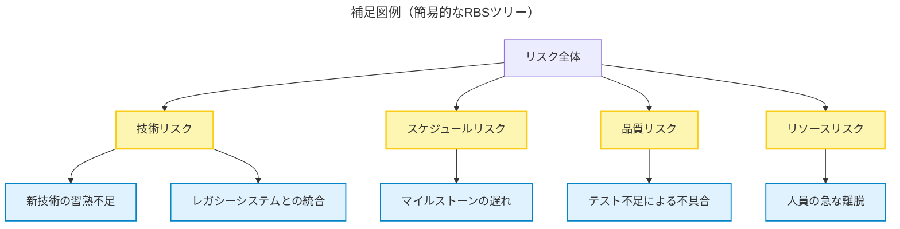

このようにRBSは、「構造で考える」ことで洗い出しの精度と網羅性を高める手法です。  
他の感覚的・直感的アプローチ（プリモーテムなど）と **組み合わせて使う** ことで、より多面的なリスクの抽出が可能になります。

参考にすると良いサイト

- [「リスクマネジメント・ツールボックス (4)」](https://www.pmaj.or.jp/online/1101/message4.html)
- [「リスクマネジメント・ツールボックス (5)」](https://www.pmaj.or.jp/online/1102/message4.html)
- [RBS（Risk Breakdown Structure）とは？ - 2025](https://saycon.co.jp/archives/neta/rbs%EF%BC%88risk-breakdown-structure%EF%BC%89%E3%81%A8%E3%81%AF%EF%BC%9F)

PMBOK でも以下のように紹介されています。

> リスク・ブレークダウン・ストラクチャー（RBS） (Risk Breakdown Structure (RBS))　潜在的リスク源の階層表示。  

参照: [プロジェクトマネジメント知識体系ガイド（PMBOKガイド）第7版＋プロジェクトマネジメント標準](https://www.pmi-japan.shop/shopdetail/000000000028/) 用語集 3.定義 より抜粋

## フォルトツリー解析（FTA: Fault Tree Analysis）

**リスクを原因の連なりとして構造化する可視化アプローチ**

フォルトツリー解析（FTA：Fault Tree Analysis）は、 **あるリスク（障害や失敗）がなぜ起こるのか？をツリー構造で原因ごとに掘り下げていく分析手法** です。  
上から下に向かって「なぜ？」を繰り返し、**複合的なリスクの因果関係や連鎖** を可視化することで、本質的なリスクの洗い出しや対応策の特定に役立ちます。

| 項目           | 内容                                                                                                                                                                           |
|:---------------|:-------------------------------------------------------------------------------------------------------------------------------------------------------------------------------|
| **目的**       | リスクの背後にある複数の原因・要因を構造的に明らかにする                                                                                                                       |
| **実施の流れ** | ・トップに分析対象となる「リスク（障害）」を置く ・「なぜそれが起こるのか？」をブレストし、下に原因を展開 ・原因がさらに別の原因に起因する場合はツリー状に深掘りしていく |
| **効果**       | リスクの連鎖や根本原因を見える化でき、断ち切るための有効な対策ポイントが見えてくる                                                                                             |

このように、フォルトツリー解析のアプローチは **「原因を因果構造として可視化する」** 洗い出し手法です。  
カテゴリで広く拾うRBSとは異なり、**一つひとつのリスクを深掘りして因果構造を明らかにする** という点でRBSと一緒に使うことでお互いの欠けている部分を補って使えます。

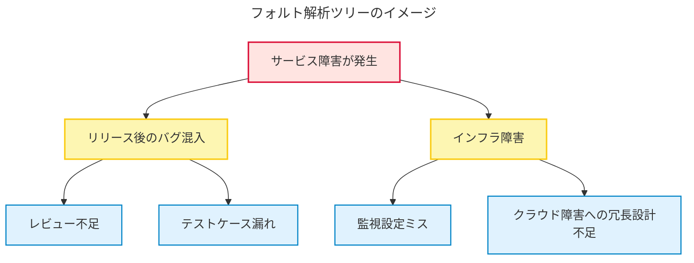

参考にすると良いサイト

- [土木研究センター 用語解説](https://www.pwrc.or.jp/yougo_g/pdf_g/y1308-P054-054.pdf)
- [フォルトツリー解析 - Wikipedia](https://ja.wikipedia.org/wiki/%E3%83%95%E3%82%A9%E3%83%AB%E3%83%88%E3%83%84%E3%83%AA%E3%83%BC%E8%A7%A3%E6%9E%90)

## 象・死んだ魚・嘔吐

**チームの感情・暗黙知から課題やリスクを引き出す対話型アプローチ**

一般に「象・死んだ魚・嘔吐」は振り返りの文脈で使われる手法ですが、チームが抱える暗黙的な違和感や懸念を掘り起こす点で、リスクや課題の洗い出しにも効果的です。

「象・死んだ魚・嘔吐」は、**チームメンバーの中にある「言いづらさ」や「違和感」といった感情的・非言語的な懸念を課題やリスクとして顕在化する** ことを目的としたワークショップ手法です。  
形式的なチェックリストや構造的な分析では拾いにくい、**現場特有の空気に潜む課題やリスク** を可視化するのに効果的です。

| 項目           | 内容                                                                                                                                        |
|:---------------|:--------------------------------------------------------------------------------------------------------------------------------------------|
| **目的**       | チームメンバーが抱える **暗黙的な不安・未解決の問題・感情的な懸念** を表面化し、課題やリスク候補として整理する                                    |
| **実施の流れ** | ・3つのカテゴリ「象」「死んだ魚」「嘔吐」を使って対話を促進 ・自由記述や付箋ワークで話題を収集 ・話題を課題やリスク候補として整理・分類する |
| **効果**       | 形式的なレビューでは見えない **心理的・文化的な課題やリスク** を拾うことができる。 チームの信頼関係や心理的安全性の向上にもつながる            |

このように「象・死んだ魚・嘔吐」は **感覚・雰囲気・感情** から拾い上げる直感的アプローチです。  
構造的なRBSや論理的なFTAと組み合わせることで、**形式と感覚の両面からリスクを網羅的に抽出**できます。

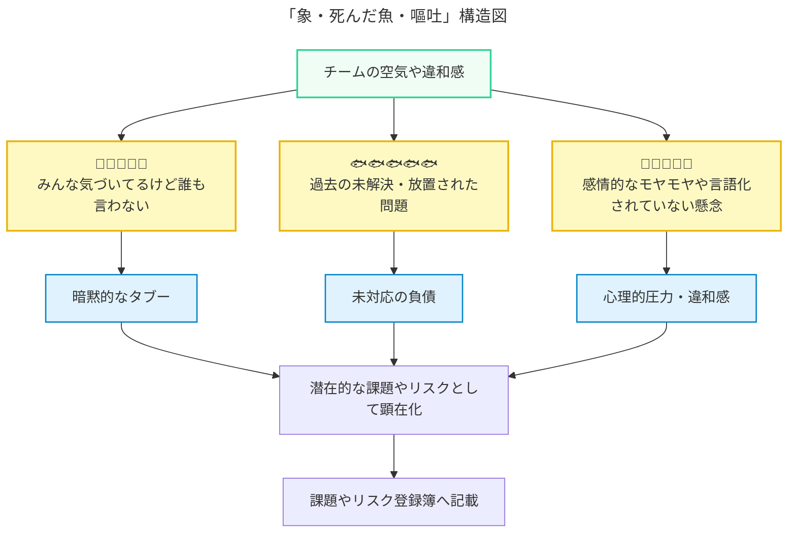

「象」「死んだ魚」「嘔吐」にはそれぞれ以下のような意味があります。

| 項目         | 意味                                                                         | 例                                                                   |
|:-------------|:-----------------------------------------------------------------------------|:---------------------------------------------------------------------|
| **象**       | みんなが気づいているのに誰も口にしない「チーム内のタブー」                   | 「プロダクトオーナーがよく仕様を変えるけど、誰も指摘できない」       |
| **死んだ魚** | 過去に起きた問題で、もう忘れ去られたり放置されたが、今なお影響している事象   | 「前回リリースのバグの振り返りが有耶無耶になったまま放置されている」 |
| **嘔吐**     | チームメンバーが感じているモヤモヤ・不満・違和感など、言語化されていない感情 | 「方針が二転三転してついていけない」「とにかく焦っていて怖い」       |

※もともとはチーム振り返りの手法ですが、「潜在的な課題の兆候」＝「将来起こりうるリスクの種」と捉えることで、リスクマネジメントにも応用できます。

参考にすると良いサイト

- [ふりかえり手法「象、死んだ魚、嘔吐」でチームの闇と向き合おう - Qiita](https://qiita.com/piyonakajima/items/ad3c44d1dc377e41d394)

## IPAのリスク事象ドライバー一覧を活用する

**チェックリストから網羅的に拾い上げるアプローチ**

リスク事象ドライバー一覧は、IPAの資料[『ITプロジェクトのリスク予防への実践的アプローチ』](https://www.ipa.go.jp/archive/digital/iot-en-ci/hjuojm000000m6de-att/000026834.pdf)を活用し、プロジェクトで起こり得るリスクを洗い出す手法です。  
網羅性の高いリストを **チェックリスト的に参照** することで **見落としていたリスクや発想の盲点を補う** ことができます。

| 項目           | 内容                                                                                                                                                                                                                                                             |
|:---------------|:--------------------------------------------------------------------------------------------------------------------------------------------------------------------------------------------------------------------------------------------------------|
| **目的**       | 既存の知見をベースに、想定外のリスクを見落とさずに拾い上げる                                                                                                                                                                                            |
| **実施の流れ** | ・IPAの資料[『ITプロジェクトのリスク予防への実践的アプローチ』](https://www.ipa.go.jp/archive/digital/iot-en-ci/hjuojm000000m6de-att/000026834.pdf)のリスク事象ドライバー一覧を活用 ・自プロジェクトに該当する項目をチェックしながらリスクを洗い出す |
| **効果**       | 自力では発想が及ばないリスクもカバーできる。 過去事例や標準知見をもとに **網羅性・信頼性を高められる**。チームの経験差を補うのにも有効                                                                                                               |

このように、「リスク事象ドライバー一覧」は トップダウン型の発想支援ツールとして優れた補助になります。
プレモーテムや「像・死んだ魚・嘔吐」のようなボトムアップ型手法と組み合わせることで、 **主観と客観の両側からリスクを網羅的に抽出** できます。

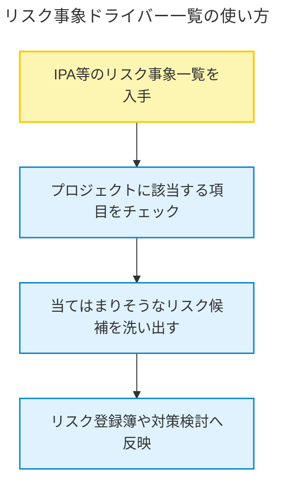

参考リンク

- [『ITプロジェクトのリスク予防への実践的アプローチ』](https://www.ipa.go.jp/archive/digital/iot-en-ci/hjuojm000000m6de-att/000026834.pdf) 第2部(資料編) を参照

# リスクをどのように管理するか

## 優先順位をつける: 「確率 x 影響度」でリスクを評価する

# リスク対応を仕組みとして回す

# なぜプロジェクトマネジメントにとってリスクが重要なのか？

# まとめ

-----------

ここから下は過去に検討していたセクション内容

# リスクの種類と対応優先順位

- 技術リスク、外部リスク、人的リスク、マネジメントリスクなど分類
- リスクの4象限モデル（確率×影響度）で優先度をつける
- 対応方針：回避、軽減、移転、受容の使い分け

# プロジェクトマネジメントにおけるリスクの重要性

- 「PMはタスク管理者ではない。リスクと向き合うプロである。」
- タスク管理に偏重しがちな誤解を解く
- プロジェクトは不確実性に包まれており、リスク対応力がPMの本質
- 予定通り進むことは例外、だからこそ「見えないもの（リスク）」を意識する必要がある
-  （hiroki daichiさんのスライドを参照し、「リスクこそがPMの本丸」という視点を補強）

## リスクと課題の違い

- リスク＝未来の不確実性、課題＝既に発生した問題
- リスクが顕在化すると「課題」になる（リスク管理→課題管理へ移行）
- 両者のステータス遷移（発生前と発生後）を理解し、連携させることが重要

# まとめ 〜リスクと向き合うことは、未来のプロジェクトを守ること〜

- リスクを避けるのでなく、管理することがプロジェクト成功の鍵
- 小さくてもよいので、まずはリスク洗い出し（プリモーテムなど）を実施してみよう
- リスクに向き合う力が、PMとしての真の信頼を築く
